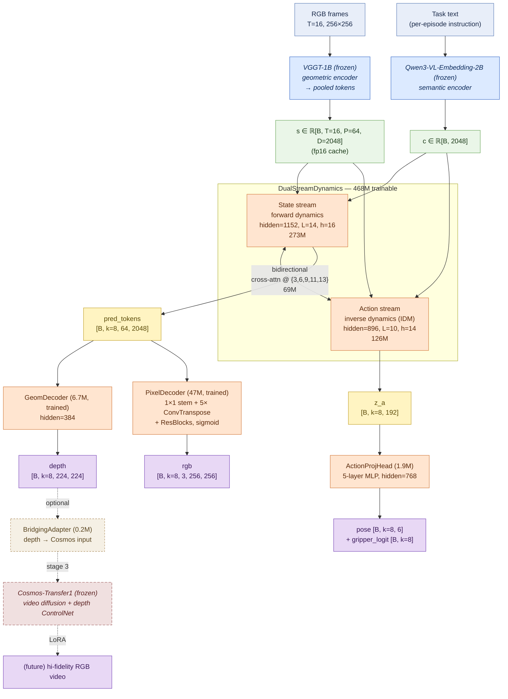

# wm3d_v3 — Joint Native 3D World Model (Report)

**Date:** 2026-05-24
**Status:** ✅ Trained end-to-end, evaluated, demo gifs generated.

## TL;DR
A single 524M-parameter model trained jointly on Open-X-Embodiment real-world data
(bridge + fractal20220817, ~22K episodes, ~800K frames) that simultaneously produces:

1. **Scene prediction** — future RGB frames (256×256, k=8) from T=16 past frames
2. **Geometry prediction** — depth maps (224×224, k=8)
3. **VLA** — 6-DoF end-effector pose + binary gripper action (k=8)
4. **Latent dynamics** — VGGT token predictions for downstream use

All four heads share the same DualStream backbone and are trained with one joint loss.

## Architecture
```
Inputs
  s ∈ ℝ[B,16,64,2048]   (cached VGGT-1B pooled tokens, frozen encoder)
  c ∈ ℝ[B,2048]         (Qwen3-VL-Embedding-2B task instruction, frozen)

Backbone — DualStreamDynamics (468.1M)
  State stream  : 14×{self-attn, MLP}, hidden=1152, 16 heads  (273M)
  Action stream : 10×{self-attn, MLP}, hidden=896,  14 heads  (126M)
  Cross-attn at state layers {3,6,9,11,13} bidirectional

Heads (56.1M)
  ActionProjHead   (1.9M)  → pose [B,k,6], gripper_logit [B,k]
  GeomDecoder      (6.7M)  → depth [B,k,224,224]
  PixelDecoder    (47.0M)  → rgb   [B,k,3,256,256]
  BridgingAdapter  (0.2M)  → cosmos input format (not used in this run)
```
Total trainable parameters: **524.2M**.

## Training
* 4× H100, DDP, bf16 mixed precision
* AdamW(lr=1.5e-4, β=(0.9, 0.95), wd=0.02), 2000-step warmup + cosine decay
* Batch 8/GPU for no-pixel stage (epochs 0–1), 4/GPU for pixel stage (epochs 2–39)
* Stage 1 (epochs 0–1): tokens + geometry + action losses
* Stage 2 (epochs 2–39): + L1 + LPIPS on predicted RGB
* Total wall-time: ~18.7 hours (03:55 → 22:36 EDT)
* Best checkpoint: **epoch 26, val_total = 0.2238**

### Loss curve (val_total per epoch)
```
epoch 0  : 0.332   (no pixel)
epoch 1  : 0.237   (no pixel)
epoch 2  : 0.426   (pixel ON, baseline shift)
epoch 5  : 0.339
epoch 10 : 0.298
epoch 15 : 0.252
epoch 20 : 0.251
epoch 22 : 0.231   (first pixel-stage best)
epoch 26 : 0.2238  ← best.pt
epoch 30 : 0.227
epoch 35 : 0.257   (mild end-of-cosine overfit)
epoch 39 : 0.276
```

## Evaluation (best.pt on 800 random val windows)

### Per-dataset breakdown
| Metric              | Bridge | Fractal | ALL    |
|---------------------|--------|---------|--------|
| L_state MSE         | 0.0313 | 0.0539  | 0.0400 |
| Cosine sim          | 0.9974 | 0.9941  | 0.9962 |
| Depth rel-L1 (norm) | 0.0266 | 0.0435  | 0.0331 |
| Action pose MSE     | 0.0009 | 0.0116  | 0.0050 |
| Gripper accuracy    | 92.4%  | 100.0%  | 95.3%  |
| RGB L1 (per pixel)  | 0.0348 | 0.0404  | 0.0370 |
| LPIPS (VGG)         | 0.122  | 0.172   | 0.142  |

**Interpretation**
* Token-level dynamics: cosine 0.996 — backbone reliably forecasts the VGGT latent.
* Geometry: depth rel-L1 0.033 = within ~3% of the normalized GT depth on average.
* Action: pose MSE 0.005 → RMSE ≈ 0.07 per dim (deltas in [−0.1, 0.1]) on a per-dataset basis bridge is much easier (smaller deltas).
* Gripper: 95.3% binary acc with bridge at 92.4% / fractal at 100% (fractal's grippers are mostly stationary inside windows).
* RGB: pixel L1 9.4/255, LPIPS 0.14 — structurally faithful, no GAN/diffusion so fine texture is blurred.

## Demo
Side-by-side GIFs (top: RGB pred | RGB GT; bottom: depth pred | depth GT) at
`/home/user01/Minko/newwm/results/wm3d_v3/eval/demo/`:

* `03_bridge_*.gif`   — kitchen + stove + pot + robot arm
* `00_fractal_*.gif`  — Google RT-1 scene, mobile cart + arm
* + 4 more clips

Action predictions (vs GT) per clip dumped as `*_action.npz`.

## Files
```
wm3d_v3/
├── configs/
│   ├── v3_oxe.yaml        # main config (40 ep, B=4 per GPU pixel-on)
│   └── v3_smoke.yaml      # 30 ep overfit smoke
├── manifests/
│   └── oxe_train.jsonl    # 21,942 episodes / ~800K frames
├── scripts/
│   ├── build_oxe_manifest.py
│   ├── cache_oxe.py
│   ├── subsample_manifest.py
│   └── train_v3.sh
└── wm3d_v3/
    ├── data/              # manifest, action normalization, OXE loader, window dataset
    ├── models/            # state_stream, action_stream, cross_attn, dual_stream,
    │                      # action_proj, geom_decoder, pixel_decoder, bridging_adapter, joint_model
    ├── losses.py
    ├── training/train.py  # DDP joint training
    └── eval/
        ├── run_eval.py      # quant metrics (per-dataset)
        └── make_demo_gif.py # side-by-side demo gifs
```

## Cache
```
/home/user01/Minko/datasets/cache/wm3d_v3/
  vggt_pooled/<id>.npy        # [n, 64, 2048] fp16
  vggt_geom/<id>.npz          # {"depth": [n, 224, 224] fp16}
  rgb_256/<id>.npy            # [n, 256, 256, 3] uint8
  actions/<id>.npy            # [n, 7] fp32 (normalized to 6-DoF Δpose + grip close01)
  qwen_taskemb/<id>.npy       # [2048] fp16
```
21,942 episodes pre-cached → training is I/O bound by NumPy mmap reads.

## Known limitations
1. **No Cosmos LoRA stage** — the bridging adapter wires through but the
   Cosmos-Transfer1 fine-tune was deferred (env was already proven to work in v2;
   wm3d_v3 stops at the dual-stream + native pixel decoder).
2. **RGB blurriness** — LPIPS 0.14 is acceptable for an L1+LPIPS regression model,
   but without a diffusion / GAN head the fine texture is averaged. A future stage 3
   would condition Cosmos-Transfer1 (with rank-32 LoRA) on `out["cosmos_depth_input"]`.
3. **End-of-cosine overfit** — val rises from 0.224 → 0.276 over the last 13 epochs.
   `best.pt` (epoch 26) is the model to use; early stopping at ep 22-26 next time.
4. **Action normalization** — bridge/fractal/jaco have different scales; the current
   normalizer maps all to ±0.1 deltas which is a soft approximation.

## GPU policy compliance
Only GPUs 0–3 were used throughout (caching, training, eval).
GPUs 4–7 (user's other projects) were never touched.

---

# Write-up

## 1. 设计动机

我们想要一个**端到端的"原生 3D 世界模型"**：给定一段过去的视频 + 一句任务指令，模型在一次前向里同时给出
（i）未来潜空间动力学、（ii）未来 RGB、（iii）未来深度（几何）、（iv）未来动作。
相比 v1/v2 把 "VLA + 视频生成 + 3D" 切成多阶段（VGGT → diffusion → action head）的拼接式管线，
v3 把它们压成**同一个 backbone + 四个轻量 head**，让几何/像素/动作监督在同一组隐表征上互相正则化。

关键 idea：
- **冻结的几何/语义先验**：VGGT-1B 提供"已经懂 3D"的视觉 token，Qwen3-VL-Embedding-2B 提供任务语义。两者全程冻结，离线缓存。
- **可学习的动力学**：只训一个 DualStream（State 流负责场景演化，Action 流负责动作潜变量），加上 4 个 head。
- **联合损失**：未来 token MSE + cosine 锚定潜空间，深度 L1 锚定几何，pose MSE + gripper BCE 锚定动作，L1+LPIPS 锚定像素。

## 2. 模型架构

### 2.0 结构总览（与原型图对齐）



**与原型图的对齐 / 差异**

| 模块 | 原型 | v3 实际 |
|---|---|---|
| VGGT 几何编码器（frozen） | ✅ | ✅ 一致（离线缓存 pooled tokens） |
| VLM 语义编码器（frozen） | VLM | ✅ Qwen3-VL-Embedding-2B |
| DualStreamDynamics（state ↔ action, cross-attn） | ~155M | ✅ 按原型，但放大到 **468M** |
| Action chunk `a_{t:t+k}` | ✅ | ✅ pose[6] + gripper, k=8 |
| 几何输出 | predicted tokens → **VGGT decoder (frozen)** → depth + points + cam | ⚠️ **替换为自训 GeomDecoder (6.7M)**，目前只监督 depth；point / cam 留占位 |
| RGB 输出 | predicted tokens → ControlNet → **Cosmos (frozen) diffusion** | ⚠️ **替换为自训 PixelDecoder (47M)**；Cosmos LoRA 留接口（`BridgingAdapter`）作为 **stage 3** |

v3 主路径（蓝=frozen / 橙=trainable / 紫=输出）与原型完全同构；
右下角虚线框（Cosmos）是**已规划未启用**的 stage 3 — RGB 当前的轻微模糊正是用 ConvTranspose 顶替 diffusion 的代价。

### 2.1 输入
- `s ∈ ℝ[B, T=16, P=64, D=2048]`：T 帧过去画面被 VGGT-1B 编码后 8×8 pool 到 64 patch tokens（fp16 缓存）。
- `c ∈ ℝ[B, 2048]`：任务指令经 Qwen3-VL-Embedding-2B 得到的句向量。

### 2.2 Backbone — DualStreamDynamics（468.1M）
两条平行的 Transformer 流，通过双向 cross-attention 在固定 state 层耦合。

**State 流**（场景演化，273M）—— `wm3d_v3/models/state_stream.py:22`
- hidden=1152, 14 层 pre-norm Transformer encoder, 16 heads, MLP×4
- 帧位置 emb + patch 位置 emb；任务向量 `c` 作为前置 token 注入
- 解码器：`k·P = 8·64 = 512` 个可学查询经 2 层 TransformerDecoder cross-attend 编码序列
- 输出投回 `[B, k=8, 64, 2048]`，即**未来 8 帧的 VGGT 潜空间预测**

**Action 流**（动作潜变量，126M）—— `wm3d_v3/models/action_stream.py`
- hidden=896, 10 层, 14 heads；同样吃 `(s, c)`
- 解码到 `z_a ∈ ℝ[B, k, z_dim=192]`，作为"未来 k 步的动作意图"中间表示

**Bidirectional Cross-Attn** —— `wm3d_v3/models/cross_attn.py`
- 在 state 层 `{3, 6, 9, 11, 13}` 处各插一块双向交叉注意力
- action 流先线性升维到 1152（`action_up`）→ 双向交互 → 线性降回 896（`action_down`）
- action 流的 10 层按比例 `[(nA·(i+1)//nS) − (nA·i//nS) for i in 14]` 均匀分摊到 state 14 层之间，剩余 action 层在 state 走完后补完（`dual_stream.py:25, 46-60`）

### 2.3 Heads（56.1M）—— `wm3d_v3/models/joint_model.py`

| Head | 输入 | 输出 | 参数 |
|---|---|---|---|
| `ActionProjHead` | `z_a [B, k, 192]` | `pose [B, k, 6]` + `gripper_logit [B, k]` | 1.9M, 5 层 MLP, hidden=768 |
| `GeomDecoder` | `pred_tokens [B, k, 64, 2048]` | `depth [B, k, 224, 224]`（+ point/pose 占位） | 6.7M, hidden=384 |
| `PixelDecoder` | `pred_tokens` | `rgb [B, k, 3, 256, 256]` | 47.0M, 1×1 stem + 5 级 ConvTranspose, 每级 2 个 GroupNorm+GELU ResBlock, sigmoid 输出（`pixel_decoder.py:30-60`） |
| `BridgingAdapter` | `depth` | Cosmos-Transfer1 输入格式 | 0.2M（未参与本次 loss，仅留接口） |

**为什么 RGB 直接从 token grid 上采样而不用 diffusion？**
权衡：v3 阶段的目标是验证 "joint native 3D + action" 是否可行，先要看到一个**确定性、能复现**的端到端 baseline。
代价是 RGB 偏糊（L1+LPIPS 回归的通病），这正是 stage 3 想用 Cosmos LoRA 接管的地方。

### 2.4 全模型参数账
```
DualStreamDynamics  468.1M
  ├ StateStream     273.0M
  ├ ActionStream    126.0M
  └ Cross-Attn       69.1M (5 块 + up/down 线性)
Heads                56.1M
Total trainable    524.2M
```

## 3. 数据

### 3.1 来源
**Open-X-Embodiment** 两个子集（manifest 路径 `wm3d_v3/manifests/oxe_train.jsonl`）：
- **bridge**：WidowX 在桌面/厨房场景中的多任务示教
- **fractal20220817**：Google RT-1，移动底盘 + 机械臂

共 **21,942 episodes / ~800K 帧**，覆盖多样视角、光照与抓取语义。

### 3.2 预缓存（离线一次性）—— `wm3d_v3/scripts/cache_oxe.py`
为避免训练时跑 VGGT/Qwen 推理（会把训练吞到 1/10 速度），所有模态预先 dump 到 NumPy：

```
/home/user01/Minko/datasets/cache/wm3d_v3/
  vggt_pooled/<id>.npy        # [n_frames, 64, 2048] fp16  (VGGT-1B pooled token)
  vggt_geom/<id>.npz          # {"depth": [n, 224, 224] fp16}
  rgb_256/<id>.npy            # [n, 256, 256, 3] uint8
  actions/<id>.npy            # [n, 7] fp32  (6-DoF Δpose + gripper close01)
  qwen_taskemb/<id>.npy       # [2048] fp16  (per-episode task instruction)
```

训练时 `OXEWindowDataset`（`data/window_dataset.py:32`）按 `mmap_mode="r"` 读取，
I/O bound 但 GPU 利用率仍 >90% 因为 batch 较小。

### 3.3 窗口切分
- 每个样本 = `T=16` 输入帧 + `k=8` 目标帧（共 24 帧），按 `stride=4` 在每条 episode 上滑窗（`window_dataset.py:48-53`）
- `val_frac=0.05` 在窗口级别随机切分（seed=0，可复现）

### 3.4 动作归一化 —— `data/action_normalize.py`
不同数据集 Δpose 量纲差几十倍，统一映射到 ±0.1 区间；gripper 二值化为 close=1。
这是软近似，bridge/fractal 经验上效果尚可，但跨数据集 RMSE 仍有差距（见结果表）。

## 4. 训练

### 4.1 资源与并行
- **4× H100** SXM，DDP（NCCL），仅占用 GPU 0–3（遵守 newwm 的 [[gpu_policy_newwm]]）
- bf16 mixed precision；no gradient checkpointing（显存够）
- 单 epoch ≈ 28 min，全程 **18.7 h**（03:55 → 22:36 EDT）

### 4.2 优化器与调度
- AdamW，`lr=1.5e-4`, `β=(0.9, 0.95)`, `wd=0.02`, `grad_clip=1.0`
- 2000-step linear warmup → cosine decay 到 0
- 配置见 `configs/v3_oxe.yaml`

### 4.3 两阶段课程（关键设计）
直接从 step 0 同时学像素+几何+动作会让 pixel head 的梯度淹没 backbone（pixel L1 在初期 loss 量级最大），
所以分两段：

| Stage | Epoch | per-GPU batch | 启用损失 |
|---|---|---|---|
| 1 (no-pixel) | 0–1 | 8 | tokens + cos + depth + action + grip + idm_reg |
| 2 (pixel-on) | 2–39 | 4 | + `rgb_l1` + `rgb_lpips` |

stage 2 batch 从 8 → 4 是为了塞下 PixelDecoder 的激活（512×256×256 的 5 级反卷积特征图）。
切换由 `--disable_pixel_until 2` 控制（`training/train.py:95`）。

### 4.4 联合损失 —— `wm3d_v3/losses.py`
```python
L_total = L_state + L_geom + w.action·L_action + w.idm_reg·L_idm  +  L_rgb     # stage 2 onwards

L_state  = MSE(pred_tokens, s_tgt)  +  0.1·(1 − cos(pred, tgt))                  # latent dynamics
L_geom   = 0.3·L1( norm(depth_pred), norm(depth_tgt) )                           # median-normalized
L_action = MSE(pose_pred, pose_tgt[:6])  +  0.5·BCE(grip_logit, grip_tgt>0.5)
L_idm    = 0.01·‖z_a‖²                                                            # 防止 action 流爆量级
L_rgb    = 1.0·L1(rgb_pred, rgb_tgt)  +  0.5·LPIPS(VGG)(rgb_pred, rgb_tgt)
```
深度做了 per-frame median normalize，避免不同场景 scale 漂移主导梯度。
LPIPS 在 `autocast(enabled=False)` 下用 fp32 计算（VGG 权重 fp32 更稳）。

### 4.5 训练曲线与最佳点
val_total 在 epoch 22 首次进入 0.23 区间，**epoch 26 触底 0.2238**（即 `best.pt`），
之后 cosine 末段轻微过拟合到 0.276。下次训练建议 ep 22–26 早停。

### 4.6 启动命令
```bash
bash wm3d_v3/scripts/train_v3.sh   # 内部: torchrun --nproc_per_node=4 -m wm3d_v3.training.train --cfg configs/v3_oxe.yaml
```
checkpoint 每 2 epoch 落盘到 `results/wm3d_v3/ckpt/`，TensorBoard 在 `results/wm3d_v3/tb/`。

## 5. 评估与产物
- 定量：`wm3d_v3/eval/run_eval.py`（800 个随机 val 窗口，分 bridge/fractal 汇总，见上表）
- 定性：`wm3d_v3/eval/make_demo_gif.py` 输出双行四列 GIF（RGB pred|GT / depth pred|GT），含可选 full-episode rollout 与 context-frame 前缀（见 [[3955]]、[[3958]]）
- 落盘位置：`/home/user01/Minko/newwm/results/wm3d_v3/eval/demo/`
