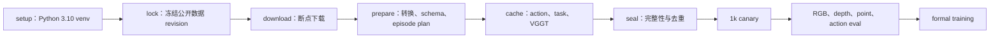

# WM3D-V7

WM3D-V7 是原生 3D 世界模型。模型在显式时空 3D lattice 上联合预测未来 RGB、depth、
point、camera 和 grouped action。仓库提供从公开数据下载、数据转换、离线 cache、
分布式预训练到 checkpoint 评测的完整流程。

入口脚本是 `wm3d_v7/run_v7.sh`。默认配方为约 4.96B 参数、64 或 128 张 H200；
模型规模、数据清单和训练步数都由配置文件定义。

## 从新集群开始

### 1. 集群条件

- Linux x86_64 与 Python 3.10；
- 每节点 8 张 H200 SXM，节点内 NVLink；
- Slurm：`sbatch`、`srun`、`scontrol`；
- `git`、`curl`、`ffmpeg`；
- 所有节点可访问同一共享存储；
- 训练节点间建议使用 400 Gb/s InfiniBand；
- Hugging Face 账号已取得 AgiBot Alpha/Beta 的访问权限。

推荐准备 200 TB 可用空间，其中 80–100 TB 为训练期间的高速热层。64 张 H200
可以运行该配方；128 张 H200 是正式推荐拓扑。

### 2. 克隆代码

```bash
git clone --branch v7 --single-branch --filter=blob:none \
  https://github.com/wxqnl/world_model.git
cd world_model/wm3d_v7
```

### 3. 创建 Hugging Face token 文件

先在 Hugging Face 网页接受 AgiBot Alpha/Beta 的许可。随后把 read token 写入一个
权限为 0600 的文件：

```bash
install -d -m 700 /shared/secrets
umask 077
read -rsp "Hugging Face token: " HF_TOKEN
printf '%s\n' "$HF_TOKEN" > /shared/secrets/huggingface_token
unset HF_TOKEN
chmod 600 /shared/secrets/huggingface_token
```

token 只从该文件读取，不会写入 source lock、Slurm 参数或训练日志。

### 4. 生成站点配置并安装环境

```bash
./run_v7.sh init site.env
```

编辑 `site.env`：

```bash
WORK_ROOT=/shared/wm3d_v7_native5b
HF_TOKEN_FILE=/shared/secrets/huggingface_token
SLURM_PARTITION=h200
SLURM_ACCOUNT=your_account
ACCEPT_DATA_LICENSES=YES
```

`WORK_ROOT` 必须位于所有计算节点可见的共享存储。环境安装使用 Python 3.10 venv，
依赖版本由 `environments/scale5b/requirements.lock` 固定：

```bash
./run_v7.sh setup site.env
./run_v7.sh doctor site.env
```

PyPI 访问较慢时，可以为安装命令指定镜像：

```bash
PIP_INDEX_URL=https://mirrors.aliyun.com/pypi/simple \
  ./run_v7.sh setup site.env
```

## 公开数据清单

基础数据全部从公开仓库下载。当前 5B 配方包含以下数据：

| source | Hugging Face 数据集 | 规划时长 | 下载后目录 |
|---|---|---:|---|
| DROID | [`lerobot/droid_1.0.1`](https://huggingface.co/datasets/lerobot/droid_1.0.1) | 约 350 h | `raw/snapshots/droid` |
| Bridge V2 | [`ember-lab-berkeley/bridge_v2`](https://huggingface.co/datasets/ember-lab-berkeley/bridge_v2) | 约 100 h | `raw/snapshots/bridge` |
| RoboCasa365 Atomic | [`robocasa365-pretrain-atomic`](https://huggingface.co/datasets/ember-lab-berkeley/robocasa365-pretrain-atomic) | 约 21 h | `raw/snapshots/atomic` |
| RoboCasa365 Composite | [`robocasa365-pretrain-composite`](https://huggingface.co/datasets/ember-lab-berkeley/robocasa365-pretrain-composite) | 约 383 h | `raw/snapshots/composite` |
| RoboCasa365 MG | [`robocasa365-pretrain-mg`](https://huggingface.co/datasets/ember-lab-berkeley/robocasa365-pretrain-mg) | 约 1,615 h | `raw/snapshots/mg` |
| AgiBotWorld2026 真机数据 | [`agibot-world/AgiBotWorld2026`](https://huggingface.co/datasets/agibot-world/AgiBotWorld2026) | 约 661 h | `raw/snapshots/agibot_world_2026_snapshot` |
| AgiBotWorld Beta | [`agibot-world/AgiBotWorld-Beta`](https://huggingface.co/datasets/agibot-world/AgiBotWorld-Beta) | 2,976.4 h | `raw/snapshots/agibot_beta_snapshot` |

规划总量约 **6,106.4 小时**。AgiBotWorld2026 的 Imitation Learning、Rich
Interaction 和 Reinforcement Learning 真机部分进入训练，Simulation 不在当前配方中。
AgiBot Alpha 快照只提供 Beta 官方转换器。

DROID、Bridge、Atomic、Composite、MG 延续 V7 五路数据定义。它们在总采样周期中
占 40%，内部相对比例保持 35/15/10/20/20；AgiBot 数据占 60%。精确权重位于
`configs/scale5b/dataset_inventory_public6106h.template.yaml`。

### 下载、转换和 cache

一条命令完成公开快照下载和全部数据处理：

```bash
./run_v7.sh data site.env
```

该命令执行：

1. 查询每个 Hugging Face 仓库的 40 位 commit SHA；
2. 写入 `WORK_ROOT/release/raw_sources.lock.yaml`；
3. 断点下载八个不可变快照，其中一份包含官方转换器；
4. 安全解包 AgiBotWorld2026，转换 AgiBot Beta；
5. 审计每个 LeRobot source 的 RGB、action、时间戳和 episode schema；
6. 生成统一 episode plan 与 embodiment-aware grouped action；
7. 统计 action 分布，生成 task cache 和 VGGT 3D cache；
8. 合并 shard，检查缺失、重复和覆盖率，发布 dataset seal。

单独下载或续传某个 source 时，先生成 lock，再指定 source：

```bash
./run_v7.sh plan site.env
source site.env

"$PYTHON_BIN" scripts/scale5b/pipeline_native5b.py \
  lock --site "$PWD/site.env"

"$PYTHON_BIN" scripts/scale5b/download_raw_snapshots.py \
  --lock "$RELEASE_ROOT/raw_sources.lock.yaml" \
  --raw-root "$RAW_ROOT/snapshots" \
  --source droid \
  --resume
```

`--source` 可取 `droid`、`bridge`、`atomic`、`composite`、`mg`、
`agibot_world_2026_snapshot`、`agibot_beta_snapshot` 或
`agibot_alpha_converter_snapshot`。

处理完成后的关键目录：

```text
WORK_ROOT/
├── raw/
│   ├── snapshots/       # 绑定 commit SHA 的公开原始快照
│   └── materialized/    # AgiBot 解包和转换结果
├── datasets/
│   ├── v7_native5b_public6106h_v1/
│   │   ├── control/     # dataset contract、episode plan、采样和 action 统计
│   │   ├── shards/      # 训练 cache
│   │   └── receipts/    # source scan、worker 和 dataset seal
│   └── v7_native5b_encoder_assets_v1/
├── release/             # source lock、代码与环境 receipt、物化配置
├── runs/                # checkpoint
└── logs/
```

正式训练以
`WORK_ROOT/datasets/v7_native5b_public6106h_v1/receipts/dataset_seal.json`
为数据入口。规划小时数用于容量估算；source scan 和 dataset seal 中的实测帧数与时长
是正式统计。

## Pipeline



### 小数据全流程验证

在正式下载数十 TB 数据前，可以先在一台机器上验证完整软件链。下面的命令会创建独立
Python 3.10 venv，下载固定 revision 的 ALOHA 公开数据（约 91 MB），生成真实 VGGT
cache，再用 GPU0–1 对完整约 4.96B core 做一步 FSDP2 训练和一步 checkpoint eval：

```bash
./run_v7.sh smoke /shared/wm3d_v7_smoke
```

如果机器已有固定 revision 的 VGGT 模型快照，可以避免重复下载：

```bash
VGGT_MODEL_SNAPSHOT=/abs/hf-cache/models--facebook--VGGT-1B/snapshots/860abec7937da0a4c03c41d3c269c366e82abdf9 \
  ./run_v7.sh smoke /shared/wm3d_v7_smoke
```

该入口固定检查本机地址、GPU0–1 空闲状态、ECC 和磁盘余量，不会抢占已有进程。最终
证据在 `/shared/wm3d_v7_smoke/smoke_report.json`，同时包含原始数据 revision、dataset
seal、精确参数量、step-1 checkpoint 哈希和 eval 指标。这是基础设施正确性验证，不是
模型质量结论；正式训练仍使用 T24/P144/K16/D2048 和 64/128 张 H200 配方。

查看完整命令而不提交任务：

```bash
./run_v7.sh plan site.env
```

从环境安装一路运行到正式训练：

```bash
./run_v7.sh all site.env
```

也可以分阶段执行：

```bash
./run_v7.sh setup site.env
./run_v7.sh data site.env
./run_v7.sh train site.env
./run_v7.sh status site.env
```

每个阶段发布 receipt。相同命令会验证已有结果并续传缺失 shard。训练恢复只选择带
`COMMITTED.json` 的最高编号 checkpoint。

## 5B 配方

配置文件：

- `configs/scale5b/wm3d_v7_native5b_h200.template.yaml`
- `configs/scale5b/wm3d_v7_native5b_h200_canary1k.template.yaml`
- `configs/examples/v7_native5b_h200.env`

核心时空参数：

| 参数 | 值 | 设计目的 |
|---|---:|---|
| `T` | 24 | 5 Hz 下使用 4.8 秒历史 |
| `P` | 144 | 每帧 12×12 原生空间格 |
| `K` | 16 | 显式预测未来 3.2 秒 |
| 外部 token `D` | 2048 | 对齐 VGGT/cache 接口 |
| state hidden/layers | 2560 / 32 | 承载 RGB、depth、point、camera 的世界状态动力学 |
| action hidden/layers | 2048 / 24 | 建模多 embodiment、可变维 grouped action |
| state↔action bridge | 10 层 | 在深层交换世界状态与动作信息 |

模型精确参数量为 **4,956,589,929**：

| 模块 | 参数量 | 占比 |
|---|---:|---:|
| world state trunk | 3,250,831,360 | 65.5860% |
| grouped-action trunk | 1,195,474,944 | 24.1189% |
| state↔action bridge | 424,719,360 | 8.5688% |
| 接口、memory、位置与 query | 55,055,872 | 1.1108% |
| 三视角 fuser | 16,783,360 | 0.3386% |
| RGB head | 9,357,443 | 0.1888% |
| depth/point/camera/confidence head | 3,959,840 | 0.0799% |
| action distribution head | 407,750 | 0.0082% |

约 65.6% 参数用于 world state trunk，约 24.1% 用于 action trunk。RGB、depth、
point 和 camera 共享未来原生 3D state，动作则由独立时序主干建模。长度
`(T+K)×P = 5,760` 的 lattice 使用帧内空间 attention、同 patch 因果时间
attention 和低频 memory。

复核参数预算：

```bash
source site.env
export PYTHONPATH="$PWD"
"$PYTHON_BIN" scripts/scale5b/report_parameter_budget.py \
  --config configs/scale5b/wm3d_v7_native5b_h200.template.yaml
```

## 训练与评测

`./run_v7.sh train site.env` 先运行 1,000-step 全拓扑 canary。canary 完成后执行
RGB、depth、point 和 action eval；门禁通过后提交正式训练。

对任意完整 checkpoint 运行评测：

```bash
./run_v7.sh eval site.env \
  /shared/wm3d_v7_native5b/runs/RUN/checkpoints/step_XXXXXXXX
```

正确性检查包括：

- checkpoint 目录包含 `COMMITTED.json`；
- eval `report.json` 中所有指标 finite；
- RGB、depth、point、action 的监督覆盖率非零；
- `rgb_target_top_prediction_bottom.png` 上排为真值、下排为预测；
- checkpoint 绑定同一份 dataset seal、代码 receipt、环境 receipt 和 run lineage。

固定验证集可用于比较 RGB PSNR 与边缘频谱、depth/point 误差、action NLL。机器人
闭环成功率由下游 benchmark 单独评估。

## 常用排查

- `site.env 缺少 ...`：补全站点配置中的必填值；
- `HF_TOKEN_FILE 权限`：执行 `chmod 600 TOKEN_FILE`；
- `revision 漂移`：检查 `release/raw_sources.lock.yaml` 与当前模板；
- `已有目录但没有 receipt`：保留目录并用同一命令加 `--resume`；
- `No space`：扩容共享存储后继续相同阶段；
- Slurm 任务状态：`./run_v7.sh status site.env`。
