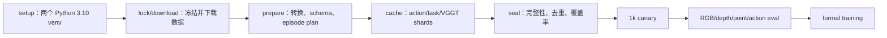

# WM3D-V7

本分支只维护 **WM3D-V7 原生 3D 世界模型**的预训练代码。模型在线部分不依赖
Wan、Qwen、VLA 或 V8；VGGT 和文本编码器只在离线 cache 阶段生成观测证据。
训练、恢复和评测都只认带 `COMMITTED.json` 的编号 checkpoint。

仓库只有一个公开入口：`wm3d_v7/run_v7.sh`。下面的 5B/H200 配方是 V7 的一个
大规模示例，不代表 V7 只能训练 5B。

## 从一台新服务器开始

### 1. 系统前置条件

- Linux x86_64，Python 3.10；
- NVIDIA driver 能运行 CUDA 12.8 wheel，计算节点有 H200/NVLink；
- Slurm 命令 `sbatch`、`srun`、`scontrol`；
- `git`、`curl`、`ffmpeg`；
- 节点间共享存储与 400 Gb/s InfiniBand；
- Hugging Face 账号已接受 AgiBot Alpha/Beta 的数据许可。

不需要 Docker、Conda 或 micromamba。脚本会创建两个普通 venv：主训练环境和
AgiBot 官方转换器环境，后者单独隔离是为了避免旧版 LeRobot 依赖污染训练环境。

如果集群访问官方 PyPI 很慢，可以只在安装命令前临时指定站点镜像；锁文件中的版本
和 wheel SHA 校验仍然生效：

```bash
PIP_INDEX_URL=https://mirrors.aliyun.com/pypi/simple ./run_v7.sh setup site.env
```

### 2. 克隆并生成站点配置

```bash
git clone --branch v7 --single-branch --filter=blob:none \
  https://github.com/wxqnl/world_model.git
cd world_model/wm3d_v7

./run_v7.sh init site.env
```

编辑 `site.env` 中标为“必填”的项目：

- `WORK_ROOT`：共享高速存储根目录；
- `LEGACY_ROOT`：现有 V7 formal 数据根目录；
- `LEGACY_MANIFEST_FULL`：现有 V7 全量 episode manifest；
- `HF_TOKEN_FILE`：只含一行 token 的普通文件，执行 `chmod 600`；
- `SLURM_PARTITION` / `SLURM_ACCOUNT`；
- 接受许可后将 `ACCEPT_DATA_LICENSES=YES`。

先检查站点参数，再运行全流程：

```bash
./run_v7.sh setup site.env
./run_v7.sh plan site.env       # 只打印完整命令，不下载、不提交任务
./run_v7.sh doctor site.env
./run_v7.sh data site.env
./run_v7.sh train site.env
```

也可以一条命令执行以上过程：

```bash
./run_v7.sh all site.env
```

`train` 会先等待 1,000-step 全拓扑 canary 和显式 RGB/depth/point/action eval
通过，再异步提交正式训练，不会跳过 canary。查看状态：

```bash
./run_v7.sh status site.env
```

## 数据会下载和处理什么

`./run_v7.sh data site.env` 会依次完成版本冻结、断点下载、安全解包、AgiBot 转换、
schema 审计、action 统计、任务文本 cache、VGGT cache、全量 merge 和 dataset seal。
上游浮动分支只在首次运行时解析一次，之后全部绑定到 40 位 commit SHA。

| 数据 | 获取方式 | 规划大小 | 规划时长 |
|---|---|---:|---:|
| 现有 V7 residual | 从项目内部存储复制 | 依站点现状 | 约 397 h |
| RoboCasa365 full MG | 脚本从 HF 下载 | 约 315 GB | 约 1,615 h |
| AgiBotWorld2026 真机部分 | 脚本从 HF 下载 | 约 10.7 TB 有效载荷 | 约 661 h |
| AgiBotWorld Beta | 脚本从 HF 下载并转换 | 约 48.1 TB | 2,976.4 h |
| AgiBot Alpha 转换器 | 只下载固定转换脚本 | 很小 | 不计训练时长 |

规划总量约 **5,649.4 h**。小时数只用于采购；最终以 source scan 和 dataset seal
中的实测帧数为准。AgiBotWorld2026 的 simulation 默认排除。旧 V7 中约 98 h 的
RoboCasa 40k 子集会从 residual manifest 剔除，再用 full MG 替换，避免重复计数。

现有 V7 residual 是唯一不能由公开下载器重建的输入，因为其来源和许可由项目内部
维护。新集群必须先复制 `LEGACY_ROOT` 与 `LEGACY_MANIFEST_FULL`；缺失时 pipeline
会直接报错，不会悄悄缩小数据集。

推荐空间：至少 100 TB 当前可用；正式 5,000–8,000 h 方案准备 200 TB usable，
其中 80–100 TB 为 NVMe 热层。原始下载、转换副本、cache、checkpoint 和失败临时目录
都要计入容量。

## Pipeline 的实际顺序



每一阶段都写不可变 receipt。中断后重新运行相同命令，只会验证已完成阶段并补齐缺失
shard；不会覆盖已有 shard。训练恢复只选择最高的完整编号 checkpoint，不读取
`latest`。

## 5B/H200 示例配置

站点示例在 `wm3d_v7/configs/examples/v7_native5b_h200.env`，训练模板由入口脚本内部
选择。推荐 16×8 H200，最低 8×8 H200；默认 BF16、FSDP2、逐层 activation
checkpoint、分片 optimizer/checkpoint。

| 参数 | 5B 示例 | 原因 |
|---|---:|---|
| `T` | 24 | 5 Hz 下 4.8 秒上下文，覆盖更多接触前因 |
| `P` | 144 | 每帧 12×12 原生空间格，改善小物体和边缘 |
| `K` | 16 | 显式预测未来 3.2 秒，不局限 K=8 |
| 外部 token `D` | 2048 | 与 VGGT/cache 接口一致，避免无信息的 I/O 膨胀 |
| state hidden/layers | 2560 / 32 | 主要容量放在原生世界状态动力学 |
| action hidden/layers | 2048 / 24 | action 是独立动力学主干，不是小型末端 head |
| state↔action bridge | 10 层 | 世界状态与动作在深层反复交互 |

精确参数总数是 **4,956,589,929**：

| 模块 | 参数量 | 占比 |
|---|---:|---:|
| 原生 world state trunk | 3,250,831,360 | 65.5860% |
| grouped-action trunk | 1,195,474,944 | 24.1189% |
| 10 个 state↔action bridge | 424,719,360 | 8.5688% |
| 接口、memory、位置与 query | 55,055,872 | 1.1108% |
| 三视角 fuser | 16,783,360 | 0.3386% |
| 显式 RGB head | 9,357,443 | 0.1888% |
| depth/point/camera/confidence head | 3,959,840 | 0.0799% |
| 动作分布 head | 407,750 | 0.0082% |

约 65.6% 参数给 state trunk，是为了让 RGB、depth、point 和 camera 共享同一个未来
原生 3D state；约 24.1% 给 action trunk，使双臂、夹爪、底盘、腰和头部动作拥有真正
的时序动力学。5B 示例不是视频生成器，也不是在 VLM 上接 action head。

`(T+K)×P = 5,760` 个位置不会使用全局 dense attention：每层采用帧内空间 attention
和同 patch 因果时间 attention，并通过低频 memory 承载 30–60 秒历史。这既保留
显式时空 lattice，也避免 `5,760²` 的计算量。

复核参数预算：

```bash
cd world_model/wm3d_v7
source site.env
export PYTHONPATH="$PWD"
"$PYTHON_BIN" scripts/scale5b/report_parameter_budget.py \
  --config configs/scale5b/wm3d_v7_native5b_h200.template.yaml
```

## 如何判断训练是正确的

1. `data` 结束后必须存在 `DATASET_ROOT/receipts/dataset_seal.json`；
2. canary 必须自然生成 `checkpoints/step_00001000/COMMITTED.json`；
3. eval 的 `report.json` 中所有指标 finite，RGB/depth/point/action 监督覆盖率非零；
4. `rgb_target_top_prediction_bottom.png` 上排是真值、下排是预测，用于发现黑图、常量图
   和明显模糊；
5. 只有以上检查通过，入口脚本才会提交正式训练。

对任意完整 checkpoint 手工评测：

```bash
./run_v7.sh eval site.env \
  /shared/wm3d_v7_native5b/runs/RUN/checkpoints/step_XXXXXXXX
```

这里的 eval 是正确性门禁，不冒充最终 benchmark。模型优劣需要在固定验证集上比较
RGB PSNR/边缘频谱、depth/point 误差、action NLL 与机器人闭环成功率。

## 常见失败

- `site.env 缺少 ...`：补全示例配置中的必填值；
- `HF_TOKEN_FILE 权限`：执行 `chmod 600 TOKEN_FILE`；
- `revision 漂移`：不要手改已生成 lock，换新 `WORK_ROOT` 重新冻结；
- `已有但没有 receipt`：保留现场，检查失败 shard 后重跑同一命令；
- `No space` 或 preflight 失败：扩容后重跑，不降低安全门槛。

内部脚本保留在 `scripts/scale5b/` 是因为它们实现当前 5B 示例；使用者不需要逐个调用。
日常只使用 `run_v7.sh`、一个 `site.env` 和明确编号 checkpoint。
