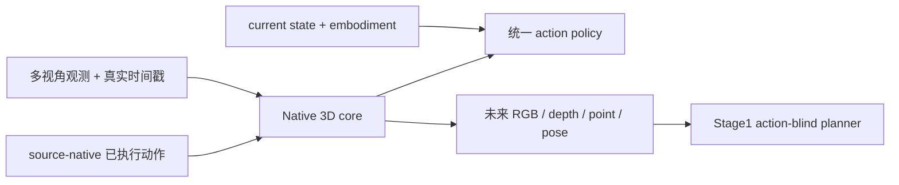

# WM3D

WM3D 是动作条件的原生 3D 世界模型。模型使用真实时间戳，在显式 3D 状态上预测未来
native token、RGB、depth、point 和 camera pose，并由同一核心输出可执行的 grouped
robot action。1B 与 5B 共享模型类、数据 ABI、训练器和 checkpoint 合同，只选择不同
profile。



## 核心设计

- world、action 和 current-state 保留数据源真实时间戳，不使用全局固定 Hz。
- dynamics 使用真实执行过的 source-native fine command；policy 与 factual dynamics
  state 分离，避免未来动作泄漏。
- grouped action/current-state ABI 表达单臂、双臂、底盘、腰部、头部和可变维度。
- RGB、depth、point、pose 是显式监督和显式输出，不存在 VLA/WAN action 旁路。
- Stage0 是联合世界动力学与 action policy 预训练；Stage1 冻结 Stage0，用真实 simulator
  candidates 和 native 3D future evidence 学习候选排序。
- DDP/FSDP2 共用训练入口；DCP 支持完整编号 checkpoint、独立进程 exact resume 和受控
  topology reshard。

## 目录

```text
wm3d/
├── configs/             # 数据、adapter、encoder、模型、runtime、objective、Stage1 profile
├── docs/                # 从零操作、扩展设计、归一化、Stage1 与发布验收
├── environments/        # Python 依赖锁和环境引导脚本
├── scripts/             # 下载、audit、cache、seal、runtime、eval 与 Stage1 工具
├── tests/               # 数据、模型、分布式与端到端合同回归
├── wm3d/
│   ├── data/            # manifest、adapter、grouped robot、cache 与 sampler
│   ├── encoders/        # VGGT 与任务 encoder
│   ├── models/          # 1B/5B 共用 native world model
│   ├── stage1_planner/  # 冻结 Stage0 的规划阶段
│   └── training/        # FSDP2/DDP、DCP、Stage0 与 offline eval
├── README.md
└── run_wm3d.sh          # 唯一用户入口
```

各主要目录中的 `CODING.md` 说明职责、边界和修改规则。旧 receipt/schema 中的
`wm3d_v8_*` 字符串是已经发布的磁盘 ABI 版本，只为兼容已有资产保留；新项目命名、
Python 包、脚本和文档统一使用 `WM3D` / `wm3d`。

## 环境

推荐 Linux x86_64、Python 3.10、PyTorch 2.7.1 和 CUDA 12.8。正式多机运行要求共享
存储、节点内 NVLink、节点间 InfiniBand，以及足够的 cache/checkpoint 空间。

```bash
git clone --branch v8 --single-branch https://github.com/wxqnl/world_model.git
cd world_model/wm3d
./run_wm3d.sh env
source .venv/bin/activate
PYTHON_BIN=.venv/bin/python ./run_wm3d.sh check
```

依赖由 `environments/requirements.lock` 固定；环境引导会执行 `pip check` 并生成不可覆盖
的环境 receipt。CUDA wheel 与集群驱动不匹配时应显式调整 index，不能伪装环境证据。

## 数据 pipeline

正式顺序为：

```text
source revision/file list lock
→ 断点下载及必要的冻结 converter
→ schema inspection + 人工确认 adapter 语义
→ source inventory + sealed data profile
→ task embedding bank
→ episode cache plan / workers / seal
→ window index + grouped normalization
→ sealed runtime
```

完整命令见 [从零数据、训练与评测](docs/WM3D_FROM_ZERO.md)。adapter 的单位、坐标系、
gripper 极性、group 边界和 fine/coarse supervision 必须人工确认；代码不会猜测。

默认正式数据模板为
`configs/data/public_robot_5649h_legacy_compatible.template.yaml`。它保留已交付数据家庭、
小时预算和采样权重，但所有样本都重新进入当前 grouped action/current-state/native-time
ABI。旧 residual 只能由 `legacy-residual-import` 审计并转换，不能直接读取旧 cache。

## 真实小样本验收

在正式训练前，用两张空闲 GPU 从冻结的公开 ALOHA 小样本真实跑通环境、下载、adapter、
cache、Stage0 训练、独立进程恢复和离线评测：

```bash
./run_wm3d.sh smoke-real \
  --work-root /data/wm3d_smoke \
  --gpus 0,1 \
  --operator "$USER" \
  --accept-dataset-license \
  --confirm-adapter-semantics
```

该命令验证基础设施正确性，不代表模型质量。细节见
[真实公开小样本验收](docs/WM3D_REAL_SMOKE.md)。

## Stage0 训练与评测

模型、数据和运行拓扑是相互独立的 profile。先物化 sealed runtime，再在每台节点运行
preflight，之后使用相同 rendezvous 参数启动训练：

```bash
./run_wm3d.sh preflight \
  --nnodes="$NNODES" --nproc_per_node="$GPUS_PER_NODE" --node_rank="$NODE_RANK" \
  --master_addr="$MASTER_ADDR" --master_port="$PREFLIGHT_PORT" -- \
  --runtime "$SEALED_RUNTIME"

./run_wm3d.sh train \
  --nnodes="$NNODES" --nproc_per_node="$GPUS_PER_NODE" --node_rank="$NODE_RANK" \
  --master_addr="$MASTER_ADDR" --master_port="$TRAIN_PORT" -- \
  --runtime "$SEALED_RUNTIME" --stop-after-step "$STOP_STEP"

./run_wm3d.sh eval \
  --nnodes="$NNODES" --nproc_per_node="$GPUS_PER_NODE" --node_rank="$NODE_RANK" \
  --master_addr="$MASTER_ADDR" --master_port="$EVAL_PORT" -- \
  --runtime "$SEALED_RUNTIME" \
  --checkpoint "$RUN_ROOT/checkpoints/step_XXXXXXXX" \
  --output "$RUN_ROOT/eval_step_XXXXXXXX.json"
```

恢复必须指向含 `COMMITTED.json` 的完整编号 DCP，不接受 `latest`。128×H200 正式训练按
canary → validation → formal 逐级提升。第一次接手集群运行时直接使用
[5B 从数据到 10K 验证训练](docs/WM3D_5B_SCALING.md)；模型规模和分布式设计见
[统一训练与扩展](docs/WM3D_SCALING.md)。

## Stage1 规划

Stage1 只加载同一 sealed Stage0 runtime 和 committed DCP。完整入口为：

```text
stage1-seal-selection
→ stage1-replay-authority
→ stage1-audit-rollouts
→ stage1-produce
→ stage1-materialize
→ stage1-train
→ stage1-eval
```

planner 不读取 candidate action；动作只用于外部可审计 cost。真实 simulator replay、native
evidence、DCP exact resume 和完整 split gate 见
[Stage1 统一原生 3D 规划](docs/WM3D_STAGE1_UNIFIED.md)。

## 发布门禁

```bash
PYTHON_BIN=.venv/bin/python ./run_wm3d.sh check
```

发布提交必须在 clean tree 上无筛选通过静态检查和全部测试。真实训练证据、能力结论边界
以及 1B/5B 资源验收见 [发布验收](docs/WM3D_RELEASE_VALIDATION.md)。
