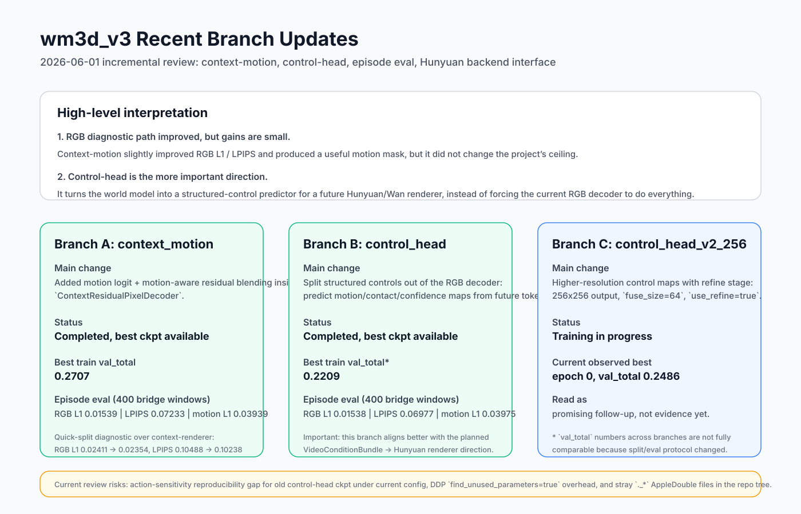
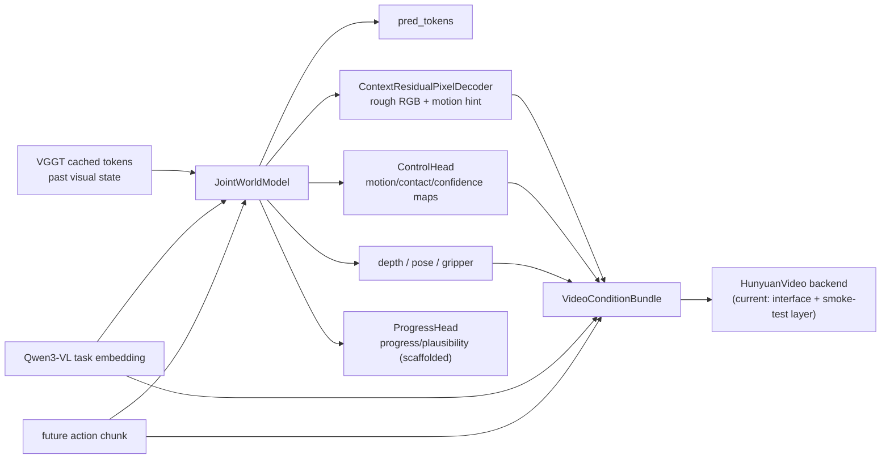

# wm3d_v3 Recent Updates Review

**Date:** 2026-06-01  
**Audience:** project lead / incremental update  
**Scope:** review the latest architectural changes after the first `context_renderer` report, summarize what actually improved, and identify the remaining engineering gaps.

## TL;DR

- The project has moved from a single rough RGB decoder toward a **structured-control world model**.
- The latest meaningful changes are:
  - `context_motion`: motion-aware residual rendering inside the RGB head
  - `control_head`: separate motion/contact map prediction from future tokens
  - `episode split`: evaluation no longer relies only on random window split
  - `action_sensitivity`: counterfactual action benchmark scaffold is in place
  - `video_backends`: Hunyuan backend interface is wired for the next RGB stage
- The practical conclusion is now clearer than before:
  - **`context_motion` is directionally correct but only a small gain**
  - **`control_head` is the more important architectural step**, because it matches the long-term path of `world model -> structured controls -> pretrained video backend`
- There are still two concrete engineering issues to close:
  - evaluation reproducibility for older `control_head` checkpoints under the current config
  - repo hygiene / config drift around recent local file syncs

## What Changed Since the Last Report

The current delta is shown below.



At a system level, the model is no longer just:

```text
past tokens + task + future action -> future tokens/depth/rough RGB
```

It is now becoming:



The full base architecture from the previous report still applies:


## Review Findings

### 1. Evaluation reproducibility is not closed for old `control_head` checkpoints

This is the main review issue.

`action_sensitivity.py` rebuilds the model from the **current live config** and then strict-loads the checkpoint state dict:

- [`wm3d_v3/eval/action_sensitivity.py`](/Users/apple/Documents/New-H100-3/wm3d_v3/eval/action_sensitivity.py:238)

At the same time, the current `ControlHeadConfig` now defaults to `use_refine=True` with a refine tower when `output_size > fuse_size`:

- [`wm3d_v3/models/control_head.py`](/Users/apple/Documents/New-H100-3/wm3d_v3/models/control_head.py:35)
- [`wm3d_v3/models/control_head.py`](/Users/apple/Documents/New-H100-3/wm3d_v3/models/control_head.py:98)

But the original `control_head` training config does not pin that setting explicitly:

- [`configs/v3_p64_140m_actioncond_control_head.yaml`](/Users/apple/Documents/New-H100-3/configs/v3_p64_140m_actioncond_control_head.yaml:36)

As a result, a smoke rerun of action-sensitivity on the old `control_head` best checkpoint currently fails with missing `control_head.refine.*` weights. That means the training result exists, but the evaluation path is not fully reproducible from the current code/config pair.

**Interpretation:** this is not a modeling failure. It is a config/versioning gap and should be fixed before we rely on the benchmark outputs for decision-making.

### 2. Repo hygiene is currently noisy

The repo contains many stray `._*` AppleDouble files after recent file syncs, for example:

- [`wm3d_v3/video_backends/._hunyuan_video.py`](/Users/apple/Documents/New-H100-3/wm3d_v3/video_backends/._hunyuan_video.py:1)
- [`configs/._v3_p64_140m_actioncond_control_head.yaml`](/Users/apple/Documents/New-H100-3/configs/._v3_p64_140m_actioncond_control_head.yaml:1)
- [`tests/._test_action_sensitivity.py`](/Users/apple/Documents/New-H100-3/tests/._test_action_sensitivity.py:1)

These are metadata artifacts, not source files. They do not change model behavior directly, but they make repo inspection noisier and can interfere with broad file operations.

### 3. The current `control_head` configs still carry unnecessary DDP overhead

The active control-head configs set:

- [`configs/v3_p64_140m_actioncond_control_head.yaml`](/Users/apple/Documents/New-H100-3/configs/v3_p64_140m_actioncond_control_head.yaml:57)
- [`configs/v3_p64_140m_actioncond_control_head_v2_256.yaml`](/Users/apple/Documents/New-H100-3/configs/v3_p64_140m_actioncond_control_head_v2_256.yaml:62)

to `find_unused_parameters: true`.

But the current training log for `control_head_v2_256` reports:

```text
find_unused_parameters=True was specified ... but did not find any unused parameters
```

So the branch is paying extra DDP traversal cost without evidence that it still needs it.

## What The New Branches Actually Do

### A. `context_motion`: make the RGB head explicitly motion-aware

Config:

- [`configs/v3_p64_140m_actioncond_context_motion.yaml`](/Users/apple/Documents/New-H100-3/configs/v3_p64_140m_actioncond_context_motion.yaml:1)

Core changes:

- enable motion prediction inside `ContextResidualPixelDecoder`
- add motion-aware residual blending
- add motion BCE / Dice supervision in the loss

Relevant code:

- [`wm3d_v3/models/context_residual_pixel_decoder.py`](/Users/apple/Documents/New-H100-3/wm3d_v3/models/context_residual_pixel_decoder.py:1)
- [`wm3d_v3/losses.py`](/Users/apple/Documents/New-H100-3/wm3d_v3/losses.py:1)

Observed result:

- best checkpoint: `results/wm3d_v3_p64_140m_actioncond_context_motion/ckpt/best.pt`
- best `val_total`: `0.2707`
- episode eval on 400 bridge windows:
  - `L_rgb_L1 = 0.01539`
  - `LPIPS = 0.07233`
  - `motion L1 = 0.03939`

Interpretation:

- This branch improves the diagnostic renderer in the right direction.
- The motion hint is useful as a **dynamic-region mask**.
- It still does not fundamentally solve the long-term RGB problem.

### B. `control_head`: separate structured controls from rough RGB

Config:

- [`configs/v3_p64_140m_actioncond_control_head.yaml`](/Users/apple/Documents/New-H100-3/configs/v3_p64_140m_actioncond_control_head.yaml:1)

Core idea:

- keep the world model predicting future tokens and depth
- add a dedicated head that predicts:
  - `motion_hint`
  - `contact_hint`
  - `control_confidence`
- stop asking the rough RGB decoder to be the only carrier of motion/object structure

Relevant code:

- [`wm3d_v3/models/control_head.py`](/Users/apple/Documents/New-H100-3/wm3d_v3/models/control_head.py:1)
- [`wm3d_v3/models/joint_model.py`](/Users/apple/Documents/New-H100-3/wm3d_v3/models/joint_model.py:1)

Observed result:

- best checkpoint: `results/wm3d_v3_p64_140m_actioncond_control_head/ckpt/best.pt`
- best `val_total`: `0.2209`
- episode eval on 400 bridge windows:
  - `L_rgb_L1 = 0.01538`
  - `LPIPS = 0.06977`
  - `motion L1 = 0.03975`

Interpretation:

- The diagnostic RGB numbers are similar to `context_motion`.
- The more important gain is architectural: we now have a **clean structured-control interface** that a Hunyuan/Wan backend can consume.
- This is much closer to the intended end-state than continuing to over-optimize the current rough RGB decoder.

### C. `control_head_v2_256`: higher-resolution control maps

Config:

- [`configs/v3_p64_140m_actioncond_control_head_v2_256.yaml`](/Users/apple/Documents/New-H100-3/configs/v3_p64_140m_actioncond_control_head_v2_256.yaml:1)

What changed:

- `control_output_size: 256`
- `control_hidden: 96`
- explicit refine stage on top of fused control features

Status at review time:

- training is still running
- current observed best is `epoch 0, val_total 0.2486`

Interpretation:

- This branch is still exploratory.
- It is the correct next scaling step for the control path, but not yet a finished conclusion.

### D. `progress_head`: scaffolded but not active in training yet

Relevant code:

- [`wm3d_v3/models/progress_head.py`](/Users/apple/Documents/New-H100-3/wm3d_v3/models/progress_head.py:1)

What it adds:

- per-step progress
- terminal success logit
- plausibility logit

Current status:

- unit-tested
- integrated into `JointWorldModel`
- not yet enabled in the active configs reviewed here

Interpretation:

- This is important for a future `simulate -> evaluate -> revise` loop.
- It is not yet contributing to current experiment results.

## Evaluation and Infrastructure Upgrades

### Episode-level split is now supported

Relevant code:

- [`wm3d_v3/data/splits.py`](/Users/apple/Documents/New-H100-3/wm3d_v3/data/splits.py:1)
- [`tests/test_episode_splits.py`](/Users/apple/Documents/New-H100-3/tests/test_episode_splits.py:1)

Why this matters:

- The old random-window split can leak near-identical windows across train/val.
- Episode split is a more serious offline protocol for long-horizon prediction.

### Counterfactual action benchmark is now in the codebase

Relevant code:

- [`wm3d_v3/eval/action_sensitivity.py`](/Users/apple/Documents/New-H100-3/wm3d_v3/eval/action_sensitivity.py:1)
- [`tests/test_action_sensitivity.py`](/Users/apple/Documents/New-H100-3/tests/test_action_sensitivity.py:1)

What it measures:

- compare prediction under real actions vs zero / shuffled / sign-flipped / scaled / grip-toggled actions
- ask whether the real action keeps the predicted future closer to ground truth

Current status:

- the benchmark code and tests are in place
- current smoke tests for the module pass
- old `control_head` checkpoint reproducibility still needs the config/versioning fix described above

### Hunyuan backend interface now exists

Relevant code:

- [`wm3d_v3/video_backends/base.py`](/Users/apple/Documents/New-H100-3/wm3d_v3/video_backends/base.py:1)
- [`wm3d_v3/video_backends/hunyuan_video.py`](/Users/apple/Documents/New-H100-3/wm3d_v3/video_backends/hunyuan_video.py:1)
- [`tests/test_control_bundle_video_backend.py`](/Users/apple/Documents/New-H100-3/tests/test_control_bundle_video_backend.py:1)

Important limitation:

- current Hunyuan integration is still **interface plumbing + smoke-test path**
- structured controls are summarized into prompt text for now
- there is no learned control adapter into the video backbone yet

That is acceptable for this stage. The point of the current work is to define the interface cleanly before doing the expensive backend integration.

## Current Overall Conclusion

The project direction is now more coherent.

The base world model should remain:

- VGGT-token based
- Qwen-conditioned
- action-conditioned
- depth-aware
- able to emit structured control maps

The current rough RGB decoder should be treated as:

- useful for debugging
- useful for short-horizon visual sanity checks
- **not** the final fidelity path

The most important recent change is therefore **not** the small RGB gain from `context_motion`.  
It is the fact that `control_head` turns the model into a better **conditioning source** for a stronger renderer.

## Immediate Next Steps

1. Fix checkpoint/config reproducibility for `control_head` evaluation.
   - Either pin all control-head architecture flags explicitly in config, or persist the resolved model config with the checkpoint and load from that during eval.
2. Finish `control_head_v2_256`, then run:
   - episode eval
   - action-sensitivity
   - demo generation
3. Remove `._*` metadata files and add a guardrail so they do not return.
4. Turn off `find_unused_parameters` for the control-head line if the branch is now structurally clean.
5. Move to the next real milestone:
   - `VideoConditionBundle(context_rgb, depth, motion_hint, contact_hint, action, task)`
   - learned injection into Hunyuan backend

## Verification Notes

I re-ran the recent unit-test surface for the new modules:

```text
pytest tests/test_action_sensitivity.py \
       tests/test_episode_splits.py \
       tests/test_control_bundle_video_backend.py \
       tests/test_control_progress_heads.py -q
```

Result:

```text
21 passed, 2 warnings
```

## Useful Paths

- previous main status doc: [`REPORT_WM3D_STATUS_2026-06-01.md`](/Users/apple/Documents/New-H100-3/REPORT_WM3D_STATUS_2026-06-01.md:1)
- current roadmap note: [`TAU0_STYLE_WM3D_ROADMAP.md`](/Users/apple/Documents/New-H100-3/TAU0_STYLE_WM3D_ROADMAP.md:1)
- Hunyuan plan: [`HUNYUAN_INTEGRATION_PLAN.md`](/Users/apple/Documents/New-H100-3/HUNYUAN_INTEGRATION_PLAN.md:1)
