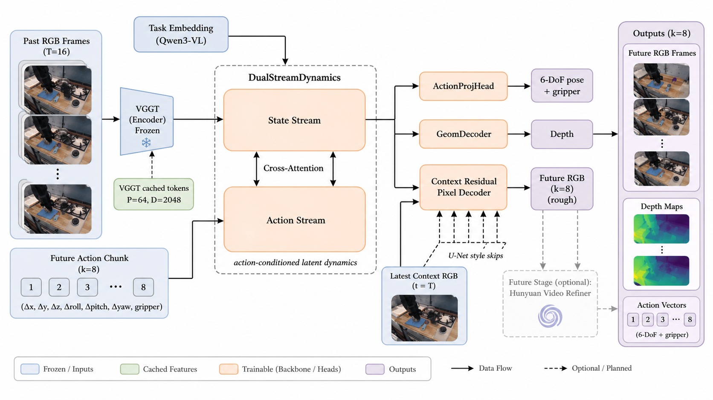
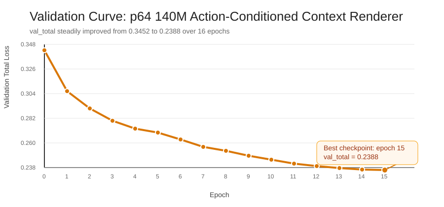
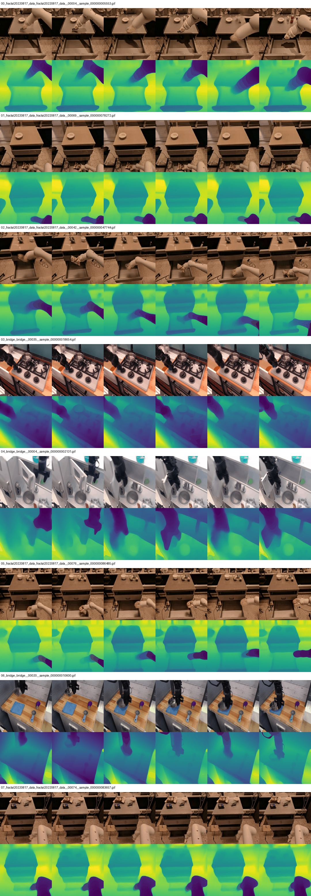

# wm3d_v3 World Model Status

**Date:** 2026-06-01  
**Audience:** project lead / quick status review  
**Status:** action-conditioned `p64` world model is trained and running end-to-end; stage-1 RGB decoder refactor has been completed and evaluated; Hunyuan-based high-fidelity RGB is planned but not yet active.

## TL;DR

- We now have a working **action-conditioned robotics world model** that predicts future latent state, future action, future depth, and rough future RGB from past frames.
- The current active line is a **`p64`, ~135M parameter** model using cached **VGGT** visual tokens, **Qwen3-VL task embeddings**, and future action chunks.
- The latest experiment replaced the old RGB head with a **context residual pixel decoder**. This gives a **real but limited improvement** in RGB quality:
  - On a same-window quick comparison against the previous `138M` baseline, **RGB L1 improved by about 11%**.
  - LPIPS improved slightly.
  - **Motion-region error did not materially improve**, so moving objects, gripper details, and long-horizon blur are still the main bottlenecks.
- Current conclusion: the project has moved beyond “can it predict anything at all” and is now at the stage of **improving motion fidelity and long-horizon stability**.
- The planned long-term RGB path is **world model for structure + pretrained Hunyuan for high-fidelity rendering**.

## What This Project Is Trying to Build

The target is a **robotics world model**: given the past visual context and a task, predict what will happen next under a candidate action sequence.

Concretely, for each training window the model takes:

- `T=16` past RGB frames
- one task embedding from `Qwen3-VL`
- a future action chunk `k=8` containing `6-DoF delta pose + gripper`

and predicts:

- future latent visual tokens
- future robot action outputs
- future depth maps
- rough future RGB frames

The rough RGB is not the final product. It is currently used for:

- qualitative debugging
- short-horizon visual validation
- future conditioning for a higher-fidelity video model

## Current Architecture

The figure below summarizes the current mainline model path. It matches the actual code path in [`wm3d_v3/models/joint_model.py`](/Users/apple/Documents/New-H100-3/wm3d_v3/models/joint_model.py:1), [`wm3d_v3/models/context_residual_pixel_decoder.py`](/Users/apple/Documents/New-H100-3/wm3d_v3/models/context_residual_pixel_decoder.py:1), and [`wm3d_v3/training/train.py`](/Users/apple/Documents/New-H100-3/wm3d_v3/training/train.py:1).



### Main data flow

1. Past RGB frames are encoded offline by **VGGT** into cached pooled tokens `s ∈ R[B,16,64,2048]`.
2. Task text is encoded into a cached **Qwen3-VL task embedding** `c ∈ R[B,2048]`.
3. Future action chunk `a_{t:t+8}` is normalized and passed in as action condition.
4. A **DualStreamDynamics** backbone predicts future latent state tokens while coupling scene dynamics and action dynamics through cross-attention.
5. Three task heads decode the shared latent:
   - `ActionProjHead` -> future `pose + gripper`
   - `GeomDecoder` -> future `depth`
   - `ContextResidualPixelDecoder` -> future rough `RGB`

### Why the new RGB head matters

The old RGB path was:

```text
pred_tokens -> PixelDecoder -> RGB
```

The new stage-1 RGB path is:

```text
pred_tokens + latest context RGB -> ContextResidualPixelDecoder -> RGB
```

This change lets the renderer reuse high-frequency detail from the latest observed frame and only synthesize what needs to change. That is why the arm and scene structure became noticeably more stable.

### Important implementation note

The task-embedding path is wired into the training pipeline, but the current dataset loader still falls back to a zero vector if a cached Qwen embedding is missing. That means:

- the architecture already supports text/task conditioning
- full cache coverage is still an operational item, not a modeling unknown

## Latest Training Run

Main config:

- config: [`configs/v3_p64_140m_actioncond_context_renderer.yaml`](/Users/apple/Documents/New-H100-3/configs/v3_p64_140m_actioncond_context_renderer.yaml:1)
- backbone scale: `p64`, about `135.4M` trainable params
- train windows: `79,473`
- val windows: `4,182`
- training regime: `8x H100`, `bf16`, DDP
- final checkpoint: `epoch 15`
- best validation: `val_total = 0.2388`

Validation curve for the completed run:



Selected qualitative outputs from the latest `best.pt`:



The full auto-generated demo directory is:

`/data/Minko/world_model/wm3d_v3/results/wm3d_v3_p64_140m_actioncond_context_renderer/demo_best_auto_latest`

## What Has Been Completed So Far

### 1. End-to-end action-conditioned world model path is working

This is no longer a partial prototype. The model trains, validates, checkpoints, and auto-generates demos after training.

### 2. Decoder refactor is done

The new context-aware RGB head is integrated into:

- model build
- training loop
- loss computation
- demo generation
- long rollout generation

### 3. Training infrastructure issues were resolved

During this iteration we fixed several practical blockers:

- DDP unused-parameter failure from unsupervised geometry branches
- 8-GPU NCCL failure caused by `NVLS`
- automatic demo generation after training completion

### 4. Hunyuan direction is defined but not yet active

The project already has a concrete plan for using the world model as a conditioning module for a pretrained Hunyuan video model:

- planning note: [`HUNYUAN_INTEGRATION_PLAN.md`](/Users/apple/Documents/New-H100-3/HUNYUAN_INTEGRATION_PLAN.md:1)

The idea is:

```text
world model provides structure / geometry / motion layout
Hunyuan provides high-frequency appearance and video realism
```

## Experimental Findings

### A. Action conditioning is clearly useful

This was already visible qualitatively before the latest run: adding future actions made rollout behavior much more plausible than non-action-conditioned variants.

### B. The new context renderer is a real improvement, but not a breakthrough

Using the same validation windows, a quick comparison between the previous `p64_138m_actioncond_full` baseline and the new `p64_140m_actioncond_context_renderer` model gave:

| Model | RGB L1 | LPIPS | Motion L1 | State MSE |
|---|---:|---:|---:|---:|
| old `138M` baseline | 0.02787 | 0.10878 | 0.05703 | 0.02625 |
| new context renderer | 0.02475 | 0.10659 | 0.05798 | 0.02636 |

Interpretation:

- **overall RGB got better**
- perceptual quality got a little better
- latent dynamics stayed basically the same
- **motion-region quality did not improve enough**

So the change helped scene structure and overall sharpness, but it did **not** solve the core failure mode around:

- gripper detail
- small manipulated objects
- later rollout steps becoming blurry

### C. The current bottleneck is not “train longer”

The model completed the full 16-epoch run and kept improving gradually, but the experimental result indicates that the main limitation is now architectural:

- the renderer still relies too much on copying context and applying a smooth residual
- small moving regions are not being modeled explicitly enough

## Current Risks / Limitations

1. **Moving-object fidelity is still weak.** The arm can be fairly stable while the gripper and manipulated objects remain soft or shape-unstable.
2. **Long-horizon RGB degrades faster than latent/state metrics suggest.** The model can keep scene layout while still losing visual crispness over time.
3. **Task embedding cache coverage is not guaranteed yet.** Missing Qwen cache currently becomes zero embedding.
4. **Current RGB is still supervised regression output, not a pretrained video generator.** Some blur is expected from this design class.

## Recommended Next Step

The next step should be:

**keep the current world-model backbone, but move the RGB path from generic context reuse to motion/object-aware decoding.**

Concretely, the most sensible next experiments are:

1. Add explicit **motion-region supervision** inside the context residual decoder and train that variant, instead of only reweighting RGB loss externally.
2. Focus the renderer on **moving-object masks / blend control**, especially for gripper-object interaction zones.
3. Keep Hunyuan integration as the medium-term high-fidelity path rather than trying to force the current regression decoder to become photo-realistic.

In short:

```text
Current base is good enough for structure and action-conditioned dynamics.
The next modeling gain has to come from better motion-aware rendering,
not from blindly scaling epochs on the current decoder.
```

## Useful Paths

- latest main report: [`REPORT_V3.md`](/Users/apple/Documents/New-H100-3/REPORT_V3.md:1)
- latest context-renderer status note: [`REPORT_WM3D_STATUS_2026-06-01.md`](/Users/apple/Documents/New-H100-3/REPORT_WM3D_STATUS_2026-06-01.md:1)
- main model wiring: [`wm3d_v3/models/joint_model.py`](/Users/apple/Documents/New-H100-3/wm3d_v3/models/joint_model.py:1)
- current RGB decoder: [`wm3d_v3/models/context_residual_pixel_decoder.py`](/Users/apple/Documents/New-H100-3/wm3d_v3/models/context_residual_pixel_decoder.py:1)
- current training loop: [`wm3d_v3/training/train.py`](/Users/apple/Documents/New-H100-3/wm3d_v3/training/train.py:1)
- current loss design: [`wm3d_v3/losses.py`](/Users/apple/Documents/New-H100-3/wm3d_v3/losses.py:1)
