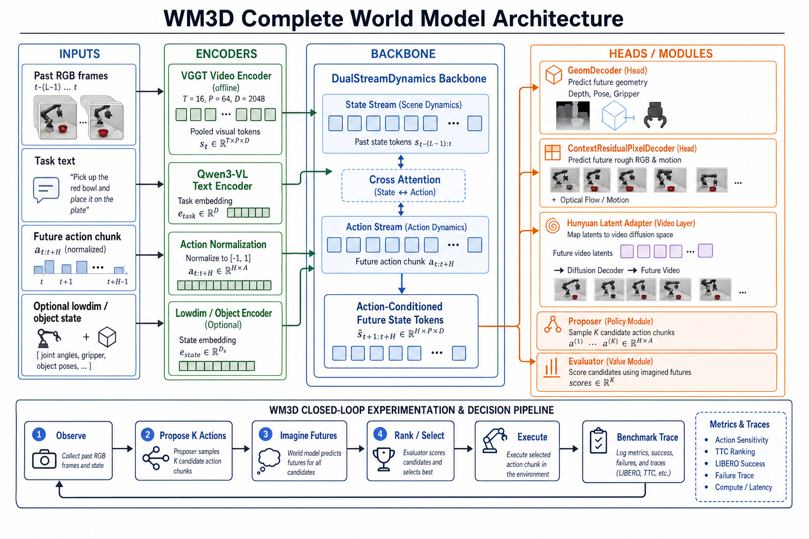
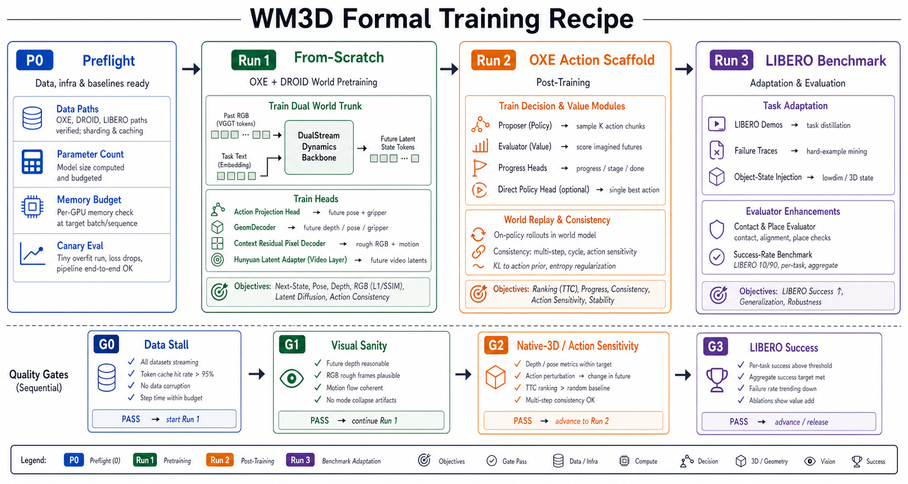
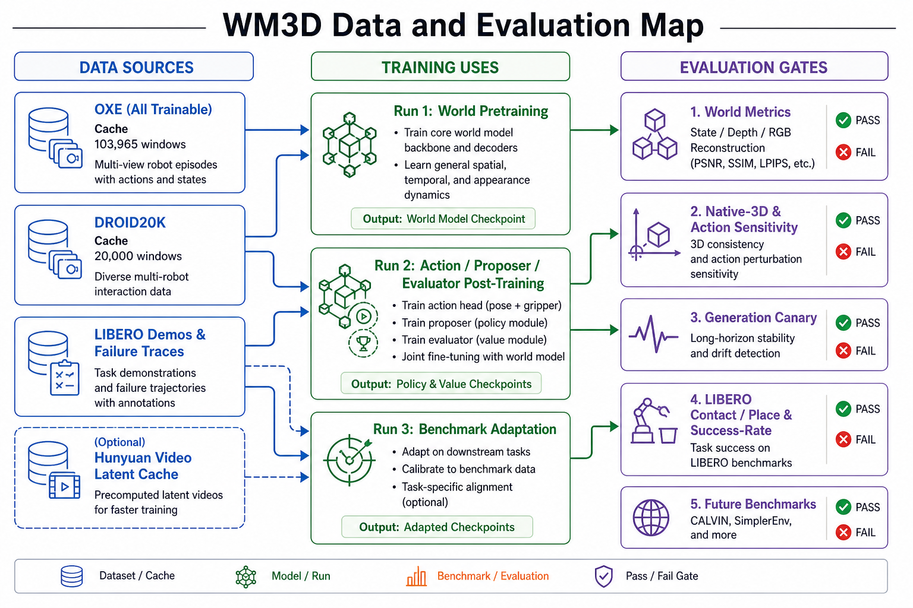

# WM3D World Model 项目迭代记录与规划

> 本文档用于持续记录 `wm3d_v3` world model 的目标、架构、正式训练 recipe、数据设置、benchmark gate 和每日项目状态。当前核心目标是把 VGGT-native action-conditioned simulator 推进成一个接近 tau0-WM 思路的 **world model + VLA 闭环系统**：模型不仅要预测“给定动作后会发生什么”，还要能提出候选动作、想象未来、评估任务进展，并最终在 LIBERO / CALVIN / SimplerEnv 等标准 benchmark 上形成可报告的 success-rate 结果。

## 1. 总览

### 1.1 当前定位

当前系统已经从单一 world-model demo，推进到完整 WM3D 系统雏形：

```text
VGGT-native action-conditioned world model
    + Hunyuan latent video layer
    + proposer / evaluator / direct-policy heads
    + benchmark rollout harness
```

最核心的建模问题仍然是：

```text
past observation + task text + candidate future action
    -> predicted future state / geometry / video controls
    -> candidate action score
    -> selected robot action
```

### 1.2 完整模型架构



### 1.3 正式训练与数据地图





## 2. 当前结论

| 维度 | 当前状态 | 结论 |
|---|---|---|
| 架构 | `VGGT tokens + Qwen3-VL task + action chunk -> DualStreamDynamics -> geom/RGB/Hunyuan/proposer/evaluator` | 完整 world model 架构已经成型 |
| 正式 recipe | `Stage0/1 core 3D -> Run1.5 Hunyuan bridge -> Run2 action scaffold -> Run3 benchmark`，RunG 作为可选 generation | Hunyuan/text generation 已从 core dynamics 主线拆出 |
| 数据 | OXE+DROID20K 原始合并 123,965 windows；balanced manifest 160,000 windows | Run1/Run2 数据采样更均衡 |
| 当前训练 | `140M stage0 visual-depth stabilized continue 10k->20k` 正在 4-node 运行 | 用 140M 快速验证 depth/RGB 稳定 recipe，再推 300M revised flow |
| Benchmark | LIBERO runner/action convention 已由 expert replay 验证 | learned policy 仍未过真实 success gate |
| Scaling | 500M warm-start 被定位为诊断 run | 正式 1B/2B 应从 0 按同一 recipe 做 preflight 后启动 |

## 3. 完整架构

### 3.1 主数据流

| Step | 输入/模块 | 输出 | 说明 |
|---|---|---|---|
| 1 | Past RGB frames | VGGT pooled tokens `[T=16, P=64, D=2048]` | 离线 cache，作为主 world state |
| 2 | Task text | Qwen3-VL task embedding `[D=2048]` | 任务语义条件 |
| 3 | Future action chunk `[k=8, 7D]` | normalized action condition | 训练时用真实未来动作；推理时用候选动作 |
| 4 | DualStreamDynamics | future state tokens | state/action 双流 + cross-attention |
| 5 | Heads | depth / pose / gripper / RGB / motion / Hunyuan latent | world prediction 与 future video controls |
| 6 | Proposer + Evaluator | candidate actions + scores | 支持 `propose -> imagine -> rank -> execute` |
| 7 | Benchmark harness | traces / success / contact-place metrics | LIBERO 当前主线，CALVIN/SimplerEnv 后续接入 |

### 3.2 模块边界

| 模块 | 当前角色 | 是否属于基础 world pretraining |
|---|---|---|
| `dual.` world trunk | 预测未来 VGGT state | 是，Run 1 从 0 训练 |
| `action_proj.` | action-conditioned dynamics auxiliary | 是，Run 1 从 0 训练 |
| `geom.` | future depth / pose / gripper | 是，Run 1 从 0 训练 |
| `context_pixel.` | rough RGB / motion hint | 是，Run 1 从 0 训练 |
| Hunyuan latent adapter | future video latent bridge | Run 1 低权重/可 detached；Run 1.5 单独对齐 bridge |
| progress/evaluator | scoring imagined futures | Run 2 开始作为 action scaffold 训练 |
| proposer / direct policy | action generation / selection | Run 2 先 proposer/progress；完整 policy/evaluator 放 Run 3/Run2b |
| LIBERO lowdim/object/plan/local heads | benchmark adaptation | Run 3，不属于基础 world model |

## 4. 正式训练安排

正式训练不再把 video generation、text-only generation 和 action dynamics 混成一个目标。当前落地版是：先稳定 3D dynamics，再接 Hunyuan bridge，再训练 action scaffold；RunG 是后补 generation。

| 阶段 | 目标 | 数据 | 训练模块 | 输出 | Gate |
|---|---|---|---|---|---|
| P0 preflight | 不训练，只验数据/参数/显存/脚本 | OXE, DROID, LIBERO path check | 无 | 可启动配置 | 无缺数据、无 shape/memory 问题 |
| Stage0/1 core 3D | 从 0 学 action-conditioned world dynamics | OXE+DROID balanced | world trunk, geom, RGB/motion；world_prior 极低权重 | base world ckpt | world/depth/RGB/native-3D sanity |
| Run1.5 Hunyuan bridge | 对齐 world tokens/depth/action 到 Hunyuan latent | OXE+DROID balanced | context_pixel + Hunyuan adapter；world trunk detached/frozen | bridge ckpt | Hunyuan latent 改善且 world 不漂 |
| Run2 action scaffold | 学 proposer/progress，必要时加 proxy evaluator | OXE action windows + world replay | proposer, progress；world trunk frozen | world+action scaffold ckpt | selected candidate > anchor；world 不遗忘 |
| Run 3 benchmark adaptation | 适配 LIBERO/CALVIN/SimplerEnv | demos + failure traces + object-state | local residual, waypoint, object/plan heads, evaluator | benchmark-ready VLA ckpt | success-rate / contact-place gate |

当前落地版本：

| Run | Config | Result dir | 状态 |
|---|---|---|---|
| 140M depth-stabilized | `configs/v3_p64_140m_stage0_visual_depth_stabilized_continue10000_to20000_v1.yaml` | `results/wm3d_v3_p64_140m_stage0_visual_depth_stabilized_noreset_resume7500_to10000_eval_v1` | 4-node 运行中，step 18k+ |
| 300M revised flow | `docs/training/300m_stage0_to_stage2_world_pretrain_v2.md` | `Stage0 -> Stage1 -> Run1.5 -> Stage2` | config/script 已落地，等 140M gate |
| Run G optional | `configs/v3_p64_300m_runG_optional_text_world_prior_hunyuan_from_stage1_2node_v1.yaml` | generation 后补 | 不阻塞 Run1-3 |

## 5. 数据设置

### 5.1 训练 manifest

| Manifest | Records | 用途 |
|---|---:|---|
| `manifests/oxe_all_trainable_cached_rgb_geom_v1.jsonl` | 103,965 | OXE 全量 trainable cache |
| `manifests/droid20k_stage1_shard0..7_v1.jsonl` | 20,000 | DROID20K，8 shard，每 shard 2,500 |
| `manifests/oxe_droid20k_stage1_world_v1.jsonl` | 123,965 | Run 1/2 当前主 manifest |
| `manifests/oxe_droid20k_balanced_world_v2.jsonl` | 160,000 | revised flow balanced manifest |
| LIBERO demos / failure traces | task-dependent | Run 3 benchmark adaptation |

### 5.2 当前数据策略

| 数据 | 放在哪个 Run | 原因 |
|---|---|---|
| OXE all trainable | Run 1/2 主体 | 提供跨数据集 robot dynamics 和 action-conditioned prediction |
| DROID20K | Run 1/2 补充 | 增加多样 robot interaction，验证 recipe 可接更广数据 |
| Core visual OXE / bridge / fractal | Run 1 monitor/anchor | 防止视觉和几何质量被大数据稀释 |
| LIBERO demos/failures/object-state | Run 3 | 只做 benchmark adaptation，不污染基础 world pretraining 定义 |
| Hunyuan latent cache/adapter | Run 1/2 visual layer | 作为 future video latent bridge，不替代 VGGT world state |

## 6. 当前指标

### 6.1 World / visual metrics

| Run | Eval | State MSE | Depth rel L1 | RGB L1 | LPIPS | Motion L1 | 结论 |
|---|---|---:|---:|---:|---:|---:|---|
| 140M visual proof | `eval_rgb40` | 0.0169 | 0.0143 | 0.0172 | 0.0779 | 0.0449 | sanity reference，不能作为 scaling 起点 |
| 500M Stage A diagnostic | step13000 canary | 0.1471 | 0.0634 | 0.0436 | 0.1452 | 0.1170 | 能学习，但不是正式 recipe |
| 300M Run 1 from scratch | `eval_rgb_depth_64b` | 0.0552 | 0.0325 | 0.0306 | 0.1529 | 0.0857 | 正式 Run 1 已形成可用 base |
| 300M Run 1 canary | generation canary | 0.0591 | 0.0396 | 0.0324 | 0.1573 | 0.0911 | 视觉可用但仍需 Run 2/scale 改善 |
| 140M depth-stabilized | step10000 eval | 0.0993 | 0.0544 | 0.0316 | 0.1278 | 0.1073 | depth/RGB 可跑通，但 state/depth 仍需 step20000 gate |

### 6.2 Training scalars

| Run | Step | `L_total` | `L_state_mse` | `L_depth` | `L_rgb_l1` | `L_hunyuan_latent` | 备注 |
|---|---:|---:|---:|---:|---:|---:|---|
| 300M Run 1 | 38,250 | 0.2928 | 0.0550 | 0.1016 | 0.0255 | 0.0523 | 已完成 |
| 300M Run 2 | 21,350 | 0.3640 | 0.0547 | 0.0327 | 0.0232 | 0.0646 | 正在运行，`proposer_anchor=0.3152` |

### 6.3 Benchmark / native-3D gates

| Gate | 当前状态 | 证据 | 判断 |
|---|---|---|---|
| Data/cache | Pass | OXE+DROID manifest 123,965；DROID20K cache 完成 | Run 1/2 数据侧可用 |
| Run 1 world sanity | Pass | 300M Run 1 basic eval + generation canary | 可作为 Run 2 起点 |
| Native-3D/action sensitivity | Partial | `world3d_claim_balanced` 已覆盖 bridge/droid/fractal/jaco/kuka/taco | 需要扩大 batch 和标准化报告 |
| LIBERO runner/action convention | Pass | expert replay / object3D eval success_rate 1.0 | runner 不是 blocker |
| LIBERO learned policy | Not passed | learned policy 最好 stage-score 0.75，但 success 仍 0 | Run 3 仍需 contact/place/evaluator |

## 7. 当前运行状态

| 项 | 状态 |
|---|---|
| 当前主进程 | `v3_p64_140m_stage0_visual_depth_stabilized_continue10000_to20000_v1` |
| 启动方式 | `torchrun --nnodes=4 --nproc_per_node=8` |
| 当前 node GPU | 8 张 GPU，约 32GB/卡，利用率 90%+ |
| Resume | `...stage0_visual_depth_stabilized_noreset.../ckpt/step_00010000.pt` |
| 当前进度 | node0 log 已到 step 18k+，目标 step 20k |
| 下一步 | step20000 eval 后决定是否启动 300M revised flow |

## 8. 关键决策

| Date | Decision | Reason | Follow-up |
|---|---|---|---|
| 2026-06-01 | VGGT 是主 world state，Hunyuan/Wan 是 future video layer | VGGT 给几何/state token；Hunyuan 负责高保真视频，不替代 world core | Hunyuan adapter 留在 Run 1/2 的 video latent bridge |
| 2026-06-02 | LIBERO 是第一条真实 benchmark 主线 | runner 已打通，最接近 robot VLA 目标 | learned policy success gate 仍需解决 |
| 2026-06-04 | 正式 scaling recipe 改为从 0、参数规模无关、三次训练 | 500M warm-start 有 `missing/skipped`，不能代表正式 scaling | 以 Run 1/2/3 recipe 推进 300M，再扩 1B/2B |
| 2026-06-05 | 300M 作为正式 recipe 验证规模 | 数据、训练、评测闭环已经跑通；比直接 1B 更容易定位问题 | Run 2 完成后决定是否启动 1B preflight |
| 2026-06-05 | Hunyuan/generation 从 core dynamics 主线拆出 | 高质量 video generation 应靠 pretrained Hunyuan bridge，不应从 0 训 | 先跑 140M/300M core3D + Run1.5 bridge；RunG 后补 |

## 9. 下一步计划

| 优先级 | 工作 | 输出 | Gate |
|---|---|---|---|
| P0 | 等 140M step20000 完成并跑固定 eval | world metrics, native-3D, visual sanity | depth/RGB 稳定后启动 300M revised flow |
| P0 | 启动 300M revised flow | Stage0/1/1.5/2 reports | core3D、Hunyuan bridge、proposer 分阶段不过拟合 |
| P0 | 固化 Run 1/2/3 report 脚本 | 每个 ckpt 一页表格 | 自动可比 |
| P0 | LIBERO Run 3 contact/place adaptation | learned policy contact/place report | hdf5-init 至少一次 success |
| P1 | 1B param-count/memory/data preflight | 1B config + memory estimate | 32卡可启动 |
| P1 | 1B Run 1 from scratch | 1B base world ckpt | visual/native-3D gate 过 |
| P2 | CALVIN / SimplerEnv probe | env/action API report | benchmark 可运行 |

## 10. 每日进展

| Date | 一句话结论 | 完成 | 关键指标 | 风险/明日计划 | 需要 leader |
|---|---|---|---|---|---|
| 2026-06-05 21:32 | 训练流程已改成 core3D -> Hunyuan bridge -> action scaffold，当前用 140M 4-node 验证稳定性 | 新增 revised flow 文档/config/watch；balanced manifest 160k；140M step10000 eval 与 native3D 出结果；继续跑到 step20000 | step10000：state 0.0993/depth 0.0544/RGB 0.0316/LPIPS 0.1278；native3D depth/motion/token win=0.685/0.740/0.802；当前 step18k+ | 明日看 step20000 gate；若通过启动 300M revised flow；Run2b proxy policy 另开不混主线 | 确认 300M revised flow 启动窗口，以及是否需要 Run2b proxy evaluator/policy |
| 2026-06-05 11:30 | WM3D 正式架构、数据设置、Run1/Run2 recipe 已经闭环；当前在跑 300M Run2 | 重新 review 全系统；DROID20K 完成；Run1 完成；Run2 2-node 运行中；重画三张图 | Run1 eval：state 0.0552/depth 0.0325/RGB 0.0306；Run2 step 21350：L_total 0.364/proposer_anchor 0.315 | Run2 完成后必须跑 full gate；LIBERO learned success 仍未过 | 确认是否以 300M Run2 gate 结果作为 1B preflight 开关 |
| 2026-06-04 21:30 | 正式 scaling 从计划进入数据 preflight，DROID20K cache 正在 8 卡执行 | Stage A canary 跑到 step13000；DROID smoke/meta 测试完成；8 shard DROID20K cache 写入中 | step13000：depth 0.0634/rgb_L1 0.0436/LPIPS 0.1452；DROID cache 1322 windows；8 GPU 各约 9.4GB | Stage A 有学习但视觉仍弱于 140M sanity；明日等 cache 完成后做 1B/Run1 param-count 和启动前检查 | 确认 Run 1 是否加入 DROID20K，及 1B/32卡启动窗口 |
| 2026-06-04 17:40 | 500M Stage A 能学习但不能代表正式从 0 scaling recipe | 跑了 500M epoch0 可视化和 step9000 canary；第二台 OXE cache 同步完成；定位 warm-start 兼容性问题；重写 1B 训练计划为 Run 1/2/3 | 140M visual proof：depth 0.0143/rgb_L1 0.0172/LPIPS 0.0779；500M epoch0：depth 0.0820/rgb_L1 0.0403/LPIPS 0.1453；500M step9000：depth 0.0766/rgb_L1 0.0400/LPIPS 0.1350 | 不能再把诊断型 500M warm-start 当正式方案；下一步做 1B config/param-count/data/loss schedule preflight | 确认 32 卡资源窗口和目标 1B 参数配置 |
| 2026-06-03 21:30 | 系统从 LIBERO gate 调试推进到 OXE/full-Hunyuan 训练，但 learned LIBERO success 仍为 0 | expert replay 验证 runner；v20 waypoint 保持 stage 0.75；OXEprior 8GPU 完成评测；500M full-Hunyuan joint 8GPU 运行中 | OXEprior pose 0.3296/trans 0.475；LIBERO 300-step success 0；500M step 3800，L_total 9.00，Hunyuan MSE 0.081 | 大训练已启动但 action gate 未过；明日看 500M ckpt 并补 contact/place selector | 确认是否继续 500M full run，还是先收敛 LIBERO contact gate |

## 11. Leader Hands-On

| 类型 | 需要确认 | 触发条件 |
|---|---|---|
| 资源 | 是否以 140M step20000 + 300M revised flow gate 作为启动 1B/32卡 preflight 的开关 | revised flow 通过 world/native-3D gate |
| Benchmark | LIBERO 是否仍作为第一条 success-rate 主线 | Run3 adaptation 启动前 |
| 数据 | 是否继续扩 DROID/更多 video-manipulation 数据 | Run1/Run2 数据不再成为瓶颈后 |
| 评测 | 是否把 native-3D/action sensitivity 定义成主 claim gate | 1B 正式报告前 |

## 12. 外部参考

- tau0-WM official page: https://finch.agibot.com/research/tau0-wm
- tau0-WM paper: https://finch-static.agibot.com/VAM/blog/tau_0_wm.pdf
- LIBERO official page: https://libero-project.github.io/main
- LIBERO GitHub: https://github.com/Lifelong-Robot-Learning/LIBERO
- CALVIN GitHub: https://github.com/mees/calvin
- SimplerEnv GitHub: https://github.com/simpler-env/SimplerEnv
