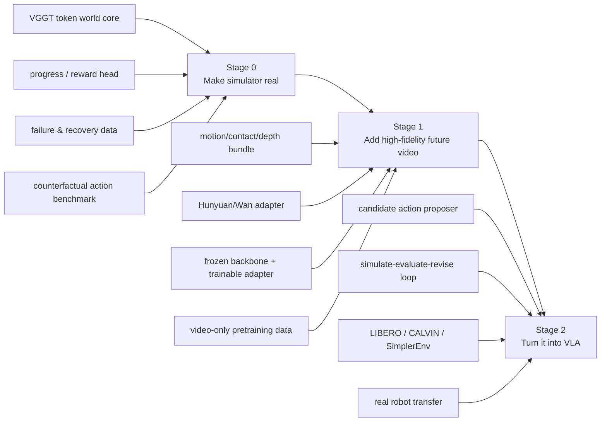

# wm3d_v3 tau0-Style Execution Plan

**Date:** 2026-06-01  
**Goal:** evolve `wm3d_v3` from a VGGT-native action-conditioned simulator into a **tau0-style world model + VLA system** that can be benchmarked seriously on standard robotics suites.

## Bottom Line

If the target is truly **tau0-style**, then the missing pieces are **not mainly sharper RGB**.

The missing pieces are:

1. a real **policy-facing proposer** (`context + task -> candidate actions`)
2. a real **progress / reward evaluator**
3. **failure / recovery-aware simulator training**
4. a **test-time computation loop** (`propose -> simulate -> rank -> revise`)
5. a stronger **future-video backbone** for high-fidelity imagined rollouts and heterogeneous visual pretraining

The correct design is:

```text
VGGT world core = primary state representation
Hunyuan / Wan   = future video backbone / renderer
```

Not:

```text
replace VGGT world core with Hunyuan
```

## Decision: Do We Need Hunyuan?

**Yes, eventually. Not as the world state, but as the future-video layer.**

Reason:

- `tau0-WM` uses a large video backbone as a **shared predictive substrate** for both action generation and action evaluation.
- If we want only a robot-only simulator core, we can stay with VGGT + rough RGB.
- If we want a **tau0-class system** that can:
  - consume heterogeneous video data
  - imagine higher-fidelity futures
  - support rollout-based evaluation and action revision
  then a `Hunyuan / Wan` class video backbone is needed.

My recommendation:

- **Stage 0:** do **not** over-invest in rough RGB or P256 world-core scaling yet.
- **Stage 1:** connect a **frozen or lightly adapted** Hunyuan/Wan backend using our structured controls.
- **Stage 2:** use that future-video layer inside a real `propose -> simulate -> revise` VLA loop.

## Current System vs Target System

### Current `wm3d_v3`

```text
past VGGT tokens + Qwen task embedding + future action chunk
    -> future VGGT tokens
    -> depth
    -> pose / gripper
    -> rough RGB
    -> motion / contact hints
```

This is already a useful **action-conditioned simulator core**.

### Target tau0-style VGGT system

```text
policy / proposer:
    context + task -> candidate action chunks

VGGT world core:
    context + task + candidate action
        -> future tokens
        -> depth
        -> motion / contact
        -> progress / reward / plausibility

future-video backend:
    context RGB + depth + motion/contact + action + task + optional token controls
        -> high-fidelity imagined future video

test-time computation:
    sample actions -> simulate futures -> rank -> revise -> execute
```

## Recommended 3-Stage Roadmap



## What Must Be Built

### P0: Make the world core decision-useful

This is the most important stage.

Must-have items:

1. **Progress / reward head becomes active**
2. **Failure / recovery data enters training**
3. **Counterfactual action benchmark becomes stable and mandatory**
4. **A proposer head exists**, even if small at first
5. **Official benchmark harness integration starts now**, not after everything else

If this stage is not done, adding Hunyuan mostly improves visuals, not decision quality.

### P1: Add high-fidelity imagined future video

At this stage:

- keep VGGT token dynamics as the world state
- use Hunyuan/Wan as a **future video layer**
- feed it:
  - `context_rgb`
  - `depth`
  - `motion_hint`
  - `contact_hint`
  - `action_cond`
  - `task`
  - optional `rough_rgb` or token-derived controls

Recommended strategy:

- freeze the video backbone at first
- train only a **control adapter / conditioning adapter**
- do **not** full-finetune a 5B backbone until the structured-control interface is validated

### P2: Build the actual VLA loop

At this stage, the system becomes:

```text
observe -> propose K actions -> simulate K outcomes -> score/rank -> revise -> execute
```

This is where it becomes genuinely tau0-like.

## Improvement Table

| Priority | Workstream | Current state | What to build next | Recommended model scale | Recommended data scale | Done criterion |
|---|---|---|---|---:|---:|---|
| P0 | **World core dynamics** | `P64`, ~140M, predicts tokens/depth/rough RGB/control | keep `P64` for now; stabilize action-conditioned future prediction, long-horizon drift, action sensitivity | **140M-200M** for next serious run; **300M-500M** only after much more data | **10M-30M robot frames** for first benchmarkable core; **50M-100M+** for serious scaling | counterfactual action benchmark passes; long-rollout drift clearly better than current baseline |
| P0 | **Progress / reward head** | scaffold exists, not a real training target | train dense progress / success / plausibility head and use it in eval | **small head (<50M extra)**; size is not the bottleneck | needs **success/failure labels** or pseudo-progress on **1M-5M windows** minimum | progress signal correlates with task completion and ranks actions better than RGB loss |
| P0 | **Action proposer / VAM** | not really present yet | build `context + task -> candidate action chunks` head; initially small and shared with world core | **50M-150M** first version; **150M-300M** once jointly trained seriously | **action-labeled robot trajectories**; ideally same pool as world core | can sample multiple candidate actions and produce meaningful diversity |
| P0 | **Failure / recovery modeling** | almost absent | explicitly include failed contact, off-trajectory, correction, recovery sequences | no major param increase; mostly data and loss design | target **10-20%** of training windows from failure/recovery for first version; **20-30%** for stronger evaluator | evaluator distinguishes good vs bad futures under counterfactual actions |
| P0 | **Benchmark harness** | episode split + partial action sensitivity | wire official / standard harnesses for **LIBERO**, **CALVIN**, **SimplerEnv** | N/A | benchmark demos + evaluation envs | every mainline checkpoint can be run through a standard harness |
| P1 | **Structured control bundle** | depth + motion/contact exist, not yet fully standardized | freeze the interface: `context_rgb + depth + motion + contact + task + action + optional rough_rgb/tokens` | small adapter additions | same robot data as core; add aligned image/video caches | stable interface consumed by both eval and renderer |
| P1 | **Hunyuan/Wan backend adapter** | plumbing exists only | train adapter / conditioner into pretrained video backbone; do not replace world core | **5B-class frozen backbone + 50M-200M adapter** | add **5k-10k h video-only / teleop / ego-manipulation** if possible; smaller is acceptable for first prototype | motion regions, contact events, and multi-step consistency clearly better than rough RGB |
| P1 | **Renderer training strategy** | rough RGB regression only | use condition dropout, adapter tuning, and structured-control ablations | adapter scale above; no rush to full FT | mixed robot + video-only data | Hunyuan-conditioned rollout is better on motion/contact metrics, not just prettier |
| P2 | **Test-time computation loop** | none | `sample K actions -> simulate -> rank -> revise` | proposer + evaluator dominate; no need huge new module first | benchmark demos + online rollout data | action revision improves benchmark success over single-shot proposer |
| P2 | **Real benchmark VLA fine-tune** | none | benchmark-specific fine-tune / adapter on simulator suites and real robot | proposer/world-core scale from P0/P1 | suite-specific train sets | competitive numbers on official benchmark protocols |

## Data Plan

### 1. Minimum data for a benchmark-ready simulator

Current internal scale is enough for architecture debugging, but too small for a serious tau0-style system.

Recommended minimum for the next step:

- **Robot action data:** `10M-30M` frames, high-quality action-labeled manipulation
- **Embodiment/task diversity:** more than one embodiment / dataset family
- **Failure/recovery ratio:** at least `10-20%` of windows
- **Task labels:** language or task metadata must be clean enough to train progress/reward heads

If we remain below this scale, we should expect:

- decent demos
- incomplete action sensitivity
- weak benchmark transfer

### 2. Data for a real tau0-class system

The tau0 official system is much larger scale than our current setup.  
If we want the same **system class**, not just the same wording, we should think in terms of:

- **large robot action pool**
- **UMI / in-the-wild human interaction pool**
- **video-only future-prediction pool**
- **failure/recovery pool**

Practical target:

- **robot-action pool:** `50M-100M+` frames, or `1k-3k+` hours quality-controlled robot manipulation
- **video-only / ego pool:** `5k-10k+` hours if we seriously want a shared future-video substrate
- **failure/recovery pool:** at least `20%` of trajectory windows in later-stage training

### 3. What data matters most by stage

#### Stage 0

Best data:

- robot trajectories with reliable action labels
- multiple tasks
- explicit success / failure / recovery segments

#### Stage 1

Best additional data:

- video-only manipulation clips
- teleop ego-view clips
- multi-view future video with no need for exact robot action labels

#### Stage 2

Best additional data:

- benchmark demos
- failure traces
- real execution correction data

## Model Sizing Guidance

### Do not scale everything at once

The current temptation is to scale token resolution or RGB decoder quality.  
That is not the right bottleneck.

### Recommended size progression

#### World core

- **Now:** `P64`, `140M-200M`
- **Next serious benchmark attempt:** keep `P64`, scale only modestly if data has already grown
- **Later:** `300M-500M` world core only after progress/reward + proposer + failure data are all active

Why:

- current bottleneck is **system completeness**, not just backbone size
- `P256` in the world core is not the first-order unlock for VLA ability

#### Proposer / VAM

- start with a **small shared proposer**
- keep it in the `50M-150M` range first
- only scale further after TTC is actually working

#### Progress / reward

- should stay relatively small
- invest in **labels and objective design**, not parameters

#### Video backend

- reuse a **pretrained 5B-class** backbone
- train a **50M-200M adapter**
- avoid full backbone finetuning early

## What Not To Over-Invest In Right Now

1. **P256 world-core scaling before progress/reward and proposer are active**
2. **rough RGB as if it were the final deliverable**
3. **more epochs without better data**
4. **full Hunyuan finetuning before structured controls are validated**

## Concrete Next Actions

### Next 2 weeks

1. Make `progress_head` a real training/eval target
2. Fix action-sensitivity reproducibility and make it a required report for every branch
3. Build a first proposer head that samples `K=4-8` candidate action chunks
4. Add failure/recovery sampling into the training manifest
5. Standardize `VideoConditionBundle` and keep the API stable

### Next 4-8 weeks

1. Run a benchmark-ready `P64` world-core branch with:
   - control head
   - progress/reward
   - failure data
   - proposer
2. Integrate a frozen Hunyuan/Wan backend with a trainable control adapter
3. Add official benchmark harnesses:
   - [LIBERO](https://libero-project.github.io/main)
   - [CALVIN](https://github.com/mees/calvin)
   - [SimplerEnv](https://github.com/simpler-env/SimplerEnv)
   - optional unified harness: [allenai/vla-evaluation-harness](https://github.com/allenai/vla-evaluation-harness)

### Next 2-3 months

1. Turn proposer + simulator into TTC loop
2. Benchmark on simulation suites
3. Push a first real-robot transfer attempt
4. Decide whether world-core scaling or video-backbone scaling gives better marginal returns

## My Recommendation

If the actual target is:

> a tau0-style VGGT-native world model that can also do VLA tasks and compete on benchmarks

then the correct order is:

1. **finish the simulator**
2. **teach it progress/reward**
3. **teach it bad futures, not only good futures**
4. **add a proposer**
5. **then connect Hunyuan/Wan**
6. **then build TTC and benchmark**

That is the shortest path to a real system.

## References

- tau0-WM official page: [AGIBOT Finch: τ0-WM](https://finch.agibot.com/research/tau0-wm)
- tau0-WM paper: [τ0-WM: A Unified Video-Action World Model for Robotic Manipulation](https://finch-static.agibot.com/VAM/blog/tau_0_wm.pdf)
- LIBERO official project: [LIBERO](https://libero-project.github.io/main)
- CALVIN official repo: [mees/calvin](https://github.com/mees/calvin)
- SimplerEnv official repo: [simpler-env/SimplerEnv](https://github.com/simpler-env/SimplerEnv)
- DROID dataset: [DROID project page](https://droid-dataset.github.io/)
