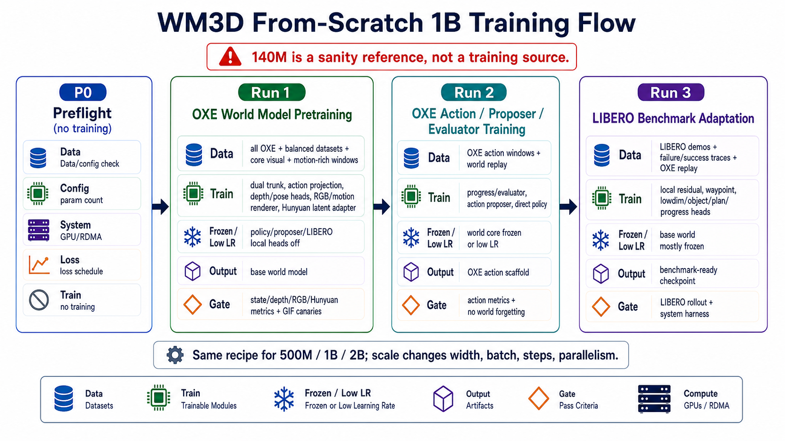

# WM3D From-Scratch World Model Pretraining Plan

> **2026-06-05 update:** This top-level training recipe is superseded by `docs/training/300m_stage0_to_stage2_world_pretrain_v2.md` for current 300M staged training boundaries. Treat any Hunyuan-heavy Run1 wording or Run2 evaluator/direct-policy wording below as archival unless it matches that canonical doc. Current default flow is Stage0 -> Stage1 -> Run1.5 Hunyuan Bridge -> Stage2 progress+proposer scaffold.


Date: 2026-06-04

This is the corrected formal recipe. It is a parameter-agnostic from-scratch world model pretraining plan. It can be used for 500M, 1B, or 2B models by changing model width/depth, batch size, parallelism, and training length. The target formal run is 1B-class.



The 140M and 500M results are diagnostics only. They are not the training source, and the goal is not to "recover 140M weights." The goal is to train a larger WM3D world model from random initialization on the existing OXE data with a stable, measurable recipe.

## 1. Correction

The earlier staged plan was too fragmented. It mixed two separate things:

1. diagnosing why the 500M warm-start run looked worse than the 140M visual proof run;
2. defining the formal world model pretraining recipe.

The formal recipe should not be eight or nine separate training stages. It should be:

```text
P0 preflight, no training
-> Run 1: one continuous from-scratch OXE world model pretraining
-> Run 1.5: Hunyuan bridge alignment
-> Run 2: OXE progress+proposer post-training
-> Run 3: LIBERO/benchmark adaptation and evaluation
```

Run 1 is the real world model pretraining. Run 1.5 aligns the Hunyuan bridge after the world core exists. Runs 2 and 3 are downstream capability training after the base world model exists. Inside each run, data sampling and loss weights can use smooth schedules. That is not a separate training stage.

## 2. Actual Training Runs

This document is superseded for the current 300M flow. The concrete current sequence is Run1 core dynamics, Run1.5 Hunyuan bridge, Run2 progress+proposer, then Run3 benchmark adaptation.

### Run 1: From-Scratch OXE World Model Pretraining

Purpose:

```text
Learn the action-conditioned world dynamics:
past observation + task + future action chunk
    -> future VGGT tokens
    -> future depth
    -> rough future RGB / motion
    -> low-weight detached Hunyuan bridge signal
```

Data:

| Data | Use |
|---|---|
| Full OXE trainable cache: `manifests/oxe_all_trainable_cached_rgb_geom_v1.jsonl` | main training data |
| Core visual OXE: bridge/fractal from `manifests/oxe_train.jsonl` | oversampled monitor/anchor inside the same dataloader |
| Motion-rich OXE windows | oversampled inside the same dataloader for motion/Hunyuan temporal signal |
| Fixed validation slices per dataset | eval only |

Train:

| Module | Status |
|---|---|
| `dual.` world trunk | train from scratch |
| `action_proj.` | train from scratch |
| `geom.` depth/pose/gripper heads | train from scratch |
| `context_pixel.` rough RGB/motion renderer | train from scratch |
| Hunyuan latent adapter | low-weight detached bridge in Run1; main bridge alignment in Run1.5 |

Do not train in Run 1:

| Module | Reason |
|---|---|
| progress/evaluator heads | needs task progress/success supervision |
| action proposer | downstream action generation |
| direct policy | downstream behavior policy |
| LIBERO local residual/waypoint/lowdim/object/plan heads | benchmark-specific adaptation |

Losses:

| Loss | Schedule |
|---|---|
| state token MSE + cosine | on from step 0 |
| depth | on from step 0, high priority |
| RGB L1 + LPIPS | on from step 0, high priority |
| RGB motion losses | on from step 0, moderate weight |
| pose/gripper auxiliary | on from step 0 |
| Hunyuan static latent MSE/L1 | low-weight detached bridge only; not a main Run1 objective |
| Hunyuan temporal/motion latent | low-weight detached in Run1; bridge-focused in Run1.5 |

Output:

```text
base OXE world model checkpoint
```

Gate:

| Gate | Required |
|---|---|
| no data stall | all OXE streams train and validate |
| no modality collapse | state/depth/RGB losses decrease; low-weight detached Hunyuan bridge remains stable |
| visual sanity | fixed GIFs show recognizable RGB and non-striped depth |
| per-dataset robustness | bridge/fractal/taco/jaco/kuka all have valid metrics |

### Run 2: OXE Progress+Proposer Post-Training

Purpose:

```text
Turn the pretrained world model into an action-selection scaffold:
candidate action chunks -> imagined futures -> progress/proposer scaffold -> selected action
```

Data:

| Data | Use |
|---|---|
| OXE action windows from the same cached OXE set | proposer imitation and progress supervision |
| OXE world replay batches | prevent world-model forgetting |
| Episode temporal labels or derived progress labels | progress pretraining; evaluator is later explicit work |

Train:

| Module | Status |
|---|---|
| progress head | train |
| action proposer | train |
| direct action policy trunk/head | not enabled in current Stage2 configs; add explicitly later |
| base world trunk/visual heads | frozen or low LR with replay |
| Hunyuan adapter | aligned in Run1.5; off/frozen in current Stage2 |

Losses:

| Loss | Purpose |
|---|---|
| direct pose/gripper | not active in current Stage2 configs; add only with explicit direct-policy head |
| proposer candidate CE/ranking | produce useful candidate actions |
| progress loss | score temporal/task progress; evaluator loss is later explicit work |
| world replay checks | keep Run 1 world quality intact; current Stage2 freezes world prefixes |

Output:

```text
OXE-trained world+action scaffold checkpoint
```

Gate:

| Gate | Required |
|---|---|
| action metrics improve | direct/proposer pose/grip errors decrease |
| imagined-future scoring works | selected candidate beats anchor/oracle proxy on offline eval |
| no world forgetting | Run 1 visual/depth metrics remain within allowed drift |

### Run 3: LIBERO / Benchmark Adaptation

Purpose:

```text
Adapt the OXE pretrained world/action scaffold to benchmark tasks.
This is VLA/benchmark adaptation, not base world model pretraining.
```

Data:

| Data | Use |
|---|---|
| LIBERO demo cache | imitation and task grounding |
| LIBERO failure traces | recovery and negative examples |
| future success/failure mixed traces | progress/evaluator supervision |
| OXE replay batches | avoid catastrophic forgetting |

Train:

| Module | Status |
|---|---|
| LIBERO local residual/waypoint heads | train |
| lowdim/object/plan/progress branches | train |
| progress/evaluator/proposer | continue training if useful |
| base world trunk | frozen or very low LR |
| RGB/depth/Hunyuan heads | usually frozen except replay sanity |

Losses:

| Loss | Purpose |
|---|---|
| LIBERO imitation | task-specific action behavior |
| recovery/waypoint losses | correct failed states |
| success/progress ranking | make evaluator task-aware |
| OXE replay | preserve general world model |

Output:

```text
benchmark-ready WM3D VLA checkpoint
```

Gate:

| Gate | Required |
|---|---|
| LIBERO hdf5-init rollout improves | selected policy improves over anchor/baseline |
| system harness passes | no API/data/action-shape regressions |
| rollout traces are usable | candidate scores, actions, frames, rewards recorded |
| final report produced | metrics, GIFs, traces, success/failure summary |

## 3. Target

Formal target:

```text
WM3D P64, 1B-class, from scratch
T=16 context frames
k=8 future steps
state token dimension D=2048
action chunk dimension 7D
primary training data: all trainable OXE cache
```

The exact 1B architecture must be confirmed by param-count preflight before launch. The intended direction is:

| Component | 1B-class target |
|---|---|
| State world trunk | larger `dual.state`, around hidden 1024, deeper transformer |
| Action stream | larger `dual.action`, around hidden 768 |
| Cross attention | scaled heads/layers matched to hidden size |
| Action projection | scaled with trunk |
| Geometry heads | scaled enough for depth/pose/gripper, not tiny relative to trunk |
| RGB/motion renderer | keep strong `context_pixel`; do not weaken visual path |
| Hunyuan latent adapter | trained as part of world pretraining, with controlled loss ramp |
| Policy/proposer/local LIBERO heads | not part of core world pretraining unless explicitly running post-train VLA adaptation |

## 4. Data

All OXE data should be used. The key is not to drop data; the key is to use a controlled sampler so broad data does not erase the strong geometry/RGB signal.

| Data group | Source | Role in pretraining |
|---|---|---|
| Core OXE visual set | `manifests/oxe_train.jsonl` | bridge/fractal; stable visual/depth reference distribution |
| Full OXE trainable set | `manifests/oxe_all_trainable_cached_rgb_geom_v1.jsonl` | main pretraining set; fractal, bridge, taco, jaco, kuka |
| Motion-rich windows | derived from full OXE using motion metrics or cached motion hints | strengthen temporal/motion and Hunyuan temporal training |
| Validation monitors | fixed held-out slices per dataset | measure regression by dataset and by modality |
| LIBERO traces/demos | LIBERO caches and closed-loop traces | post-training policy/evaluator adaptation, not the core OXE world pretraining source |

Current counts:

| Manifest | Records | Composition |
|---|---:|---|
| `oxe_train.jsonl` | 21,942 | bridge 16,209, fractal 5,733 |
| `oxe_all_trainable_cached_rgb_geom_v1.jsonl` | 103,965 | fractal 76,938, bridge 22,089, taco 3,242, jaco 972, kuka 724 |

## 5. Main World Model Training Details

Run 1 is the actual world model pretraining run. It starts from random initialization for the chosen model scale.

```text
all OXE data
    -> one continuous from-scratch run
    -> all world-model modules trained together
    -> core world, depth, RGB, motion, action, Hunyuan latent losses active with scheduled weights
```

### 4.1 Data Sampler

Use one mixed dataloader, not separate training jobs.

Recommended sampling:

| Stream | Approx role | Notes |
|---|---|---|
| Full OXE raw distribution | main coverage | keeps scale and diversity |
| Balanced per-dataset OXE | prevents minority collapse | bridge/fractal/taco/jaco/kuka all monitored |
| Core visual OXE oversample | stabilizes depth/RGB | used as an anchor, not as a separate pretraining stage |
| Motion-rich oversample | improves temporal/motion | helps Hunyuan temporal and motion hint |

The exact probabilities can ramp smoothly during training, but every source can be present from step 0.

### 4.2 Trainable Modules

Train these from scratch in P1:

| Module | Train? | Reason |
|---|---|---|
| `dual.` world trunk | yes | primary state dynamics |
| `action_proj.` | yes | action-conditioned dynamics |
| `geom.` | yes | depth, pose, gripper |
| `context_pixel.` | yes | rough RGB and motion hint |
| Hunyuan latent adapter | yes | video latent bridge |

Do not include these in the core world pretraining objective unless the run is explicitly a VLA post-train:

| Module | Default in P1 | Reason |
|---|---|---|
| progress/evaluator heads | off or auxiliary only | needs task-progress supervision, not pure OXE world state |
| action proposer | off | policy generation is downstream |
| direct action policy | off | downstream behavior policy, not core world pretraining |
| LIBERO local residual/waypoint/lowdim/object/plan heads | off | benchmark/task-specific adaptation |

This keeps the definition clean: P1 is world model pretraining, not VLA policy fine-tuning.

### 4.3 Losses

All core world losses can be active in the same run, but their weights should be scheduled so one subsystem does not dominate early training.

| Loss group | Target | Weight rule |
|---|---|---|
| State token dynamics | predicted VGGT tokens | on from step 0 |
| Depth | normalized depth future | on from step 0, high priority |
| RGB reconstruction | rough future RGB | on from step 0, high priority |
| RGB motion | future motion mask / motion L1 | on from step 0, moderate priority |
| Action pose/gripper | action-conditioned auxiliary output | on from step 0 |
| Hunyuan static latent | VAE latent appearance alignment | on from step 0 or short warmup |
| Hunyuan temporal/motion latent | temporal consistency and motion in latent space | ramp from low weight to target after early stability |

This is not "separate stages." It is a continuous loss schedule in the single P1 run.

## 6. Gates

Gates are evaluation criteria, not separate training stages.

| Gate | When | Purpose |
|---|---|---|
| G0 param/data preflight | before launch | exact param count, dataloader count, missing paths, GPU memory estimate |
| G1 early visual sanity | first few thousand steps | make sure depth/RGB are not broken or striped |
| G2 mid-run modality balance | during pretraining | make sure Hunyuan/pixel/state losses are all learning |
| G3 per-dataset robustness | during and after pretraining | make sure taco/jaco/kuka do not collapse and bridge/fractal do not regress |
| G4 final world model report | end of P1 | select checkpoint for downstream policy/benchmark work |

140M visual proof metrics are only a reference sanity line:

```text
140M reference: depth=0.0143, rgb_L1=0.0172, LPIPS=0.0779
```

For 1B from scratch, exact early metrics do not need to match 140M immediately. But if depth/RGB stay far worse after meaningful training, the run is not acceptable.

## 7. After Pretraining

After Run 1 finishes and a world checkpoint is selected:

| Step | Data | Train | Purpose |
|---|---|---|---|
| P2-A OXE policy/proposer post-train | OXE action windows | proposer/progress, with world replay or frozen world | turn world model into action-selection scaffold |
| P2-B LIBERO adaptation | LIBERO demos, failure traces, success/failure traces | local residual, waypoint, lowdim/object/plan/progress heads | benchmark specialization |
| P2-C Benchmark report | eval only | no training | system harness, action sensitivity, LIBERO rollout, future CALVIN/SimplerEnv |

This is downstream VLA training. It should not be confused with the core from-scratch world model pretraining.

## 8. 1B Launch Checklist

Before launching the 1B formal run:

| Item | Required output |
|---|---|
| 1B config | exact model dimensions and expected param count |
| Dataloader preflight | train/val windows by dataset and stream |
| Loss schedule | initial/final weights and ramp steps |
| GPU plan | 32-GPU launch command, NCCL/RDMA settings, batch size, gradient accumulation |
| Checkpoint cadence | step checkpoints, best checkpoints, canary cadence |
| Eval monitors | fixed validation slices and GIF samples |
| Stop criteria | hard failure conditions for broken depth/RGB, NaNs, collapse, or data stalls |

## 9. Current 500M Run Interpretation

The current 500M run remains useful as a diagnostic canary, but it is not the formal recipe.

Observed:

```text
500M from 140M warm-start: missing=403, skipped=329
500M epoch0: depth=0.0820, rgb_L1=0.0403, LPIPS=0.1453
500M step9000 canary: depth=0.0766, rgb_L1=0.0400, LPIPS=0.1350
```

Correct interpretation:

```text
The run is learning, but it was not a clean from-scratch 1B-style recipe.
Use it to debug schedules and metrics, not as the final large-scale plan.
```
