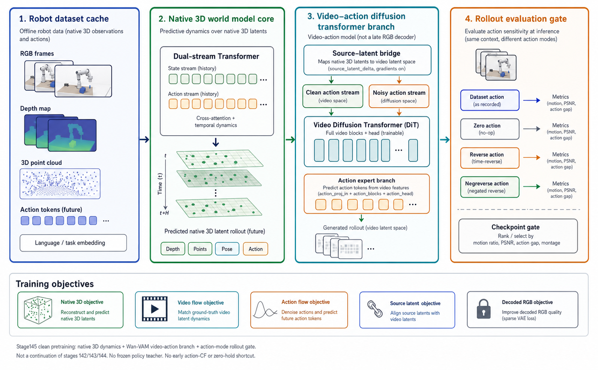
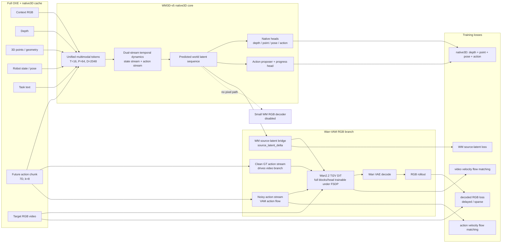

# WM3D-v5 — a native-3D video-action world model for VLA

_One-page technical brief. Written 2026-06-26. Covers the current WM3D-v5 architecture, data, training recipe, RGB/VAM direction, and immediate gates._



## The pitch, in one paragraph

Most robot world models choose one primary state space: video latents for visual realism, or low-dimensional dynamics for control. WM3D-v5 keeps an explicit **native 3D world state** as the core representation: context RGB, depth, 3D point/geometry tokens, robot state, task text, and future action chunks are fused into a 1B-class action-conditioned dynamics model. RGB is no longer generated by a small WM decoder. The current version trains a **Wan2.2-based Video-Action Model (Wan-VAM)** beside the native 3D core, so action and video tokens interact inside the video generator while depth/point/pose/action losses keep the system grounded for VLA benchmarks. The immediate target is not a prettier demo in isolation; it is a world model that can imagine action-conditioned rollouts, score or propose actions, and feed robot-policy evaluation on LIBERO-style tasks.

---

## 1. Architecture at a glance



**Current design choices:**

- **WM3D remains the world model.** Depth, point/geometry, pose/proprio, action, proposer, and progress heads stay in the core training objective.
- **Wan is not a passive renderer.** Stage145 trains Wan as a video-action model: clean dataset action drives the video stream, noisy action trains action flow, and Wan predicts video velocity.
- **No old RGB decoder path.** `model.enable_pixel=false`, `model.enable_context_pixel=false`, and `train.enable_pixel_loss=false`.
- **No continuation shortcut.** Stage145 starts clean from Wan base and current code/config. It does not initialize from stage142/143/144 and does not load the frozen stage26 action-policy teacher.

---

## 2. What changed from the original GeoPhys-WM plan

| Axis | Original one-pager | Current WM3D-v5 |
|---|---|---|
| Core latent | Frozen VGGT tokens + lightweight heads | 1B-class trainable native3D dynamics over cached VGGT/window geometry tokens |
| RGB output | Token/depth-centric, future decoder left for later | Wan2.2 TI2V RGB branch integrated into training |
| Action use | Optional conditioning / CFG style | Action is a first-class stream in WM3D and Wan-VAM |
| Trainable scale | ~420M trainable heads | Multi-billion trainable video-action stack under FSDP |
| Main benchmark pull | Medium-scale world-model paper | VLA-oriented world model: imagine, compare actions, support LIBERO-style rollout |
| Key lesson learned | Frozen geometric backbone can carry world state | RGB generation must be trained as action-video modeling, not as a small decoder bolted onto WM |

---

## 3. Main components

| Component | Current setting | Why it exists |
|---|---|---|
| **Data cache** | Full OXE/native3D sharded cache; `T=16`, `P=64`, `k=8`; current stage145 logs `1,153,440` train windows and `35,132` validation windows | Gives broad robot dynamics and cached geometry without online VGGT cost |
| **WM3D-v5 core** | 1B-class native3D model with state/action streams, cross-attention, depth/point/pose/action heads | Keeps the model grounded in geometry and robot state rather than video texture alone |
| **Action proposer + progress** | Enabled in stage145 with supervised proposer/progress losses | Moves the system toward action scoring and VLA planning instead of pure video prediction |
| **Wan2.2 TI2V branch** | Wan2.2-TI2V-5B base, VAE frozen, full DiT blocks/head trainable under FSDP | Provides a strong RGB prior while allowing action/video interaction to be learned |
| **Wan control / VAM adapter** | `WanTI2VControlAdapter params=1291.43M` | Injects WM3D state, action streams, and robot/object motion hints into Wan |
| **WM source-latent bridge** | `wan_path_type=wm_latent`, `wan_wm_source_scale=0.35`, gradients on | Lets WM3D shape future video source latents without turning Wan into a detached renderer |
| **Small RGB decoder** | Disabled | Previous small decoder could move but lacked high-fidelity RGB; it is no longer the main RGB path |

---

## 4. Current stage145 training recipe

Stage145 is the current clean pretraining run:

```text
/0604-10T-test/wm3d_v5/results/
  wm3d_v5_p64_1b_stage0_native3d_wan_vam_cleanpretrain_fsdp_jointpt_stage145_21gpu_20260626_1500

config:
  /data/Minko/world_model/wm3d_v5/configs/
  v5_p64_1b_stage0_native3d_wan_vam_stage145_cleanpretrain_3node7_v1.yaml
```

| Setting | Value |
|---|---|
| Nodes / GPUs | node43 + node44 + node41, 7 GPUs each, 21 H100 total |
| Node42 | Not used |
| Checkpoints | Every 2,500 steps; `step_00002500.pt` and `step_00005000.pt` already exist |
| Max steps | 30,000 |
| Schedule | WSD, bf16, FSDP full shard on WM + Wan transformer |
| Wan trainable | LoRA off; full `blocks.` + `head.` trainable; log shows `Wan trainable params=4910.30M` |
| Wan adapter | `1291.43M` trainable params |
| Warmup constraints | Action-CF disabled, zero-action hold disabled, decoded RGB delayed/sparse |
| Latest sampled log | At step 5420: `L_total=3.4159`, `wan_vel=0.0460`, `wan_src=2.2895`, `wan_vam_action=0.5971`, `lr=1.00e-05` |

The important recipe change is negative: **do not continue from a visually promising but structurally biased checkpoint**. Stage143 showed useful motion at step2500 but regressed by step5000. The fix is to start a clean pretraining run with the right losses and action/video wiring from the beginning.

---

## 5. Losses and gates

| Loss group | Stage145 role |
|---|---|
| Native3D losses | Preserve depth, point/geometry, robot state, and action prediction |
| Wan video velocity | Train the video generator to denoise future RGB latents under action/state conditions |
| VAM action flow | Make the Wan action branch learn the action distribution directly |
| WM source-latent loss | Align WM future state with video source latents while keeping gradients active |
| Decoded RGB loss | Starts later and runs sparsely, mainly to improve clarity without early static collapse |
| Action-CF / zero-hold | Off during clean warmup; can be reintroduced only after real action-conditioned motion is stable |

**Checkpoint gate:**

The demo evaluator must run `dataset / zero / reverse / negreverse` action modes. A checkpoint only counts as useful if the video shows real arm/object motion that changes with action mode, not background flicker or small static drift.

Target metrics:

| Metric | Target |
|---|---:|
| `motion_ratio_consecutive` | ≥ 0.70 |
| `motion_ratio_from_first` | ≥ 0.65 |
| Visual clarity | Acceptable, no dominant ghosting |
| Action sensitivity | Dataset action visibly differs from zero/reverse/negreverse |

---

## 6. Why Hunyuan and earlier Wan attempts failed

The earlier attempts were useful because they isolated the failure mode:

1. **Small RGB decoder moved, but quality ceiling was low.** It learned the robot/task dynamics because it was tightly tied to WM3D, but it could not deliver high-fidelity RGB.
2. **Hunyuan/Wan as external RGB renderer was too weakly action-coupled.** The branch could stay clear while ignoring the action, or move background texture without moving the robot/object correctly.
3. **Continuation and static guards hid the real problem.** Some checkpoints looked good early, then collapsed as static-preserve, zero-hold, or counterfactual losses overpowered the action signal.
4. **The current fix is structural.** Stage145 treats Wan as a video-action model trained in the same loop as WM3D, with clean dataset action in the video stream and noisy action in the VAM action-flow objective.

---

## 7. What we leverage, and what we deliberately avoid

| Reused | What it gives us |
|---|---|
| Full OXE/native3D cache | Robot manipulation variety plus depth/point/pose supervision |
| WM3D-v5 native3D codebase | Existing 3D state/action dynamics, cache format, and benchmark harness |
| Wan2.2-TI2V-5B | Strong RGB/video prior, VAE, and DiT backbone |
| τ0-WM-style design lesson | Video and action should interact inside the generative model, not only through a late adapter |

| Avoided | Reason |
|---|---|
| Stage142/143/144 continuation | Carries accumulated static/ghosting/action-insensitivity biases |
| Frozen stage26 teacher as video action source | Good action-head pretraining is useful, but a frozen teacher should not silently drive the video branch during clean pretraining |
| Small RGB decoder as final RGB path | It validates dynamics, but not final visual quality |
| Node42 | Unstable / excluded from the current run plan |

---

## 8. Answers to the questions that matter now

**Q. Is WM3D-v5 still a native 3D world model, or did it become a video model?**
It is still a native 3D world model. Wan-VAM is the RGB/video layer. Depth, point/geometry, pose, action, proposer, and progress remain active training targets.

**Q. Is stage145 already proof that the RGB problem is solved?**
No. It is the first clean run with the right structural assumptions. Step2500 and step5000 checkpoints exist, and demo export is the next gate. The claim should remain: the implementation is now aligned with the intended design; the checkpoint demos decide whether this run solves the visual/action problem.

**Q. Why not keep training stage143 since it looked good early?**
Because stage143 was a continuation/adaptation chain. Its step2500 demo showed motion, but step5000 regressed, which points to a recipe problem rather than a need for more steps. Stage145 starts clean to avoid carrying that bias forward.

**Q. How is this related to τ0-WM?**
The shared lesson is the same: for VLA-oriented world modeling, action must be part of the video generative model. WM3D-v5 differs by keeping a native 3D state core instead of becoming a pure video-action model.

---

## Further reading in this workspace

- `FEISHU_WM3D_LIVING_DOC.md` — running project log and decisions.
- `wm3d_v5_stage133_architecture_overview.md` — older Wan integration overview before the clean stage145 reset.
- `wm3d_v5_wan_stage133_architecture_flowchart.md` — detailed flowchart for the previous stage133 architecture.
- `wm3d_v5/docs/training/WM3D_ACTION_CORE_STAGE26_V1.md` — action-head pretraining notes.
- Remote current config: `/data/Minko/world_model/wm3d_v5/configs/v5_p64_1b_stage0_native3d_wan_vam_stage145_cleanpretrain_3node7_v1.yaml`
