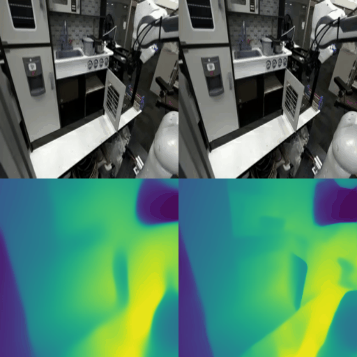
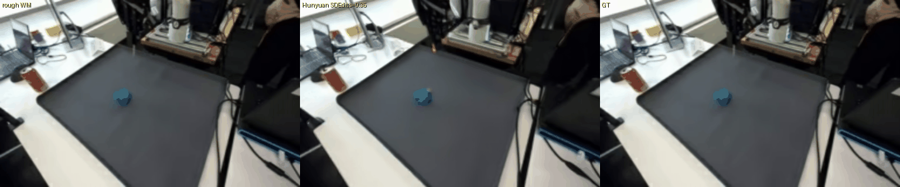
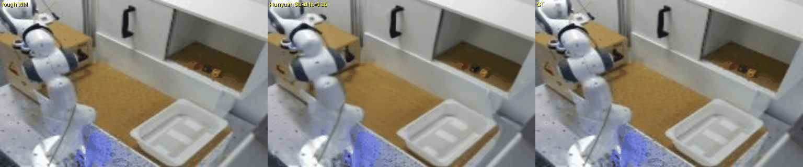
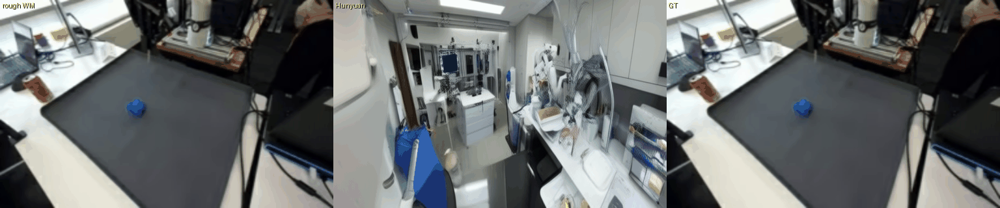
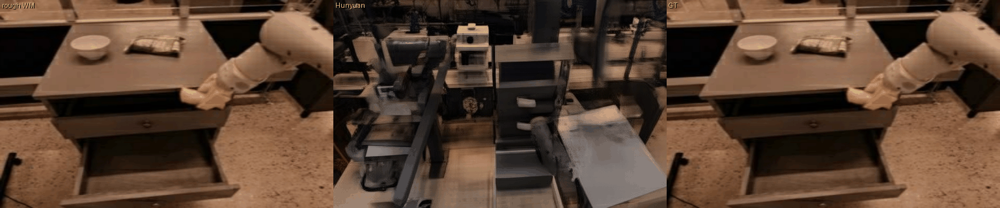
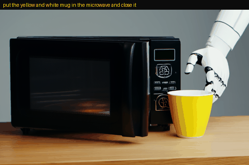
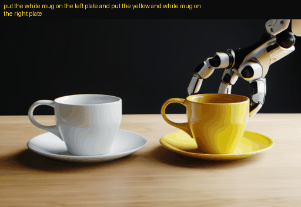
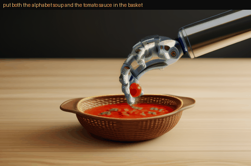
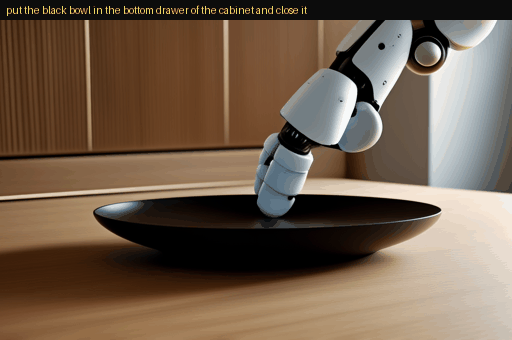

# WM3D:原生三维(Native-3D)动作条件世界模型
### 定位与方法 · 占位稿 v0.3 · 2026-06-08

---

## 摘要

我们正在构建 **WM3D —— 一个以「原生三维几何」为状态表征的动作条件世界模型(action-conditioned world model)**。与当前主流世界模型在 2D 像素 / 视频隐空间(video latent)中预测未来不同,WM3D 把每一帧观测经由一个**冻结的前馈三维基础模型(VGGT)**直接转写为**显式三维表征 —— 三维点图(world points)+ 相机位姿(camera pose)+ 深度**,并在这个原生三维空间里、在给定动作序列的条件下预测未来。我们主张:**对于需要物理一致性与可执行性的具身智能(robot manipulation / VLA),「在原生三维上建模世界」比「在二维视频上建模世界」是更本质、更可迁移的路线。**

当前进展:① 世界模型主干已**端到端训练至 10 亿参数(1B)规模**,走通了完整的分阶段训练流水线(几何/视觉预训练 → 动作条件动力学 → 视频桥接 → 动作脚手架 → 闭环策略),数据为 16 万段 OXE 真实机器人操作窗口,本稿展示其预测质量;② **原生三维变体正在训练中** —— 动作反事实(counterfactual)判据门的评测协议已就绪,完整结果将在原生三维主干收敛后给出(本稿暂不展示其指标);③ LIBERO 闭环评测的运行框架与动作协议已用专家回放验证通过。本稿用于**为该定位与方法占位**,并附上初步的结果展示与指标。

---

## 1. 定位:为什么是「原生三维」

世界模型的主流路线可粗分为两类,二者都**不在原生三维上建模**:

- **二维 / 视频隐空间**:Dreamer 系、GAIA(自动驾驶)、Genie(可玩世界)、DIAMOND / IRIS(像素扩散),以及把 Sora 式视频生成模型当世界模型用 —— 它们的状态是视频 latent 或 RGB 帧。
- **至多加深度(2.5D)**:部分工作引入 depth 条件,但仍不显式表征三维点与相机外参。

二维路线对「看起来像」很强,但对「物理上对不对、能不能据此执行」并不直接负责:同一段视频可以对应多种三维结构与相机运动,动作—几何之间的因果耦合是隐式的。**WM3D 的核心取舍是把世界的状态直接放在三维上** —— 模型预测的是未来的三维点云结构与相机位姿,动作直接作用在这个几何状态上。这使得「这个动作会把场景的三维结构推向何处」成为模型的**显式预测目标**,而非视频纹理的副产物。

> 差异化:以 VGGT 式前馈三维(pointmap + pose)作为世界模型的**状态与监督目标**,并将其作为 VLA 闭环的世界引擎 —— 这是 WM3D 区别于 2D / 视频世界模型的核心所在。

---

## 2. 方法

### 2.0 架构总览(一图看懂)

```
                    输入
   ┌──────────────┬──────────────┬──────────────────┐
   │ 过去 RGB 观测 │  任务文本     │  未来动作块        │
   │ (16 帧)      │ (自然语言)    │  [k=8, 7 维位姿/夹爪]│
   └──────┬───────┴──────┬───────┴────────┬─────────┘
          │              │                │
   ┌──────▼───────┐  ┌───▼────┐           │
   │ VGGT(冻结)   │  │Qwen3-VL│           │
   │ 几何tokenizer│  │文本编码 │           │
   └──────┬───────┘  └───┬────┘           │
          │ 几何token     │ 文本嵌入        │ 动作嵌入
          │[16,64,2048]   │                │
   ┌──────▼──────────────▼────────────────▼─────────┐
   │            JointWorldModel(双流主干)            │
   │  ┌────────────────────┐   ┌──────────────────┐ │
   │  │  State Stream(主)  │◄─►│ Action Stream/IDM│ │
   │  │  三维token动力学预测 │双向│  推断潜在动作 z_a │ │
   │  └─────────┬──────────┘交叉└──────────────────┘ │
   │            │           注意力                    │
   └────────────┼───────────────────────────────────┘
                │  未来世界 token [k=8, 64, 2048]
       ┌────────┴────────┬─────────┬─────────┬────────┐
       ▼                 ▼         ▼         ▼        ▼
 ┌───────────┐   ┌──────────┐ ┌────────┐ ┌──────┐ ┌────────┐
 │原生三维几何头│   │像素/上下文│ │评估头   │ │提议头 │ │Hunyuan │
 │world points│   │粗RGB+运动 │ │可行性分 │ │候选动作│ │视频桥   │
 │+相机位姿+深度│   └──────────┘ └────┬───┘ └──┬───┘ │(渲染)  │
 └───────────┘                      │        │     └────────┘
   ↑核心输出                          └───┬────┘
                                         ▼
                       闭环:propose→imagine→rank→execute
```

> 一句话:**冻结 VGGT 把观测变成原生三维 token → 双流主干在三维空间里按动作预测未来 → 多个可插拔头分别落地为几何/像素/评估/提议/视频。** 世界状态始终是三维的;Hunyuan 只是渲染器,不是状态来源。

### 2.1 表征:以 VGGT 几何作为世界状态

我们用 **VGGT(Visual Geometry Grounded Transformer,前馈三维基础模型)** 作为**冻结的几何 tokenizer**:输入观测帧,输出每帧的几何 token 与三维量(world points / 相机位姿编码 / 深度 / 置信度)。VGGT 不参与训练,只提供「世界当前长什么样」的三维读数。世界模型在这个三维 token 空间里学习动力学。

### 2.2 主干:双流 + 交叉注意力的单次前向

核心模型 `JointWorldModel`(单次端到端前向):

- **State Stream(主):** 由过去的 VGGT token 序列 `[T=16, P=64, D=2048]` + 任务文本嵌入(Qwen3-VL)+ 未来动作块 `[k=8, 7]`,预测**未来的 VGGT 状态 token** `[k=8, P=64, D=2048]`。
- **Action Stream(IDM):** 推断潜在动作 `z_a`,与状态流在交错层**双向交叉注意力**耦合。
- **可插拔预测头(按需开启):** 深度头与**原生三维头(world points + 相机位姿)**、粗 RGB / 运动头、进度&可行性评估头(evaluator)、动作提议头(proposer)、直接策略头(BC policy)、文本→世界 token 先验(rectified-flow)。
- **视频渲染桥(与世界核心解耦):** 基于冻结 HunyuanVideo 的零初始化残差控制注入,作为「未来视频」的渲染/桥接层 —— 它是渲染器,**不是世界状态来源**;世界状态始终来自 VGGT 几何。

### 2.3 训练:分阶段阶梯

`Stage0 视觉/几何预训练 → Stage1 动作条件动力学 → Stage1.5 Hunyuan 视频桥接 → Stage2 进度+提议(动作脚手架) → Stage3 受控视频生成 → Run3 LIBERO 闭环`。每阶段冻结/解冻不同模块,逐步从「会看世界」长到「会按动作想象世界」再到「会据此评估与执行」。

### 2.4 工程基座(标准件,非创新点,如实说明)

为支撑多机 H100 的大规模训练,几何/视觉特征**预先离线计算并缓存**;为消除海量小文件随机读带来的 IO 瓶颈,缓存以 **node 分片的随机寻址 tar 分片(uncompressed tar + 字节偏移索引)** 投递到本地 NVMe。这是业界成熟做法(WebDataset / TFRecord 一族),**属于工程基座,不构成方法创新** —— 在此声明以避免混淆:本工作的价值在「在原生三维上建模世界」,不在数据投递格式。

---

## 3. 模型功能总览

WM3D 是「单主干、多功能头」的设计 —— 一个共享的双流主干长出若干可插拔的头,覆盖从「看世界」到「想象世界」再到「评估与执行」的完整能力链。下表把每个组件映射到它负责的功能:

| 组件 | 输入 → 输出 | 在系统中的角色 |
| --- | --- | --- |
| **VGGT 几何 tokenizer**(冻结) | RGB 帧 → 几何 token + world points / pose / depth | 把观测转成**原生三维**读数,世界状态的唯一来源 |
| **State Stream**(主干) | 过去 token + 任务文本 + 未来动作块 → **未来 VGGT 状态 token** | 在三维 token 空间里做动作条件动力学预测 |
| **原生三维几何头** | 状态 token → **world points + 相机位姿 + 深度** | 把预测的世界落到显式三维量(本工作的核心输出) |
| **像素 / 上下文头** | 状态 token → 粗 RGB + 运动区域 | 提供可视化与运动监督的轻量像素读出 |
| **Action Stream / IDM** | 相邻状态 → 潜在动作 `z_a` | 逆动力学:从「世界怎么变」反推「做了什么动作」 |
| **action_proj 动作头** | 状态 token → 7 维位姿增量 + 夹爪 | 把潜在动作落到可执行的机器人动作 |
| **进度 / 评估头(evaluator)** | 想象轨迹 → 进度 / 可行性分 | 给候选未来打分,服务「想象—排序—执行」 |
| **动作提议头(proposer)** | 当前状态 + 任务 → 候选动作块 | 生成多条候选动作供世界模型想象 |
| **直接策略头(BC policy)** | 状态 + 任务 → 动作 | 行为克隆基线策略,闭环执行的兜底 |
| **文本→世界先验(world_prior)** | 任务文本 → 世界 token(rectified-flow) | 从语言直接生成初始世界状态 |
| **Hunyuan 视频桥** | 世界 token → 未来视频 | 渲染层:把三维世界状态翻译成可看的视频 |

> 闭环范式:**propose(提议候选动作)→ imagine(世界模型想象各自的未来)→ rank(评估头排序)→ execute(执行最优)**。上面的提议头 / 状态流 / 评估头 / 动作头正对应这四步。

---

## 4. 结果展示

> 说明:本节展示的指标与 GIF 均来自**已训练至 1B 规模的世界模型主干(1B demo)**,用于呈现「规模 + 预测质量」。原生三维变体仍在训练中,其动作—几何因果有效性的完整结果将在收敛后单独发布(见 §6 路线图)。

### 4.0 训练配置与数据

- **规模:** ~1B 参数,**从零训练**(State Stream 1408d / 16 层 / 16 头;Action Stream 1024d / 12 层)。
- **数据:** 16 万段动作标注窗口,挖掘自 **Open X-Embodiment**,约 **497 小时**真实机器人视频、横跨 5 种机器人本体:

| 数据集 | 本体 | 窗口数 | 时长 |
| --- | --- | ---: | ---: |
| Droid | Franka | 64,000 | 234 h |
| Bridge | WidowX | 32,000 | 64 h |
| Taco Play | Franka | 26,266 | 96 h |
| Fractal (RT-1) | Google robot | 24,000 | 62 h |
| Jaco Play | Kinova Jaco | 7,867 | 32 h |
| Kuka | Kuka iiwa | 5,867 | 8 h |
| **合计** | | **160,000** | **~497 h** |

- **窗口:** 16 帧过去 → 预测 8 帧未来(stride 4),5 fps;按 episode 划分训练/验证(3% 验证)。
- **训练:** AdamW(0.9, 0.95)、WSD 学习率 1.2e-5 → 1.2e-6、4k warmup、4 epoch / 55,952 步、全局 batch 96(3/GPU × 32)、bf16、grad-clip 1.0;硬件 **32×H100(4 节点 × 8)**。

### 4.1 预测质量(1B 主干)

> **能力 · 动作条件下的原生三维未来预测** — 输入:过去视频(16 帧)+ 任务文本 + 动作块 → 输出:未来三维状态(world points · 相机位姿 · 深度)+ 世界模型自带的粗 RGB 视频。

给定过去观测 + 真实动作,模型对未来若干帧做想象,与真值并排对比 —— 选取效果最佳的一段:



*左:模型想象的未来;右:真实未来。结构、深度与运动趋势与真值一致。*

在 64 段留出窗口上的定量指标:

| 指标 | 数值 | 含义 |
| --- | --- | --- |
| 状态 token 余弦相似度 | **0.9946** | 预测的未来世界 token 与真值高度一致 |
| 状态 MSE | 0.0446 | 状态回归误差 |
| 深度相对 L1 | **0.0411** | 深度预测相对误差约 4% |
| 相机位姿 MSE | 6.7e-6 | 相机外参预测近乎精确 |
| 夹爪开合准确率 | **1.00** | 夹爪状态预测全对 |
| RGB L1 / LPIPS | 0.0209 / 0.0869 | 粗 RGB 读出的像素 / 感知误差 |

### 4.2 闭环评测就绪(LIBERO)

运行框架、在线 tokenizer(RGB 窗口→VGGT token + Qwen 嵌入)、动作协议已通过**专家回放验证(成功率 1.0)**。基于 1B 的离线策略拟合给出 `policy_grip_acc 0.959`、`policy_pose_l1 0.350`。学习到的闭环策略成功率是下一步推进的里程碑。

### 4.3 视频桥渲染(Hunyuan)

> **能力 · 把预测渲染成逼真视频** — 输入:世界模型的粗 RGB 预测 → 输出:细节视频(冻结 HunyuanVideo + 控制适配器,SDEdit;保留世界模型预测的结构,补足纹理)。

世界模型只预测**粗 RGB 未来**;一个**冻结的 HunyuanVideo** 扩散模型,在我们训练的控制适配器(control adapter)引导下,通过 **SDEdit** 把粗预测渲染为**细节视频** —— 把粗预测编码进 latent、加部分噪声(strength = 0.35)再去噪,从而**保留世界模型预测的结构**,由 Hunyuan 补足纹理与细节。世界状态始终是三维的,Hunyuan 只是渲染器。





*每段为三联面板 —— 左:世界模型的粗 RGB;中:控制适配器引导的 Hunyuan 渲染;右:真值。渲染 512×320 / 9 帧,SDEdit strength = 0.35 + 颜色匹配(color-match),把渲染锚定到预测结构。*

### 4.4 文本→视频生成(从噪声,最后一块拼图)

> **能力 · 文本→视频生成** — 输入:任务文本(+可选的世界模型预测)→ 输出:从纯噪声生成的机器人操作视频(30/40 步去噪)。

与 §4.3 的 SDEdit(从粗预测出发精修)不同,这里 HunyuanVideo **从纯噪声**出发完整生成,其 DiT 由我们训练的**控制适配器(control adapter)**引导。控制强度 `control_scale` 是一个旋钮,在「忠于世界模型预测的几何结构」与「自由的文本生成」之间连续权衡。

**(a) 世界模型条件下的从噪声生成(`control_scale = 1.0`)**

DiT 由控制适配器引导,条件为任务文本 + 世界模型预测的未来(30 步去噪)。推理时**不喂入任何粗像素** —— 世界模型的预测只通过控制适配器注入。





*每段三联面板 —— 左:世界模型粗 RGB;中:从噪声生成的视频(text→video,控制适配器引导);右:真值。512×320 / 9 帧。提示词:"robot manipulation scene … visible object and gripper motion"。*

**(b) 纯文本→视频(`control_scale = 0`)**

把世界模型的条件**完全关掉**(`control_scale = 0`),同一条推理路径就退化成一个**纯文本→视频生成器**:此时**任务指令是唯一输入**。下面四段各对应一条不同的 LIBERO 指令,从纯噪声生成(40 步去噪),指令标注在每段上方。









*纯文本驱动:自然语言指令进,逼真机器人操作视频出 —— 指令里点名的物体与动作如实出现在画面中。512×320 / 13 帧,`control_scale = 0`。把世界模型条件调回去,则用文本自由度换取对具体场景与几何的锚定(§4.4a / §4.3)。*

---

## 5. 初步证据小结

- **规模可行性(1B):** 世界模型主干已从零训练至 **~1B 参数**(State Stream hidden 1408 / 16 层,Action Stream hidden 1024 / 12 层),在 **16 万段 OXE 真实操作窗口**(约 **497 小时**真实机器人视频,Droid / Bridge / Taco / Fractal / Jaco / Kuka,均衡采样)上走通完整阶梯式流水线,并给出高质量的未来预测(见 4.1)、可渲染的视频桥(见 4.3)与文本→视频生成(见 4.4),说明该架构与训练配方在 1B 规模稳定可扩展。
- **原生三维表征(进行中):** 动作反事实判据门 `world3d_claim_eval` 的评测协议已就绪,原生三维变体正在训练;待其收敛后,我们将给出动作—三维几何因果有效性的完整指标(这是当前的核心实验,见 §6)。
- **闭环评测就绪(LIBERO):** 框架与协议经专家回放验证(成功率 1.0);闭环策略成功率为待解项,暂不报告。

---

## 6. 路线图

1. **原生三维 × 主干(当前核心实验):** 完成原生三维变体(world points + camera pose 监督)的训练,跑通动作反事实判据门并给出胜率/几何指标,验证动作—三维几何的因果耦合;随后扩展到 1B 主干。
2. **闭环成功率:** 攻克 LIBERO 的接触/放置与评估器排序,把「想象—评估—执行」闭环跑出可报告的成功率;随后扩展到 CALVIN / SimplerEnv。
3. **三维一致性度量:** 把 `world_point_l1`、`camera_pose_enc_mse`、反事实胜率沉淀为对外可比的标准指标。

---

## 一句话总结

**WM3D 把世界模型的状态从「二维视频」搬到「原生三维(VGGT 三维点 + 相机位姿)」,让动作直接作用于几何 —— 这是面向具身执行的更本质路线。我们已在 1B 规模跑通流水线并给出高质量预测,原生三维变体正在训练中,这是当前推进的核心实验。**

*占位稿 · 2026-06-08 · WM3D 团队*
