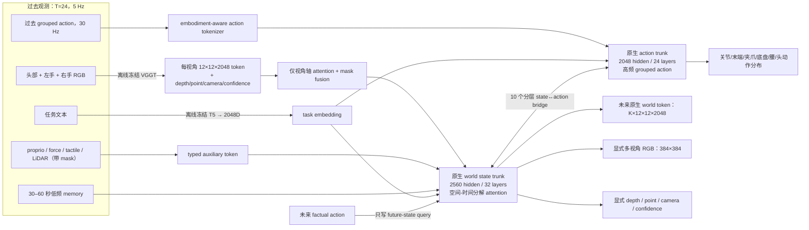

# WM3D-V7 Native 5B 架构与参数组成

## 1. 设计边界

这是把 V7 的 **native 3D world model core** 放大并训练充分，而不是在视觉语言
模型上接 action head。在线模型没有 Qwen/VLA/Wan；VGGT 和文本 encoder 只负责离线
生成观测证据。WM3D core 仍然拥有显式未来世界和原生动作动力学。



## 2. 精确参数组成

下表由 `scripts/scale5b/report_parameter_budget.py` 在 meta device 上计算，不是手工
估算。默认配置精确总参数为 **4,956,589,929**。

| 模块 | 参数量 | 占比 | 为什么这样分配 |
|---|---:|---:|---|
| 原生 world state trunk | 3,250,831,360 | 65.5860% | 最大预算给时空状态、物理变化和 RGB/几何共同表征 |
| 原生 grouped-action trunk | 1,195,474,944 | 24.1189% | action 不是小 head，而是一条独立 24 层高频动力学主干 |
| 10 个 state↔action bridge | 424,719,360 | 8.5688% | 让动作与世界状态在深层多次交互，而非末端拼接 |
| 接口投影、memory、位置/查询参数 | 55,055,872 | 1.1108% | 对齐 2048D 外部接口、长期记忆与未来 query |
| 三视角 fuser | 16,783,360 | 0.3386% | 融合三相机，但不把容量浪费在重复 encoder 上 |
| 显式 RGB head | 9,357,443 | 0.1888% | 清晰度主要来自高分辨率 state lattice；head 只做残差上采样 |
| depth/point/camera/confidence head | 3,959,840 | 0.0799% | 保持显式原生 3D 监督，而非 latent-only 3D |
| 动作分布 head | 407,750 | 0.0082% | 大部分动作能力在 action trunk，head 只参数化均值/尺度/contact |

复算命令：

```bash
cd /workspace/wm3d_v7
export PYTHONPATH=/workspace/wm3d_v7
/opt/wm3d/bin/python scripts/scale5b/report_parameter_budget.py \
  --config configs/scale5b/wm3d_v7_native5b_h200.template.yaml \
  --format markdown
```

如果输出不是 `4,956,589,929`，正式版本直接拒绝发布。

## 3. 为什么是 T=24、P=144、K=16、D=2048

| 项目 | 旧 V7 | 5B 默认 | 设计理由 |
|---|---:|---:|---|
| 上下文 `T` | 16 | 24 | 5 Hz 下从 3.2 秒扩到 4.8 秒，覆盖更多接触前因 |
| 空间 `P` | 64 | 144 | 从 8×8 增到 12×12，显著增加细物体、手指和边缘信息 |
| 未来 `K` | 8 | 16 | 从 1.6 秒扩到 3.2 秒，学习更长动作后果 |
| 外部 token `D` | 2048 | 2048 | 保持 VGGT/cache 接口；增加 D 会放大 100TB 级 I/O，不会自动增加信息 |
| state hidden | 1600 | 2560 | 真正把容量加到 world model 内部，而不是缓存向量 |

每个样本有 `(T+K)×P = 40×144 = 5,760` 个 state 位置。若使用全局 dense
attention，计算和显存会失控。因此每个 state layer 分解为：

1. 每帧独立对 144 个空间位置做 spatial attention；
2. 每个 patch 独立沿 40 帧做 causal temporal attention；
3. SwiGLU FFN；
4. 每 4 层读一次低频 memory；指定的 10 层与 action trunk 双向交互。

这保留显式时空 lattice，同时避免 `5,760²` 全局 attention。

## 4. 为什么 state trunk 占 65.6%

目标是更强的 world model、RGB 和 depth，所以大约三分之二参数必须留在原生状态
动力学。RGB、depth、point、camera 并不是四套互不相干的网络，它们共享同一未来
state；这样 3D 几何会约束 RGB，动作后果也能约束几何。如果把大量参数堆到 RGB
生成器，容易得到“画面更好但物理和动作更弱”的视频模型，这不是 V7 的目标。

`P=144`、384×384 显式 RGB、Charbonnier + gradient + Laplacian loss 用于缓解模糊。
但 5B 参数本身不能保证清晰：1k canary 必须检查边缘频谱、运动区域和多视角一致性。
若仍模糊，优先增加 `rgb_hidden`/解码监督帧数或提高有效 RGB 数据质量；不要先把
外部 token D 从 2048 暴力放大。

## 5. 为什么 action trunk 占 24.1%

V7 旧的固定 7D 接口无法覆盖双臂、底盘、腰、头和不同末端。5B 版使用：

- 最多 8 个 action group；每组最多 16 维；
- 每个 group 独立维度 mask、控制模式、embodiment/group embedding；
- 视觉 5 Hz、动作 30 Hz，每帧 6 个 substep；
- 连续维度预测均值和 log-scale；离散夹爪/contact 预测 logits；
- action trunk 读取 task、过去动作、上下文 state summary 和 learned future query；
- world state 同时可由未来 factual action 条件化，以学习可控动力学。

这使动作能力来自 1.2B 的原生 action dynamics，而不是几十万参数的末端 head。

## 6. 未来信息不泄漏

未来 factual action 只用于“给定动作会发生什么”的世界预测，不能偷喂给动作预测：

1. factual future action 只投影到 future-state query；
2. state temporal attention 是 causal；
3. state→action bridge 只读取前 `T` 个上下文 state summary；
4. future action 输入是 learned query，不是 target action；
5. 单测要求 action 输出对未来 factual action 的梯度严格为零，而 world 输出会变化。

## 7. 显式输出与损失

- 所有 `K=16` future world token：MSE + cosine；
- 选定未来帧的三视角 RGB：Charbonnier + gradient + Laplacian；
- depth：log-depth + gradient；
- 3D point、geometry confidence、camera pose；
- grouped action NLL、速度平滑、contact/gripper；
- 所有缺失相机/传感器/动作维度都有显式 mask，NaN 不会变成事实。

## 8. 不可突破的边界

- 不导入 V8/A2/Qwen/Wan/VLA；
- 不把 3D 变成 latent-only 预测；
- 不用黑图冒充缺失相机；
- 不退化为固定 7D action；
- 训练和 cache 节点不隐式联网下载；
- 不从 `latest` 恢复，只认 `step_XXXXXXXX/COMMITTED.json`。
