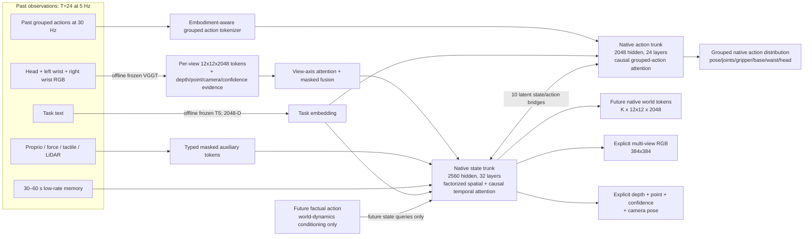

# WM3D-V7 native 5B architecture

## Scope

This is a scaled **native WM3D-V7 world model**. It does not import later V8
components, language-model reasoning lanes, video generators, or VLA policy
backbones. Text is encoded once, offline, into the existing 2048-D V7 task
interface. During training and inference the only online learned model is the
native WM3D core.

## Frozen representation contract

| Component | Value | Reason |
|---|---:|---|
| Context `T` | 24 | 4.8 s at 5 Hz |
| Spatial tokens `P` | 144 | explicit 12x12 spatial lattice |
| Future `K` | 16 | 3.2 s at 5 Hz |
| External token width | 2048 | preserves the VGGT/V7 representation interface |
| State hidden | 2560 | increases world-model capacity without inflating cache I/O |
| State trunk | 32 layers, 20 heads | native world dynamics |
| Action hidden | 2048 | dedicated high-capacity action dynamics |
| Action trunk | 24 layers, 16 heads | native grouped action prediction |
| Bridges | 10 | recurrent state/action exchange throughout depth |
| Action cadence | 6 substeps/frame | 30 Hz action under 5 Hz visual state |
| Views | 3, individually masked | missing cameras never become fake black evidence |
| Low-rate memory | 12 slots by default | long task state without setting `T=64` |

The exact default parameter count is `4,956,589,929`, tested on a meta device.
The major groups are:

| Group | Parameters |
|---|---:|
| State trunk | 3,250,831,360 |
| Action trunk | 1,195,474,944 |
| State/action bridges | 424,719,360 |
| Remaining fusion, embeddings, and explicit heads | 85,564,265 |

## Why the sequence is tractable

The raw representation contains `(T+K)*P = 40*144 = 5,760` state tokens per
sample. A global dense 5,760-token attention layer is not used.

Each state layer alternates:

- spatial attention over 144 patches independently for every frame;
- causal temporal attention over 40 frames independently for every patch;
- SwiGLU feed-forward processing.

This preserves native spatial/temporal state while avoiding quadratic global
attention. Multi-camera attention is restricted to the view axis before the
state trunk.

## Native action ownership

Actions are not a seven-value afterthought. Each embodiment declares ordered
groups with independent dimensions and masks. The default maximum interface is
eight groups, sixteen dimensions per group, and six 30 Hz substeps per 5 Hz
frame. The model predicts:

- a mean and log scale for every valid continuous action dimension;
- contact/gripper logits;
- the entire `K`-frame high-rate action horizon.

The action trunk receives past actions, task conditioning, embodiment/group
identities, learned future action queries, and state summaries. It never
receives future target actions.

## No-future-leak invariant

Future factual actions are needed to learn controllable world dynamics, but
they must not leak into the policy prediction:

1. factual future actions are projected only into future state queries;
2. temporal state attention is causal;
3. action-to-state bridging may affect future world prediction;
4. state-to-action bridging reads only the first `T` context-state summaries;
5. future action inputs are learned queries, not teacher-forced targets.

A gradient test asserts that predicted actions have exactly zero dependency on
future factual action tensors while predicted world state does change.

## Explicit supervision

The state trunk owns all native outputs:

- quantized-token reconstruction and cosine alignment;
- four selected future RGB frames during training, with Charbonnier,
  gradient, and Laplacian losses;
- per-view depth, 3D points, geometry confidence, and camera pose;
- all `K` world tokens for future rollout.

The RGB decoder is learned residual upsampling from the 12x12 future state,
not an attached video diffusion model. More RGB frames can be decoded during
evaluation; the four-frame training subset controls activation memory.

## Non-negotiable boundaries

- No imports or config values from V8, A2, Qwen, Wan, or VLA code.
- No latent-only 3D prediction: explicit depth/point/camera outputs remain.
- No silent single-view substitution: every view has a validity mask.
- No fixed-7D action assumption.
- No implicit downloads during data encoding or training.
- No implicit `latest` resume.
