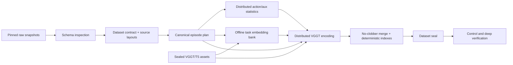

# Native 5B data pipeline

## Planned corpus

The checked-in inventory is a planning template, not a claim that vendor
schemas are already correct.

| Source | Planning hours | Sampling weight |
|---|---:|---:|
| Existing V7 formal mixture | 495.0 | 10 |
| Full RoboCasa MG | 1,517.0 | 15 |
| AgiBotWorld2026 imitation | 295.0 | 10 |
| AgiBotWorld2026 rich interaction | 155.0 | 8 |
| AgiBotWorld2026 reinforcement | 211.0 | 12 |
| AgiBot Beta | 2,976.4 | 45 |
| Total | 5,649.4 | 100 |

Hours, licenses, raw snapshot revisions, and every sensor/action column must be
re-measured and signed off after download. Simulation packages are not added
to the hour total until duplicate versions are resolved.

At 5 Hz, 5,650 hours contain about 101.7 million visual frames. Three views of
144x2048 int8 tokens require roughly 90 TB before indexes, scales, JPEG packs,
actions, and redundancy. A 200 TB usable tier is therefore the intended
operating point.

## Immutable stages



Every publication is exclusive and transactional. A pre-existing output is an
error. Incomplete UUID-suffixed directories remain forensic evidence and are
never mistaken for committed data.

## 1. Freeze raw snapshots

Record for every source:

- repository/dataset revision and license;
- every raw file size and SHA-256;
- total episodes, frames, FPS, and measured hours;
- embodiment identity;
- RGB view names;
- action, proprioception, force, tactile, and LiDAR fields;
- any missing-camera or missing-sensor semantics.

Never merge physically different embodiments under one action schema.

Inspect each LeRobot snapshot before editing the layout:

```bash
cd /workspace/wm3d_v7
/opt/wm3d/bin/python scripts/scale5b/inspect_lerobot_schema.py \
  --root /datasets/agibot_beta \
  --max-data-files 8
```

Copy and edit:

- `configs/scale5b/dataset_inventory_5650h.template.yaml`
- `configs/scale5b/source_layouts_5650h.template.json`

The AgiBot column names in the template are placeholders until this inspection
passes. A field mismatch must fail at scan time; do not add heuristic aliases
to the expensive encoder.

For legacy data, produce `native5b_episode_manifest.jsonl`. Each line is an
`EpisodeDescriptor` with a safe relative parquet path, row interval, exact
timestamps/FPS, three ordered view records (nullable paths allowed), action
column mappings, and optional auxiliary mappings. The split in this file is
ignored and deterministically recomputed. Its `raw_root`, timestamp/episode
columns, action mapping, auxiliary mapping, and available camera feature keys
must exactly match the source layout; operator-local aliases are rejected.

## 2. Build the offline encoder asset bundle

All encoder nodes must be offline. Prepare immutable local snapshots first:

- VGGT source commit;
- VGGT model snapshot revision;
- `google/flan-t5-xl` snapshot revision.

Then publish one portable bundle:

```bash
export REPO=/workspace/wm3d_v7
export ASSET_ROOT=/datasets/wm3d_v7_native5b_encoder_assets_v1
cd "${REPO}"

/opt/wm3d/bin/python scripts/scale5b/prepare_encoder_assets.py \
  --vggt-source-root /staging/vggt \
  --vggt-source-commit "${VGGT_SOURCE_COMMIT}" \
  --vggt-model facebook/VGGT-1B \
  --vggt-snapshot "/staging/hf/vggt/${VGGT_REVISION}" \
  --vggt-revision "${VGGT_REVISION}" \
  --task-model google/flan-t5-xl \
  --task-snapshot "/staging/hf/flan-t5-xl/${TASK_REVISION}" \
  --task-revision "${TASK_REVISION}" \
  --output-root "${ASSET_ROOT}"

/opt/wm3d/bin/python scripts/scale5b/verify_encoder_assets.py \
  --asset-root "${ASSET_ROOT}" --deep
```

The bundle copies data out of Hugging Face symlink layouts, forbids symlinks
in the published tree, hashes every regular file, and records immutable model
and source revisions.

## 3. Compile and scan

Use a new empty dataset root:

```bash
export REPO=/workspace/wm3d_v7
export DATASET_ROOT=/datasets/wm3d_v7_native5b_5650h_v1
export BOOTSTRAP_ROOT=/releases/wm3d_v7_native5b_5650h_v1_bootstrap
export WM3D_V7_LEGACY_ROOT=/raw/v7_formal
export ROBOCASA_FULL_ROOT=/raw/robocasa_full
export AGIBOT_2026_IMITATION_ROOT=/raw/agibot2026/imitation
export AGIBOT_2026_RICH_ROOT=/raw/agibot2026/rich
export AGIBOT_2026_REINFORCEMENT_ROOT=/raw/agibot2026/reinforcement
export AGIBOT_BETA_ROOT=/raw/agibot_beta

test ! -e "${DATASET_ROOT}"
mkdir -p "${BOOTSTRAP_ROOT}"
cd "${REPO}"
/opt/wm3d/bin/python scripts/scale5b/compile_dataset_contract.py \
  --inventory configs/scale5b/dataset_inventory_5650h.template.yaml \
  --output "${BOOTSTRAP_ROOT}/dataset_contract.json"

/opt/wm3d/bin/python scripts/scale5b/scan_sources.py \
  --dataset-contract "${BOOTSTRAP_ROOT}/dataset_contract.json" \
  --source-layouts configs/scale5b/source_layouts_5650h.template.json \
  --output-root "${DATASET_ROOT}"
```

Review `receipts/source_scan.json`. The measured hours and train/val/test
counts—not the planning table—become authoritative. The scan now completes a
deep input gate before publication: every episode interval must fit its
Parquet metadata, every required column and action/auxiliary vector width must
match, all paths must be regular files without symlink traversal, and every
referenced video must be non-empty. The dataset output root is created
exclusively by the scanner (or must already be empty); a partial or reused
dataset tree is rejected before control files are published. Actual video
timestamp/frame decoding is still repeated transactionally by each encoder
shard.

## 4. Distributed action and auxiliary statistics

Example with 256 CPU shards:

```bash
export REPO_ROOT=/workspace/wm3d_v7
export DATASET_ROOT=/datasets/wm3d_v7_native5b_5650h_v1
export NUM_SHARDS=256
sbatch --array=0-255%64 \
  "${REPO_ROOT}/scripts/scale5b/sbatch_action_stats_array.sh"
```

`GLOBAL_SAMPLE_BUDGET` defaults to 8,000,000 rows for the complete corpus,
not per array task. Each shard receives a deterministic
`ceil(global_budget / NUM_SHARDS)` cap. This keeps the final merge bounded
while preserving a reproducible, plan-hash-bound sample; increasing the
number of CPU shards therefore does not multiply merge memory.

After all 256 tasks succeed, merge exactly the complete numbered set:

```bash
cd "${REPO_ROOT}"
/opt/wm3d/bin/python scripts/scale5b/build_action_stats.py merge \
  --partials "${DATASET_ROOT}"/control/action_stats_partials/partial_*.npz \
  --output "${DATASET_ROOT}/control/action_stats.json" \
  --clip 5.0
```

The merger rejects missing, duplicate, or mixed-lineage partials. Continuous
factual action values must be finite. Missing auxiliary values carry a
per-dimension validity mask and do not contaminate robust quantiles.
The final statistics receipt records both the configured global budget and
the actual row count. The merger rejects a combined sample above the
deterministic global cap.

## 5. Task bank

```bash
export REPO_ROOT=/workspace/wm3d_v7
export DATASET_ROOT=/datasets/wm3d_v7_native5b_5650h_v1
export ENCODER_ASSET_ROOT=/datasets/wm3d_v7_native5b_encoder_assets_v1
export TASK_MODEL_REVISION=<immutable-commit>
sbatch "${REPO_ROOT}/scripts/scale5b/sbatch_task_bank.sh"
```

This is offline conditioning only. T5 is absent from the training graph.

## 6. Distributed VGGT encoding

Choose enough shards that each can complete comfortably inside the site wall
time. The shard count is part of the final receipt. Example:

```bash
export REPO_ROOT=/workspace/wm3d_v7
export DATASET_ROOT=/datasets/wm3d_v7_native5b_5650h_v1
export ENCODER_ASSET_ROOT=/datasets/wm3d_v7_native5b_encoder_assets_v1
export VGGT_REVISION=<immutable-commit>
export NUM_SHARDS=1024
sbatch --array=0-1023%128 \
  "${REPO_ROOT}/scripts/scale5b/sbatch_encode_array.sh"
```

The encoder produces per-part:

- int8 per-vector VGGT view tokens and scales;
- explicit view masks;
- FP16 depth, points, confidence, camera evidence;
- JPEG random-access RGB packs;
- grouped 30 Hz action tensors and validity masks;
- typed context-only auxiliary tokens;
- deterministic window rows;
- a manifest and commit receipt.

A missing camera is scattered as invalid evidence; it is never replaced by a
synthetic black image.

## 7. Merge, seal, and verify

Only after every encoder worker receipt exists:

```bash
cd "${REPO_ROOT}"
/opt/wm3d/bin/python scripts/scale5b/merge_and_seal.py \
  --dataset-root "${DATASET_ROOT}" \
  --num-encoder-shards 1024 \
  --index-rows-per-file 1000000

/opt/wm3d/bin/python scripts/scale5b/verify_dataset.py \
  --dataset-root "${DATASET_ROOT}" \
  --mode control \
  --sample-windows-per-source 4
```

Before formal training, run the expensive deep verifier once:

```bash
/opt/wm3d/bin/python scripts/scale5b/verify_dataset.py \
  --dataset-root "${DATASET_ROOT}" \
  --mode deep \
  --sample-windows-per-source 16
```

The final seal binds the contract, layouts, episode plan, action statistics,
task bank, encoder asset receipt, every worker receipt, every index, and every
payload manifest. Training verifies the seal but does not re-hash all ~100 TB
on every launch.

The seal also requires exactly the contract source set, positive measured
hours, and positive train/validation window counts for every source.
Materializing a formal training YAML re-hashes this complete control plane and
all payload manifests once more; a self-consistent-looking but stale receipt
cannot be promoted into a launch config.
