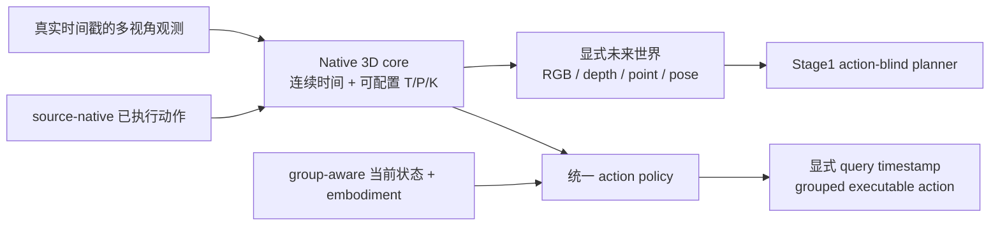

# WM3D V8

WM3D V8 是一个动作条件的原生 3D 世界模型。模型在显式 3D 状态上预测未来 RGB、depth、point 和 camera/pose，同时输出可直接执行的机器人动作序列。1B 与 5B 使用同一个模型类、数据 ABI、训练器和命令，只选择不同 profile。



核心约束：

- 世界状态、action 和 current-state 均保留数据源真实时间戳；不存在全局固定 Hz 或整数频率比。
- dynamics 输入保留每个真实 world interval 内的 source-native action 子步，不从 coarse effect 伪造 fine command。
- serving action 只有一个 grouped owner；单臂、双臂、底盘、腰部和头部通过 group/mask/semantic ABI 表达。
- policy 直接读取与 action chunk 首个真实 query timestamp 对齐的 current-state 和 embodiment token；缺失即拒绝样本。
- Panda/LIBERO 的 `[B,8,7]`、20 Hz 和 10D state 只是 benchmark adapter，不是统一模型 ABI。
- RGB、depth、point、pose 始终是显式监督和显式输出；没有 WAN/VLA action 旁路。
- 数据源和采样权重完全由 materialized data profile 决定；训练器不认识数据集名称。

统一实现相对 V7 的修正、真实训练曲线和发布边界见
[V8 发布验收](docs/WM3D_V8_RELEASE_VALIDATION.md)。数据处理命令见
[从零数据与训练手册](docs/WM3D_V8_FROM_ZERO.md)，1B/5B 参数组成与多机方案见
[统一扩展说明](docs/WM3D_V8_UNIFIED_SCALING.md)。

## 目录

```text
wm3d_v8/
├── configs/          # 数据、encoder、1B/5B、runtime、objective 与 Stage1 profile
├── docs/             # 从零操作、扩展设计、Stage1 与发布验收
├── scripts/          # 下载、audit、cache、seal、runtime、eval 与 Stage1
├── tests/            # 统一入口及数据/模型/分布式合同回归
├── wm3d_v3/
│   ├── data/         # source-native cadence、grouped robot 与 episode cache
│   ├── models/       # 1B/5B 共用 native 3D core 与 action policy
│   ├── stage1_planner/ # 冻结 Stage0 的原生 3D 规划阶段
│   └── training/     # FSDP2/DDP、DCP、Stage0 与 offline eval
├── requirements.txt
└── run_v8.sh
```

发布入口只构造 `native_world_model`。旧 direct-pose/delta-gripper/flow、fixed-rate
sidecar、V7 trainer 和 single-file checkpoint eval 不属于 V8 发布闭包。当前
`stage1_planner` 只在冻结的 V8 native future 上训练 action-blind planner，不会取得
action serving 权。

## 环境

推荐 Python 3.10、PyTorch 2.7.1、CUDA 12.8。空服务器不需要 Docker：

```bash
git clone --branch v8 https://github.com/wxqnl/world_model.git
cd world_model/wm3d_v8
./run_v8.sh env
source .venv/bin/activate
```

安装脚本会执行 `pip check` 并写出 `.venv/environment_receipt.json`。集群驱动不兼容 CUDA 12.8 wheel 时，应修改 `PYTORCH_INDEX_URL`，不能在 receipt 中伪装成已验证环境。

发布自检不会写入 `__pycache__` 或 pytest cache：

```bash
PYTHON_BIN=.venv/bin/python ./run_v8.sh check
```

## 配置

模型规模、数据和拓扑是三个正交 profile：

| 配置 | 用途 |
|---|---|
| `model/native_1b.yaml` | 1,194,740,883 参数模型 |
| `model/native_5b.yaml` | 5,108,342,963 参数模型 |
| `runtime/smoke_2gpu_fsdp2.yaml` | 两卡 0→1→2 correctness smoke |
| `runtime/canary_2gpu_fsdp2.yaml` | 两卡 100-step 可学习性 gate |
| `runtime/h100_8_fsdp2.yaml` | 单节点 8 卡运行 profile |
| `runtime/h200_128_fsdp2.yaml` | 16 节点、128 卡运行 profile |
| `runtime/h200_128_fsdp2_canary1k.yaml` | 同拓扑 1K 启动/恢复 canary |
| `runtime/h200_128_fsdp2_validation100k.yaml` | 同拓扑 100K 扩展验证，不是正式预算 |
| `stage1/unified_native_planner.template.yaml` | 从 committed Stage0 DCP 进入统一规划阶段的 fail-closed 模板 |

```bash
PYTHON_BIN=.venv/bin/python ./run_v8.sh check
```

## 从零数据链路

完整命令与每个 receipt 的含义见 [从零数据与训练手册](docs/WM3D_V8_FROM_ZERO.md)。主线固定为：

```text
锁定 revision/file list → 断点下载 → 必要的版本锁定转换/collection 拆分
→ schema inventory + adapter 候选 → 人工确认 action/state 语义
→ strict adapter audit → source inventory → sealed data profile
→ task embedding bank → episode cache plan/并行 worker/seal
→ 1B 或 5B window index → grouped normalization → runtime materialize
→ preflight → train → eval
```

第一处必须由人确认的是 adapter 语义：字段名可以自动列出，但单位、坐标系、gripper 极性、group 边界和 fine/coarse supervision 不能靠代码猜。`adapter-audit` 要求显式确认字面量并输出 SHA-bound receipt；在此之前 inventory 会拒绝运行。

AgiBotWorld2026 的一个下载快照会按冻结目录 `ImitationLearning/`、`RichInteraction/`、`ReinforcementLearning/` 分别生成三个 collection/source receipt，不能把三类数据混成一个 source。AgiBot Beta 必须先使用同一 source lock 中冻结的 AgiBot Alpha 官方 converter；若冻结 revision 的 schema 与 converter 不兼容，流程会停在 conversion/schema audit，不会给出猜测 adapter。

昂贵 episode cache 与模型规模无关：它绑定 raw manifest row、adapter、视觉 encoder、task encoder/bank 与 representation SHA，不绑定 T/K、训练步数或 1B/5B profile。view token 按 int8 per-vector 保存，depth/point 为 fp16；切换 1B/5B 只需重建便宜的 window index/runtime。

交给已有 V7 下载任务的默认数据合同是
`configs/data/public_robot_5649h_v7_compatible.template.yaml`：它原样保留六个数据家庭、
5649.4 小时预算和 `10/15/10/8/12/45` 的 100-sample 周期，但每条数据都必须重新通过
V8 grouped action/current-state/native-time ABI。旧 397 小时 residual 用
`legacy-residual-import` 严格导入，不能直接消费 V7 cache。`public_robot_6106h.template.yaml`
是增加 DROID/Bridge/拆分 RoboCasa 的可选扩展 profile，不得冒充 V7-compatible 默认交付。

交付前可先在一台双卡服务器执行真实公开小样本的一键 smoke：

```bash
./run_v8.sh smoke-real --work-root /data/wm3d_v8_smoke --gpus 0,1 \
  --operator "$USER" --accept-dataset-license --confirm-adapter-semantics
```

该命令从空目录下载冻结 revision，依次完成 schema/adapter audit、双臂 inventory、
task bank、episode cache、window、normalization、runtime、0→1、独立进程 exact resume
1→2 和 offline eval，并输出绑定代码 commit 与全部 SHA 的总 receipt。已有产物只有在
receipt 和内容 SHA 全部一致时才会跳过。

## Preflight、训练与评测

sealed runtime config 生成后，每台训练机必须执行同一个 preflight：

```bash
./run_v8.sh preflight \
  --nnodes="$NNODES" --nproc_per_node="$GPUS_PER_NODE" --node_rank="$NODE_RANK" \
  --master_addr="$MASTER_ADDR" --master_port="$PREFLIGHT_MASTER_PORT" -- \
  --runtime "$SEALED_RUNTIME_CONFIG"
```

随后每个节点使用相同 runtime 和 rendezvous 参数启动；下面示例的 GPU 数、节点数都来自 runtime profile，不由模型名称决定：

```bash
./run_v8.sh train \
  --nnodes="$NNODES" --nproc_per_node="$GPUS_PER_NODE" --node_rank="$NODE_RANK" \
  --master_addr="$MASTER_ADDR" --master_port="$MASTER_PORT" -- \
  --runtime "$SEALED_RUNTIME_CONFIG" --stop-after-step "$HARD_STOP_STEP"

./run_v8.sh eval \
  --nnodes="$NNODES" --nproc_per_node="$GPUS_PER_NODE" --node_rank="$NODE_RANK" \
  --master_addr="$MASTER_ADDR" --master_port="$EVAL_MASTER_PORT" -- \
  --runtime "$SEALED_RUNTIME_CONFIG" \
  --checkpoint "$RUN_ROOT/checkpoints/step_XXXXXXXX" \
  --output "$RUN_ROOT/eval_step_XXXXXXXX.json"
```

必须从完整编号 DCP `step_XXXXXXXX/` 恢复；禁止把 `latest` 当作 authority。新集群先用 `native_1b + smoke_2gpu_fsdp2` 完成真实 optimizer step、checkpoint、独立进程 exact resume 和 eval，再切换 `native_5b + h200_128_fsdp2`；两者不更换代码或数据格式。

128×H200 必须按 `canary1k → validation100k → formal600k` 依次提升。三个 profile 使用同一
FSDP2 trainer 和相同 128 卡拓扑；每次启动先生成新鲜 resource receipt，实测 GPU/HBM、
ECC、空闲进程、节点内 NVLink、IB 速率、ulimit、`/dev/shm`、磁盘余量和分布式
all-reduce。缺一项即停止，不能直接跳到 600K。

## Stage0→Stage1 统一规划

Stage1 不读取旧 V7 `[*,384]` codec，也不保留固定 H32/7D/单臂路径。它从同一 sealed Stage0 runtime 与 committed DCP 加载冻结世界模型，在真实 simulator 候选的显式 native 3D future evidence 上训练 action-blind planner；`H` 必须落在 Stage0 已训练的单次 `K` 内。

真实 branch receipt、materialize、DCP exact resume 和 eval 门禁见 [Stage1 统一规划手册](docs/WM3D_V8_STAGE1_UNIFIED.md)。完整入口为 `stage1-seal-selection` → `stage1-replay-authority` → `stage1-audit-rollouts` → `stage1-produce` → `stage1-materialize` → `stage1-train` → `stage1-eval`。replay 必须在封存的 RoboCasa Python/环境中重新执行全部候选；旧 runtime 自报的 gate 不能替代独立 replay authority。历史 quick/v7 receipt 只是旧 schema 的开发记录，与当前 branch v3、generator receipt v2 和 rollout-audit SHA 闭包不兼容，不能用作当前发布 authority。

## 下游继承

下游从同一 `step_XXXXXXXX/` DCP 加载 `native_world_model`，并沿用相同 grouped action、
current-state、normalization 和 embodiment ABI。LIBERO adapter 可以选择 20 Hz、8-step、
单臂 7D contract，但这些值属于 adapter，不写回 world model。下游若需要不同 action
表示，必须在 adapter 边界显式转换并封存统计；不能新增第二个 serving head。
