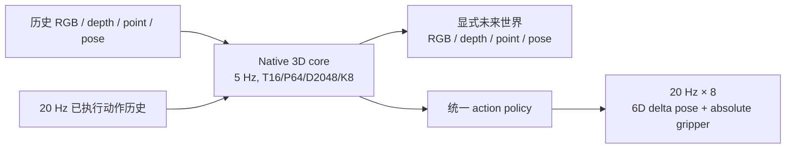

# WM3D V8

WM3D V8 是一个动作条件的原生 3D 世界模型。模型在显式 3D 状态上预测未来 RGB、depth、point 和 camera/pose，同时输出可直接执行的机器人动作序列。



核心约束：

- 世界状态以 5 Hz 建模；高频动作不再被压缩成 5 Hz policy 标签。
- dynamics 输入由每个世界步内 4 个真实动作子步组成，维度固定为 36。
- serving action 只有一个 owner，输出形状固定为 `[B, 8, 7]`。
- 前 6 维为归一化 delta pose，最后 1 维为 absolute close01 gripper。
- RGB、depth、point、pose 始终是显式监督和显式输出；没有 WAN/VLA action 旁路。
- Stage0 使用 DROID、Bridge、RoboCasa Atomic、Composite、MG 五源混合，周期为 `35/15/10/20/20`。

动作修正的设计、ABI 和验收证据见 [Stage0 动作修正说明](docs/WM3D_V8_STAGE0_ACTION_CORRECTION.md)。因果双视图缓存合同见 [Stage0 数据流水线](docs/v8_stage0_causal_dual_view.md)。

## 目录

```text
wm3d_v8/
├── configs/          # 三份 V8 Stage0 v2 模板
├── docs/             # 数据流水线与 action ABI
├── scripts/          # cache、finalize、sidecar、seal、preflight、review、gate
├── tests/            # 当前 V8 与底层数据 ABI 回归测试
├── wm3d_v3/
│   ├── data/         # 五源数据、双频动作、因果双视图
│   ├── models/       # native 3D core 与统一 action policy
│   ├── stage1/       # 数据证据/动作适配工具，不是旧 planner 训练阶段
│   └── training/     # Stage0 trainer、checkpoint 与下游严格继承
├── requirements.txt
└── run_v8.sh
```

`v7_compact_dataset.py`、`v7_action_contract.py` 等文件名保留，是因为已封存的数据 schema 和 checkpoint ABI 仍使用这些名字。它们属于当前 V8 的输入兼容层，不是旧 V7 训练流水线。

旧的 direct-pose/delta-gripper/flow 多 owner 配置和旧 Stage1 planner 没有进入本发布树；它们与当前统一 action ABI 不兼容。后续规划阶段必须从 V8 的统一 action owner 重新设计 transition。

## 环境

推荐 Python 3.10、PyTorch 2.7.1、CUDA 12.8。先安装与集群驱动匹配的 PyTorch，再安装项目依赖：

```bash
cd wm3d_v8
python3.10 -m venv .venv
source .venv/bin/activate
python -m pip install --upgrade pip
python -m pip install -r requirements.txt
export PYTHONPATH="$PWD"
```

发布自检不会写入 `__pycache__` 或 pytest cache：

```bash
PYTHON_BIN=.venv/bin/python ./run_v8.sh check
```

## 配置

当前只保留三份配置：

| 配置 | 用途 |
|---|---|
| `wm3d_v8_stage0_causal_dual_view_unified_action_canary_v2.yaml` | 自包含的短 canary 基线 |
| `wm3d_v8_stage0_causal_dual_view_unified_action_formal_v2.yaml` | 正式 100k 配方 |
| `wm3d_v8_stage0_causal_dual_view_unified_action_formal100k_world16_node43_node44_v2.yaml` | 2×8 GPU、global batch 64 拓扑覆盖 |

canary 配置已展开为自包含文件，不依赖被删除的历史配置链。模板中的 `PENDING_*` 只能由 sealed runtime overlay 替换；模板可以做 static preflight，但不能直接启动训练。

```bash
./run_v8.sh static   configs/wm3d_v8_stage0_causal_dual_view_unified_action_formal100k_world16_node43_node44_v2.yaml
```

## 数据与缓存顺序

正式输入包括：

1. DROID/Bridge 的 source manifest、canonical action cache、action audit gate 和 train-only normalization stats；
2. RoboCasa Atomic/Composite/MG 的事实动作 manifest、RGB sidecar index 和 adapter audit；
3. 固定的 PCA384 token codec 及其 SHA；
4. 本版本新生成的 causal dual-view archive 与 20 Hz action-only sidecar。

执行顺序固定为：

```text
OXE/RoboCasa 原始事实数据
  → causal dual-view cache（context 只读 T16，target 仅作 K8 监督）
  → world16 index finalize
  → RoboCasa 20 Hz action-only sidecar
  → sealed runtime config
  → full preflight
  → 0→20→100 canary + review/gate
  → formal training
```

缓存命令、输入字段和 no-clobber 规则见 [Stage0 数据流水线](docs/v8_stage0_causal_dual_view.md)。action sidecar 的完整命令见 [动作修正说明 8.2](docs/WM3D_V8_STAGE0_ACTION_CORRECTION.md#82-生成-robocasa-action-only-sidecar)。

## Preflight 与训练

sealed runtime config 生成后，两台训练机都必须独立执行 full preflight：

```bash
./run_v8.sh full "$SEALED_RUNTIME_CONFIG" "$PREFLIGHT_REPORT"
```

只有报告同时满足以下条件才允许启动：

```text
passed=true
launch_ready=true
errors=[]
warnings=[]
blockers=[]
```

随后在每个节点使用相同配置和 rendezvous 参数启动。下面只展示 node-local 命令；集群调度器负责给每个节点注入正确的 `NODE_RANK`、`MASTER_ADDR` 和 `MASTER_PORT`：

```bash
torchrun   --nnodes="$NNODES"   --nproc_per_node=8   --node_rank="$NODE_RANK"   --master_addr="$MASTER_ADDR"   --master_port="$MASTER_PORT"   -m wm3d_v3.training.train   --cfg "$SEALED_RUNTIME_CONFIG"   --print_every 20   --stop_after_step "$HARD_STOP_STEP"
```

必须从完整编号 checkpoint 恢复，并使用 trainer 的 strict resume；禁止把 `latest.pt` 当作 authority。每个 milestone 先核验 checkpoint、review 和 receipt，再进入下一段。

## Stage0→LIBERO 继承

Stage0 checkpoint 进入下游前必须运行严格审计：

```bash
./run_v8.sh transition   "$NUMBERED_STAGE0_CHECKPOINT"   "$SEALED_STAGE0_CONFIG"   "$TRANSITION_REPORT"
```

审计会在 CPU 上实例化目标模型并执行完整 key/shape/ABI strict load。下游执行时必须显式提供 pose normalization stats 和 gripper polarity，不能按数据集名称猜测。
