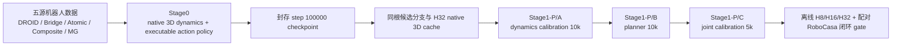

# WM3D V8 预训练

## 训练定义



### Stage0

- 主干保持 `T16 / P64 / D2048 / K8` 原生 3D 表示。
- 世界模型联合预测 RGB、depth、point、camera/pose 和未来 token。
- serving action 由 deterministic pose head 与 delta-composed gripper head 共同拥有。
- pose-only flow matching 只提供辅助 action 目标，不接管 serving。
- 禁止未来 observation 输入，禁止 WAN/VLA action owner。
- 正式配方为 3 节点、每节点 8 卡、全局 batch 96、100k steps。

Stage0 的正式配置是：

```text
configs/wm3d_v7_1b_native_actionpolicy_joint_formal100k_3node24_v3.yaml
```

文件名和 schema 中的 `v7` 是冻结的数据与 checkpoint 兼容标识。V8 沿用这些标识，
避免破坏已经验证的 Stage0 lineage；V8 的版本变化体现在 Stage0 与 Stage1-P 的完整训练定义。

### Stage1-P

Stage1-P 不训练新的 serving action head。它冻结 Stage0 的 direct pose、gripper 和 flow
proposal head，用同一 root state 生成候选 action，再由 WM3D 原生 3D rollout 预测候选后果。
planner 只能读取 predicted token、depth、point、pose、置信度和 task embedding，不能读取
候选 action 本身。

每个候选使用 4 个连续 K8 chunk rollout 到 H32。训练分三段执行，阶段之间不自动晋级：

| 阶段 | 配置 | 更新参数 | 硬停 |
|---|---|---|---:|
| A | `configs/wm3d_v7_stage1_planner_dynamics10k.yaml` | action-conditioned native 3D dynamics | 10k |
| B | `configs/wm3d_v7_stage1_planner_planner10k.yaml` | action-blind planner | 10k |
| C | `configs/wm3d_v7_stage1_planner_joint5k.yaml` | 低学习率 joint calibration | 5k |

Stage1-P 的数据生成、候选定义、恢复规则和 gate 见
[`wm3d_v3/stage1_planner/README.md`](wm3d_v3/stage1_planner/README.md)。

## 目录

```text
wm3d_v8/
├── configs/                 # Stage0 与 Stage1-P 封存配置
├── scripts/                 # 预检、cache、启动、评测与 gate
├── tests/                   # action contract、分布式合同与 planner 回归测试
├── wm3d_v3/
│   ├── data/                # 五源窗口、canonical action 与 mixed-source sampler
│   ├── models/              # native 3D core、world heads 与 action heads
│   ├── stage1_planner/      # H32 rollout、planner 与三阶段训练
│   └── training/            # Stage0 trainer 与 action/world losses
├── requirements.txt
└── run_v8.sh
```

该发布树只收录 Stage0 与 Stage1-P 的 import closure、正式配置、入口脚本和定向测试。
训练日志、cache、checkpoint、历史 WAN/VLA 实验和旧备份不在分支中。

## 环境

当前封存环境使用 Python 3.10、PyTorch 2.7.1 和 CUDA 12.8。先安装与集群驱动匹配的
PyTorch，再安装其余依赖：

```bash
cd wm3d_v8
python3.10 -m venv .venv
source .venv/bin/activate
python -m pip install --upgrade pip
python -m pip install -r requirements.txt
export PYTHONPATH="$PWD"
```

Stage0 的正式启动脚本包含当前三台训练机的 IP、IB HCA 映射、封存数据路径和确认串。
换集群时先修改站点路径和网络映射，再重新生成 distributed transport receipt；不能沿用旧集群
receipt 授权新训练。

## 发布自检

```bash
./run_v8.sh check
./run_v8.sh stage0-static
./run_v8.sh stage1-static configs/wm3d_v7_stage1_planner_dynamics10k.yaml
```

`stage1-static` 在 Stage0 step 100000 checkpoint 和 H32 cache 尚未封存时应当 fail closed。
这两个 blocker 消失前不能启动 Stage1-P。

## 正式执行顺序

1. Stage0 canary 完成后运行 canary gate，并固定 receipt SHA。
2. 三台节点分别运行 full preflight；比较配置、数据、runtime 和 IB closure。
3. 从 node43 调用 Stage0 唯一 orchestrator：

   ```bash
   WM3D_V7_FORMAL_RETRAIN=EXECUTE_WM3D_V7_1B_ACTIONPOLICY_FORMAL100K_V3 \
     scripts/start_wm3d_v7_1b_actionpolicy_joint_formal100k_3node24_v3.sh
   ```

4. 等待 `step_00100000.pt` 自然产生，核验完整性并写入 Stage1-P 配置。
5. 按 `root context -> candidates -> runtime branches -> H32 cache -> seal` 生成 Stage1-P 数据。
6. 依次执行 Stage1-P A/B/C。每段先 preflight，完成后封存编号 checkpoint 和 SHA。
7. 运行离线评测、配对 RoboCasa 闭环评测和最终 gate。

Stage0 正式训练进行中时，不得修改其配置、trainer、模型文件或启动脚本。V8 分支的
Stage1-P 代码只有在 Stage0 100k endpoint 与 H32 cache 都封存后才具备启动条件。
