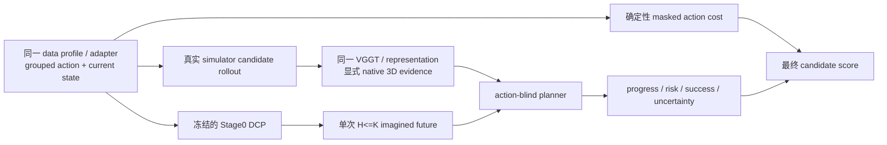

# WM3D V8 Stage1：统一原生 3D 规划阶段

Stage1 的职责是学习“哪一个显式未来更可能完成任务”，不是再造一条 action policy。它冻结一个已经训练完成的 Stage0，从同一份 V8 runtime 与完整编号 DCP 加载，并让 action-blind planner 读取真实候选分支的 native token、depth、point、camera pose、几何置信度与任务 embedding。

## 设计边界



以下是硬约束：

- planner head 的函数签名没有 candidate action；action 只在 learned logits 之外形成可审计的 masked cost。
- 世界频率、action 频率、组数、维度、视角、`T/P/K` 均来自 source/profile/封存资产，不写死 5 Hz、20 Hz、7D、单臂或固定五源。
- future evidence 必须与所绑定 Stage0 window 的 future 时间格精确一致，并携带 token/depth/point/pose/view mask；每个 fine command 的真实偏移必须落在对应 world interval。planner 显式编码可用性与视角覆盖，缺失信号不会与真实零值混淆。
- imagined rollout 只调用冻结 Stage0 一次，且 `0 < H <= K`。当前实现没有被多段未来监督，因此禁止把多次单段 forward 串成伪 autoregressive rollout。
- candidate 动作必须经过同一个 source adapter 与 grouped normalization；current-state、embodiment、语义 ID、真实 action timestamp 与 Stage0 数据 ABI 完全一致。
- Stage0 只从 committed DCP 通过共享 `DistributedCheckpointManager.load_model_for_evaluation` 加载；planner checkpoint 也使用同一 DCP 管理器并执行 exact-resume 闭包检查。

## 旧分支资产审计结论

旧 quick 资产不能用于 unified Stage1：

- `branch_codes` 是 `[C,32,64,384]` 的旧 V7 codec；V8 unified native token 是 profile 决定的 `D`（当前 1B/5B 为 2048），5B 的空间 `P` 也不同。
- 旧资产前 `K=8` 个 step 的 rewards 全为零、success 全为 false，没有当前 Stage0 horizon 内的候选排序监督。
- 旧资产固定 7D action、固定 H32，未绑定 grouped normalization、current-state、task bank、encoder 和 unified window index。

因此旧配置和旧 payload SHA 清单已从发布入口移除。加载器只接受 `wm3d_v8_unified_stage1_branch_v3`；旧 codec 或旧 closure schema 会在 schema/shape/lineage 门禁处 fail closed。

## 真实 branch 产物

Stage1 不可能从一条离线 demonstration 安全推导 counterfactual 成功/奖励。必须先在真实 simulator 中，从同一个 Stage0 window root 执行至少两个真实候选。simulator producer 输出：

1. grouped candidate action：fine/coarse lane、mask、真实 timestamp，按 data profile adapter 生成并用封存 grouped normalization 归一化；
2. 每个候选的真实 observation timestamps、reward、done、success；
3. 候选 observation 经同一冻结 encoder/representation 得到的 native token、depth、point、pose、confidence 和显式 mask；
4. `wm3d_v8_unified_stage1_candidate_generator_receipt_v2`，绑定 simulator revision/seed、source manifest、adapter、data/model/window、normalizer、task bank、encoder、representation、Stage0 runtime、DCP commit 与通过审核的 rollout-audit SHA。

没有 simulator revision、真实 outcome、同源 adapter receipt 或统一 encoder evidence 时，materializer 会拒绝发布；不会生成猜测标签或用旧 codec 占位。rollout audit 本身使用 exact schema，绑定 clean `code_commit`、train/val/test selection、逐 root 行、所有外部 referent 路径/SHA 与 `rows_sha256`；producer 会从同一文件描述符读取并哈希 audit，随后把 `rollout_audit_sha256` 持久写入 candidate receipt、manifest、branch index/seal、Stage1 runtime 以及 train/eval receipt。缺字段、多字段、软链接、替换或 SHA 漂移都会 fail closed。

### 已审计的 RoboCasa 双 source、四 root 真实闭环

仓库提供的是“重新审计和重新编码”入口，不把旧 V7 的 `D=384` token 当作 V8 数据。已跑通的最小发布验证使用两个独立 source：`OpenBlenderLid` 提供 train/val/test 各一个真实 same-root simulator root，`CoffeeServeMug` 再提供一个独立 train root，最终 selection 为 train 2、val 1、test 1。这样 world2 的训练 batch 不依赖复制、有放回采样或跨 source 伪装。顺序如下：

1. 用 `stage1-audit-rollouts` 校验旧 runtime NPZ 的 payload SHA、root-context SHA、candidate index/seal、真实 simulator revision、执行 seed、真实 RGB/reward/done/success；factual branch 的 12D simulator command 必须重排后与源 LeRobot action 行逐字节相同。
2. 用 `configs/adapters/robocasa_panda_omron_real_rollout.yaml` 分别对两个 source 的四个 episode 建立严格 source inventory。action 审计已封存末端平移/旋转单位、robot-base 坐标系与 gripper 极性；base、controller mode 与 current-state 字段仍由上游 `modality.json` / `embodiment.json` 的 SHA 约束。
3. 用 `configs/model/native_1b_stage1_real_k8_5p6s.yaml` 建 Stage0 window。这里的八个 future state 是源数据中真实存在的非均匀时间点 `0.6/1.4/2.0/2.8/3.4/4.2/4.8/5.6s`；没有插值、补帧、重排或修改 K。
4. 完成同一 RoboCasa data profile 的 episode cache、window index、grouped normalization、sealed runtime，并从该 runtime 训练一个 committed Stage0 DCP。ALOHA 或其他数据的 DCP 不能替代。
5. 用 `stage1-produce` 从真实 branch RGB 重新运行当前冻结 native VGGT，candidate command 经过同一个 RoboCasa adapter 和 grouped normalizer，且精确绑定 Stage0 episode shard、window clock、current-state、runtime 和 DCP commit。

真实审计命令（路径必须保持原资产，不要复制后改写）：

```bash
BASE=/data/Minko/world_model/wm3d_v7_actionrepair1b_20260806
CANARY=$BASE/manifests/canary_stage1p_from_s0_45k_20260808
STAGE1_ROOT=/data/Minko/wm3d_v8_stage1_real_closure_20260813
CODE_COMMIT="$(git rev-parse HEAD)"

./run_v8.sh stage1-audit-rollouts \
  --code-commit "$CODE_COMMIT" \
  --runtime-root "$CANARY/success_pool_runtime_v2" \
  --launch-receipt "$BASE/logs/canary_stage1p_from_s0_45k_20260808/success_pool_runtime_v2/launch_rank0.json" \
  --runtime-generator "$BASE/scripts/generate_robocasa_stage1_planner_branches.py" \
  --replay-helper "$BASE/scripts/generate_robocasa_same_root_cf.py" \
  --action-audit /data/Minko/world_model/wm3d_v7/manifests/audits/robocasa365_atomic_factual_action_v2.json \
  --candidate-index "$CANARY/success_pool_candidates_valid_v1/index.jsonl" \
  --candidate-index-seal "$CANARY/success_pool_candidates_valid_v1/index.seal.json" \
  --source-root robocasa_stage1_real_blender=/data/Minko/datasets/robocasa365_source/pretrain/atomic/OpenBlenderLid/20250822/lerobot \
  --source-root robocasa_stage1_real_coffee=/data/Minko/datasets/robocasa365_source/pretrain/atomic/CoffeeServeMug/20250819/lerobot \
  --selection train=0f7bc10ffdb26aea844e26db968ca0b02501ca6f75a47239d2de97b4419a806e \
  --selection train=00a4ce768aa20f3997801cb7267674c0f7fdc382c4ce086c304bf5fd8fc244fd \
  --selection val=09db4a79e6c97d63908918fb1682f501d1e976f58cb4ce66f646185fa83f2e9d \
  --selection test=8bdf49d27e4f3e66254fbe2e1e913e00f918f1a5ae8bc6c355c46b352bb810fc \
  --output "$STAGE1_ROOT/rollout_audit.json"
```

之后的数据入口与 Stage0 主线完全相同：`schema-audit -> adapter-audit -> inventory -> data-profile -> task-bank -> cache-plan -> cache-worker -> cache-seal -> window -> normalization -> runtime -> preflight -> train`。发布验证的 OpenBlenderLid 与 CoffeeServeMug 必须作为同一 data profile 里的两个独立 source，分别使用 `configs/data/stage1_robocasa_real_blender_episode_indices.txt` 与 `configs/data/stage1_robocasa_real_coffee_episode_indices.txt`；两者都必须有各自的 schema audit、adapter audit、manifest 和 inventory receipt SHA。选定的两条 train root 是不同 task/source 中的真实 simulator root，只用于形成 world2 无放回 optimizer step；禁止把 CoffeeServeMug 伪装成 OpenBlenderLid，也禁止复制单条样本补 batch。

同源 Stage0 DCP 提交后重新编码：

```bash
./run_v8.sh stage1-produce \
  --runtime "$SEALED_ROBOCASA_STAGE0_RUNTIME" \
  --stage0-checkpoint "$ROBOCASA_STAGE0_RUN/checkpoints/step_XXXXXXXX" \
  --rollout-audit "$STAGE1_ROOT/rollout_audit.json" \
  --encoder-contract configs/encoder/vggt_native_p64.yaml \
  --output-root "$STAGE1_RAW/payloads" \
  --output-manifest "$STAGE1_RAW/candidates.jsonl" \
  --device cuda --batch-frames 2
```

`stage1-produce` 不接受任意近似 sample：episode cache shard、`t0` 和八个 source future row 必须同时一致；candidate action 使用 Stage0 源 action 的实际 timestamp，current-state 必须是 policy anchor 的真实精确采样。任意一个条件不满足就 fail closed。

候选 manifest 每行使用 schema `wm3d_v8_unified_stage1_branch_v3`，并包含：sample identity、payload/receipt 的绝对路径与 SHA，以及上述 lineage SHA（包括 `rollout_audit_sha256`）。然后运行：

```bash
./run_v8.sh stage1-materialize \
  --runtime "$SEALED_STAGE0_RUNTIME" \
  --stage0-checkpoint "$STAGE0_RUN/checkpoints/step_XXXXXXXX" \
  --candidate-manifest "$STAGE1_RAW/candidates.jsonl" \
  --output-root "$STAGE1_ROOT/branches" \
  --output-index "$STAGE1_ROOT/branch_index.jsonl" \
  --output-seal "$STAGE1_ROOT/branch_seal.json"
```

materializer 验证 `H<=K`、profile 的 `P/D/V`、group/action 容量、时间戳、mask、train/val/test 非空、每条样本在 H 内至少有候选 utility 差异，并原子发布 index/seal。branch artifact 是 Stage0 runtime 专属的；切换 1B/5B、K/P/D、window index 或 normalization 后必须用真实 observation 重新编码/封存，不能重用不兼容资产。

## 配置、训练与 exact resume

复制 `configs/stage1/unified_native_planner.template.yaml`，将全部 `PENDING_*` 替换为真实绝对路径/SHA，并把 `planner.horizon` 设置为 branch seal 的 H。planner 的 token/task/P/V/time 参数建议保留 0，由 sealed Stage0 profile 唯一派生；非零覆盖必须精确相等。

```bash
# 0 -> N，N 必须是 checkpoint_interval 的整数倍
./run_v8.sh stage1-train \
  --nnodes="$NNODES" --nproc_per_node="$GPUS_PER_NODE" \
  --node_rank="$NODE_RANK" --master_addr="$MASTER_ADDR" --master_port="$PORT" -- \
  --runtime "$SEALED_STAGE1_RUNTIME" --stop-after-step "$N"

# 新进程 exact resume N -> M；禁止 latest、旧 .pt overlay 或换 topology 偷渡
./run_v8.sh stage1-train \
  --nnodes="$NNODES" --nproc_per_node="$GPUS_PER_NODE" \
  --node_rank="$NODE_RANK" --master_addr="$MASTER_ADDR" --master_port="$PORT" -- \
  --runtime "$SEALED_STAGE1_RUNTIME" \
  --resume "$STAGE1_RUN/checkpoints/step_XXXXXXXX" --stop-after-step "$M"
```

Stage0 使用其自身封存的 DDP/FSDP2 topology 加载；planner 是小型 head，以相同 world size 做 DDP 并保存 DCP。训练和评测会核对当前 Git commit 与 sealed Stage0 runtime 一致。exact resume 绑定 Stage1 runtime SHA、branch closure、Stage0 model contract、planner 自身结构与 serving-score 权重合同、global batch、world size、planner topology、optimizer、RNG 和下一 optimizer step。

## 评测与发布门禁

```bash
./run_v8.sh stage1-eval \
  --nnodes="$NNODES" --nproc_per_node="$GPUS_PER_NODE" \
  --node_rank="$NODE_RANK" --master_addr="$MASTER_ADDR" --master_port="$EVAL_PORT" -- \
  --runtime "$SEALED_STAGE1_RUNTIME" \
  --checkpoint "$STAGE1_RUN/checkpoints/step_XXXXXXXX" \
  --split val --output "$STAGE1_RUN/eval_val_step_XXXXXXXX.json"
```

评测 receipt 同时记录 observed-real 与 frozen-Stage0 imagined 的 success AUC、selected/oracle success，并执行：

- action-shuffle invariance：candidate action 不进入 learned planner；
- label-shuffle sensitivity：真实标签打乱必须改变 objective；
- gradient ownership：planner 梯度 finite/nonzero，冻结 Stage0 无梯度；
- committed DCP 与 exact lineage 校验。

正式发布还必须用独立 test split 产出 receipt，并保留真实 simulator candidate generator receipts。只有静态单元测试或旧 20-root 结果不能替代这个证据。

## 历史开发批次（不是当前发布 authority）

这里的 `v7` 只是旧 Stage1 资产迭代后缀，不表示回退到 WM3D V7。当时双 source、四 root 的实际闭包为 train 2、val 1、test 1，每个 root 有 11 个真实 simulator candidate，八个 future observation 使用源数据中的 `0.6/1.4/2.0/2.8/3.4/4.2/4.8/5.6s` 实测时间点。该批次使用旧 audit/branch/receipt schema，没有当前 branch v3、generator receipt v2 和持久 `rollout_audit_sha256` 闭包；因此旧路径与 SHA 不再列为发布证据，不得用它们提升或恢复当前运行。

val/test receipt 的 action-shuffle invariance、label-shuffle sensitivity、planner finite/nonzero gradient、Stage0 gradient absence 均为 true，证明真实 branch、冻结 Stage0、DCP exact resume 与评测门禁已经贯通。该实验只训练到 step 2：val success AUC 为 0.25，test success AUC 为约 0.0333，两个 split 的 `selected_success` 都是 0。因此它是 pipeline correctness proof，不是规划能力或效果提升证据；不得据此声称 Stage1 已经学到高质量策略。
