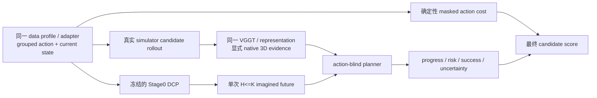

# WM3D V8 Stage1：统一原生 3D 规划阶段

Stage1 的职责是学习“哪一个显式未来更可能完成任务”，不是再造一条 action policy。它冻结一个已经训练完成的 Stage0，从同一份 V8 runtime 与完整编号 DCP 加载，并让 action-blind planner 读取真实候选分支的 native token、depth、point、camera pose、几何置信度与任务 embedding。

## 设计边界



以下是硬约束：

- planner head 的函数签名没有 candidate action；action 只在 learned logits 之外形成可审计的 masked cost。
- 世界频率、action 频率、组数、维度、视角、`T/P/K` 均来自 source/profile/封存资产，不写死 5 Hz、20 Hz、7D、单臂或固定五源。
- future evidence 必须与所绑定 Stage0 window 的 future 时间格精确一致，并携带 token/depth/point/pose/view mask；每个 fine command 的真实偏移必须落在对应 world interval。planner 显式编码可用性与视角覆盖，缺失信号不会与真实零值混淆。
- imagined rollout 只调用冻结 Stage0 一次，且 `0 < H <= K`。当前实现没有被多段未来监督，因此禁止把多次单段 forward 串成伪 autoregressive rollout。
- candidate 动作必须经过同一个 source adapter 与 grouped normalization；current-state、embodiment、语义 ID、真实 action timestamp 与 Stage0 数据 ABI 完全一致。
- Stage0 只从 committed DCP 通过共享 `DistributedCheckpointManager.load_model_for_evaluation` 加载；planner checkpoint 也使用同一 DCP 管理器并执行 exact-resume 闭包检查。

## 旧分支资产审计结论

旧 quick 资产不能用于 unified Stage1：

- `branch_codes` 是 `[C,32,64,384]` 的旧 V7 codec；V8 unified native token 是 profile 决定的 `D`（当前 1B/5B 为 2048），5B 的空间 `P` 也不同。
- 旧资产前 `K=8` 个 step 的 rewards 全为零、success 全为 false，没有当前 Stage0 horizon 内的候选排序监督。
- 旧资产固定 7D action、固定 H32，未绑定 grouped normalization、current-state、task bank、encoder 和 unified window index。

因此旧配置和旧 payload SHA 清单已从发布入口移除。加载器只接受 `wm3d_v8_unified_stage1_branch_v2`；旧 codec 会在 schema/shape/lineage 门禁处 fail closed。

## 真实 branch 产物

Stage1 不可能从一条离线 demonstration 安全推导 counterfactual 成功/奖励。必须先在真实 simulator 中，从同一个 Stage0 window root 执行至少两个真实候选。simulator producer 输出：

1. grouped candidate action：fine/coarse lane、mask、真实 timestamp，按 data profile adapter 生成并用封存 grouped normalization 归一化；
2. 每个候选的真实 observation timestamps、reward、done、success；
3. 候选 observation 经同一冻结 encoder/representation 得到的 native token、depth、point、pose、confidence 和显式 mask；
4. `wm3d_v8_unified_stage1_candidate_generator_receipt_v1`，绑定 simulator revision/seed、source manifest、adapter、data/model/window、normalizer、task bank、encoder、representation、Stage0 runtime 与 DCP commit SHA。

没有 simulator revision、真实 outcome、同源 adapter receipt 或统一 encoder evidence 时，materializer 会拒绝发布；不会生成猜测标签或用旧 codec 占位。

候选 manifest 每行使用 schema `wm3d_v8_unified_stage1_branch_v2`，并包含：sample identity、payload/receipt 的绝对路径与 SHA，以及上述 lineage SHA。然后运行：

```bash
./run_v8.sh stage1-materialize \
  --runtime "$SEALED_STAGE0_RUNTIME" \
  --stage0-checkpoint "$STAGE0_RUN/checkpoints/step_XXXXXXXX" \
  --candidate-manifest "$STAGE1_RAW/candidates.jsonl" \
  --output-root "$STAGE1_ROOT/branches" \
  --output-index "$STAGE1_ROOT/branch_index.jsonl" \
  --output-seal "$STAGE1_ROOT/branch_seal.json"
```

materializer 验证 `H<=K`、profile 的 `P/D/V`、group/action 容量、时间戳、mask、train/val/test 非空、每条样本在 H 内至少有候选 utility 差异，并原子发布 index/seal。branch artifact 是 Stage0 runtime 专属的；切换 1B/5B、K/P/D、window index 或 normalization 后必须用真实 observation 重新编码/封存，不能重用不兼容资产。

## 配置、训练与 exact resume

复制 `configs/stage1/unified_native_planner.template.yaml`，将全部 `PENDING_*` 替换为真实绝对路径/SHA，并把 `planner.horizon` 设置为 branch seal 的 H。planner 的 token/task/P/V/time 参数建议保留 0，由 sealed Stage0 profile 唯一派生；非零覆盖必须精确相等。

```bash
# 0 -> N，N 必须是 checkpoint_interval 的整数倍
./run_v8.sh stage1-train \
  --nnodes="$NNODES" --nproc_per_node="$GPUS_PER_NODE" \
  --node_rank="$NODE_RANK" --master_addr="$MASTER_ADDR" --master_port="$PORT" -- \
  --runtime "$SEALED_STAGE1_RUNTIME" --stop-after-step "$N"

# 新进程 exact resume N -> M；禁止 latest、旧 .pt overlay 或换 topology 偷渡
./run_v8.sh stage1-train \
  --nnodes="$NNODES" --nproc_per_node="$GPUS_PER_NODE" \
  --node_rank="$NODE_RANK" --master_addr="$MASTER_ADDR" --master_port="$PORT" -- \
  --runtime "$SEALED_STAGE1_RUNTIME" \
  --resume "$STAGE1_RUN/checkpoints/step_XXXXXXXX" --stop-after-step "$M"
```

Stage0 使用其自身封存的 DDP/FSDP2 topology 加载；planner 是小型 head，以相同 world size 做 DDP 并保存 DCP。训练和评测会核对当前 Git commit 与 sealed Stage0 runtime 一致。exact resume 绑定 Stage1 runtime SHA、branch closure、Stage0 model contract、planner 自身结构与 serving-score 权重合同、global batch、world size、planner topology、optimizer、RNG 和下一 optimizer step。

## 评测与发布门禁

```bash
./run_v8.sh stage1-eval \
  --nnodes="$NNODES" --nproc_per_node="$GPUS_PER_NODE" \
  --node_rank="$NODE_RANK" --master_addr="$MASTER_ADDR" --master_port="$EVAL_PORT" -- \
  --runtime "$SEALED_STAGE1_RUNTIME" \
  --checkpoint "$STAGE1_RUN/checkpoints/step_XXXXXXXX" \
  --split val --output "$STAGE1_RUN/eval_val_step_XXXXXXXX.json"
```

评测 receipt 同时记录 observed-real 与 frozen-Stage0 imagined 的 success AUC、selected/oracle success，并执行：

- action-shuffle invariance：candidate action 不进入 learned planner；
- label-shuffle sensitivity：真实标签打乱必须改变 objective；
- gradient ownership：planner 梯度 finite/nonzero，冻结 Stage0 无梯度；
- committed DCP 与 exact lineage 校验。

正式发布还必须用独立 test split 产出 receipt，并保留真实 simulator candidate generator receipts。只有静态单元测试或旧 20-root 结果不能替代这个证据。
